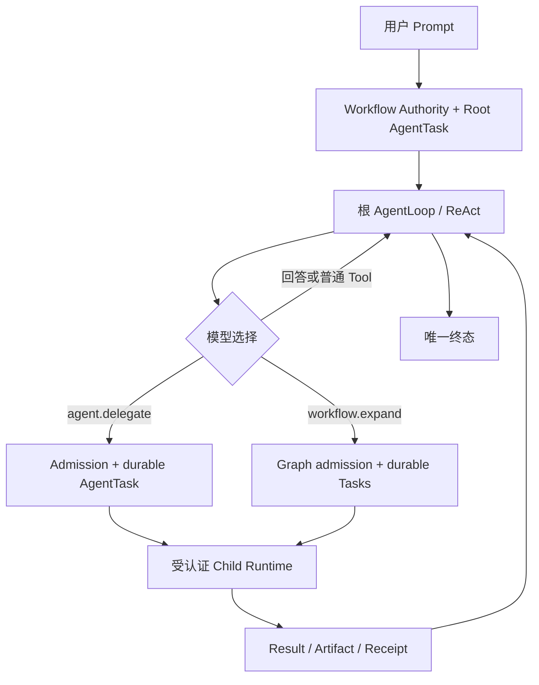

# Praxis

Praxis 是一个 TypeScript 编写的本地终端 Agent 平台。CLI/TUI 只是客户端，独立 Runtime 进程负责模型调用、工具执行、权限、Session、上下文压缩、Skills、MCP、插件以及可持久恢复的多 Agent Workflow。

新 Session 默认使用 `auto`。每条 Prompt 从一开始就是一个持久化 Workflow 和根 `AgentTask`：模型可以直接回答、调用普通工具，也可以自主选择 delegate、handoff、多步骤 DAG、有界循环、HumanTask/Timer 等待或独立 subworkflow。Runtime 而不是模型拥有授权、预算、状态迁移、租约、恢复和最终合并权。

第一次读源码时，不要从最大的文件开始。先看[新手快速入门](docs/quickstart.md)，再用[模块地图](docs/module-map.md)建立“CLI → Protocol → Runtime → Session/Workflow → AgentLoop → Provider/Tool/Child”的整体心智模型。

## 现在已经具备什么

| 能力 | 产品行为 |
| --- | --- |
| 统一执行 | `auto`、`solo`、`workflow` 都进入同一个 Workflow Orchestrator；`solo/workflow` 只是策略约束 |
| 普通 Agent | 根 Agent 在 `AgentLoop` 中进行流式 ReAct，可读写文件、运行 Shell、调用 Skill/MCP/插件工具 |
| 多 Agent | 根模型按需调用 delegate、handoff、expand、loop、wait 或 subworkflow；图支持持久化 `all/any/quorum` join；Child 是真实、受认证的 Runtime 子进程 |
| 持久化 Workflow | SQLite 原子保存 Workflow、Node、Attempt、Task、Lease、Outbox、Timer、Signal、HumanTask 和 Profile |
| 外部副作用 | MCP/process/API 调用进入 durable Activity；成功写 receipt，未知非幂等结果进入 `unknown`，补偿必须引用第二份 receipt |
| 崩溃恢复 | 启动时回收过期 Lease；纯读取和幂等任务可按 RetryPolicy 创建新 Attempt，未知副作用进入 `unknown/manual_intervention` |
| 写任务隔离 | 可写 Child 在受管 Git worktree 中工作；父 Runtime 校验候选提交、patch、scope 和基线后才 fast-forward |
| Session 双后端 | V3 JSONL 或 V3 SQLite；两者实现同一 `SessionJournalV3` 合同，可导入、恢复、分支、压缩和查询 |
| 快速启动 | JSONL 默认读取已校验 Catalog/Projection；完整重放只在 `doctor --deep` 或显式 scrub 中执行 |
| 上下文 | 默认 `iron-law-lean-v1`：单一 Trusted Instructions、Run-stable ContextView、Provider-only editing、portable/native 双层 compaction |
| 扩展 | 内置工具、Skills、MCP stdio、Process Tool/Provider、插件清单与工作区授权 |
| 安全 | Capability Bundle 单向收窄、短期 credential handle、路径边界、权限审批、预算和取消树 |
| 可观测性 | 流式事件、Trace、Usage、Workflow projection、CLI 面板、诊断和 Evaluation |
| TUI 性能 | Composer 与 Transcript 分离、可见窗口渲染、独立 Spinner；历史可滚动，流式输出不会重画全部记录 |

历史值 `direct` 和 `supervisor` 只用于兼容旧配置，加载时分别迁移为 `solo` 和 `workflow`。代码中不存在两套 Planner 实现，也没有旧的固定两路 Supervisor fallback。

## 环境要求

- Node.js 22.13 或更高版本；Runtime 的持久化层依赖内置 `node:sqlite`。
- npm。
- 使用可写 Child 时需要 Git，并且目标目录必须是 Git 仓库。
- 至少配置一个 Provider。内置开发和测试可以使用 `mock`。

## 安装

从源码安装：

```powershell
git clone https://github.com/uestc-Praxis/praxis.git
cd praxis
npm install
npm run build
npm run install:local
```

验证命令：

```powershell
praxis --version
praxis --help
praxis doctor
```

开发时直接启动：

```powershell
npm run dev
```

## 第一次使用

### 1. 配置模型

交互登录：

```powershell
praxis auth login kimi
```

也可以在启动后的 TUI 中使用 `/login`、`/models` 和 `/model`。Provider 的详细环境变量与认证方式见 [Provider 配置](docs/provider-setup.md)。

### 2. 在项目目录启动

```powershell
cd D:\your-project
praxis
```

默认 `auto` 不会先额外调用一次“路由模型”。根模型像普通 Coding Agent 一样工作；只有它认为委派或图化有价值并主动调用相应工具时，Runtime 才增加 AgentTask。

### 3. 非交互调用

```powershell
praxis --print "解释这个项目的入口" --output-format text
praxis --print "修复测试并验证；需要时自行委派 Agent" --output-format text
```

不传 `--planner` 就是 `auto`。`--planner` 只用于覆盖默认策略，实际接受：

- `auto`：默认。模型自主选择单 Agent、委派或 Workflow。
- `solo`：硬性禁止创建 Child；仍走相同 Workflow/AgentLoop。
- `workflow`：要求非平凡副作用前先形成图；不强制简单问题创建 Child。
- `direct`、`supervisor`：旧别名，分别映射为 `solo`、`workflow`。

TUI 右侧 `PLANNER` 会常驻显示当前策略。`/planner` 只用于查询，`/planner auto|solo|workflow`
用于修改下一次 Run；正常使用无需先输入 `/planner auto`。活动 Run 中不能切换。

## 一次 Prompt 如何执行



所有拓扑都使用同一个 Workflow ID、事件历史和状态机。模型提交的是不可信 Proposal；Runtime 会做 Profile、Capability、预算、依赖、冲突键、effect 和 revision CAS 校验。

### Child 能做什么

Child 拥有接近父 Agent 的能力：可使用被授予的内置工具、Skills、MCP/process/API、Provider、读写工作区和 Shell。授权始终是父能力、Profile allowlist 和节点请求的交集。外部能力并非把原始 Tool 对象交给 Child，而是调用父 `ToolRuntime` 的 brokered view，因此 schema、权限、冲突控制、Workflow Activity 和 receipt 都不会被绕过。当前产品硬边界只有 Child 不能继续创建 Child；其 Session 固定使用 `solo`。

根 LLM 可以为每个 Child 自主申请：`default | worker | explorer` Harness、自定义角色指令、Tool/Skill/MCP 子集、是否写工作区、模型或 `fast | balanced | powerful` 档位、`none | low | medium | high` 推理强度、时间/token/turn/tool 预算、返回格式与 JSON Schema、成功标准，以及 DAG 中的串行、并行和交叉审查关系。申请不是授权：Runtime 会把请求与父权限、沙箱、当前 Provider 模型目录、Profile、可用资源和剩余预算求交，并把 requested/effective/denied 配置写入 Task 与不可变 execution snapshot。

三个内置配置使用同一个 Agent Harness，不是三套 Runtime：`default` 是通用 Child，`worker` 偏执行、修复和验证，`explorer` 偏只读调查。每个 Child 都有独立 Runtime 进程、Session/上下文、Provider Tool Loop、Trace 与 Artifact；精简结果和原始模型输出 Artifact 返回父线程。

DAG 后继会从持久化 projection 解析前驱 `resultRef`，把经过 digest 校验的结果摘要作为低信任 Context Reference 交给下一个 Child；解析后的引用也进入 execution snapshot。因此 dependencies 同时表达调度顺序和可恢复的证据传递，交叉审查不会依赖调用 Tool 的临时内存。

v4 长生命周期产品路径默认不设置累计 turns、Tool calls、tokens、wall clock、Child 总数、depth、loop 或图演化次数上限；只有用户、CLI、组织策略或节点 Proposal 显式给出的 budget/deadline 才会收紧。Local Runtime 的 256 个同时运行 Child 是 worker-pool 并发容量，不是生命周期内累计 Child 配额。

### 可写 Child

写权限不会直接指向主目录。Runtime：

1. 从当前 Git HEAD 创建受管 detached worktree；
2. 将 Child Capability Bundle 的 workspace 绑定到该 worktree；
3. Child 完成后创建单一候选提交和 binary patch；
4. 父侧校验提交父节点、真实 changed files、scope、digest、主分支基线和工作区洁净度；
5. 只允许 `--ff-only` 合并；失败保留 recovery path，不覆盖主目录。

非 Git 工作区使用受管目录快照隔离：Runtime 校验基线与 changed files 后在单写锁中回写；失败时保留 recovery path。Git 工作区仍优先使用 detached worktree 和候选提交。

## Session、存储与恢复

聊天 Session 和 Workflow 是两个独立领域：一个 Session 可产生多个 Workflow。Session 保存对话、结构化消息、模型选择、usage、分支和 compaction；Workflow Authority 保存执行事实、任务、租约、不可变 Profile/能力快照、预算计费和副作用预留。

Session V3 支持两个单一权威后端：

```powershell
praxis --storage jsonl
praxis --storage sqlite
```

也可以设置 `PRAXIS_SESSION_STORE=jsonl|sqlite`。JSONL 是默认值。两个后端不是同时双写；“双后端”指同一领域合同的两种可选实现。

常用命令：

| 命令 | 用途 |
| --- | --- |
| `/sessions` | 列出 Session |
| `/resume <id>` | 恢复 Session |
| `/fork`、`/branch` | 复制或切换对话分支 |
| `/compact` | 手动压缩上下文 |
| `/plan` | 查看当前 Session 最新 Workflow projection |
| `/storage` | 查看当前 Session 后端 |
| `praxis doctor --deep` | 完整校验 Session 存储 |

JSONL 启动读取 Catalog/Projection 快速路径，Commit 只增量更新索引，不再重写整个 Catalog。深度校验会完整重放，适合诊断而不是每次启动。

## Tools、权限和 Shell

内置工具包括目录列举、glob/find、read/grep、write/edit、Shell 和 Artifact 访问。Tool descriptor 声明输入 Schema、side effect、target、并行安全、冲突范围、输出上限与 timeout。

敏感调用经过 PolicyEngine：

- `interactive`：需要时询问用户；
- `auto`：只执行策略已允许的动作；
- allow/deny 规则按工作区保存；
- Child 权限请求由父 Runtime 转发，凭证不会进入 Prompt。

Shell 使用无 shell 拼接的进程适配器；Windows 下按 PowerShell/Win32 语义处理。高风险命令、越界路径和未授权外部动作会被拒绝。

## Skills、MCP 与插件

### Skills

Praxis 从用户和项目资源目录发现 `SKILL.md`，在 Prompt 中只暴露目录摘要；模型选择 Skill 后再加载正文。可通过 `$skill`、`/skill:<name>` 或模型工具调用使用。Skill 不能扩大 Tool、路径、网络或预算授权。

### MCP

MCP stdio server 经资源目录启用后，其 Tool descriptor 会进入同一个 ToolRuntime。Child 可通过父 Runtime broker 使用被授予的 MCP；读写 MCP 同样受节点 workspace/effect、权限和 receipt 通路约束。带幂等键的外部动作在真正调用前以原子 reservation 抢占所有权；已提交结果直接重放，键相同但输入不同会被拒绝。

### 插件与 Process 扩展

插件可以注册 Provider、Tool、Planner-compatible capability 和资源。安装、启用、授权、回滚、诊断都通过 Runtime 命令与审计存储。Process Tool/Provider 由独立 host 负责握手、健康、deadline 和关闭。

详见 [插件系统](docs/plugin-system.md)、[插件开发](docs/plugin-authoring.md) 与 [Runtime 扩展说明](apps/runtime/docs/05-extensions-plugins-subagents.md)。

## TUI

TUI 通过 NDJSON JSON-RPC 连接独立 Runtime：

- Transcript 只渲染可见窗口并可用鼠标回滚；
- Composer 是独立 memo 树，输入不会重画历史；
- Spinner 独立刷新；
- Workflow 面板读取持久化 projection 并叠加 `workflow_update`；
- Runtime 重启后可重新查询 Workflow，而不是依赖内存事件缓冲。

快捷键和全部命令见 [CLI 参考](docs/cli-reference.md)。

## Provider、上下文与压缩

Provider Router 支持模型目录、能力匹配、认证状态、fallback、限流/5xx 分类和 usage。429 与暂时性 5xx 映射为可重试错误，但重试仍受 Run/Workflow Budget 控制。

默认 Prompt 程序是 `iron-law-lean-v1`。最终请求只有一个 Trusted Instructions block；runtime facts、Skill catalog、project guidance、Child ContextPacket、Session ContextView、checkpoint 和最近消息按固定顺序装配，Tool schemas 作为独立 Provider 字段发送。一次 Run 内 ContextView 保持稳定，成功 compact 后才换代；reasoning/Tool-result 编辑只改变 Provider 视图。接近 context limit 或未压缩正文达到软阈值时，CompactionService 生成 portable semantic checkpoint，支持的 Provider 可叠加精确绑定的 native context。Workflow 状态不从自然语言摘要恢复，唯一依据始终是 Workflow Journal。完整规则见 [Prompt 与上下文](docs/prompt-assembly.md)。

## Trace、诊断与 Evaluation

Runtime 为 Run、Provider、Policy、Tool、Child 和持久化操作写关联 Trace。`doctor` 检查 Provider、存储、插件和工作区；`eval` 使用固定 scenario 验证 Planner、工具、恢复和协议行为。

2026-08-09 的最终小样本覆盖 Harness-Bench、Harbor / Terminal-Bench、AgentDojo、真实 Child quorum/cross-review、长任务局部恢复、DeepSeek compaction/cache 和 MiniMax smoke。它证明了主要控制面可以运行，但不把单次小样本或一次不一致的 restart projection 宣称为工业级统计保证。详见[最终小样本测评与优化总结](docs/evaluation-final-2026-08-09.md)。

```powershell
praxis doctor
praxis doctor --deep
npm run eval -- --help
```

## 仓库结构

| 路径 | 内容 |
| --- | --- |
| `apps/cli` | CLI、Ink TUI、Runtime Bridge、窗口化渲染 |
| `apps/runtime` | Runtime composition root、AgentLoop、Workflow、Session、Provider、Tools、扩展和安全 |
| `packages/core-sdk` | Provider-neutral 领域合同：Agent、SessionJournal、Workflow、Task/Lease、Tool、Profile |
| `packages/protocol` | Runtime JSON-RPC 方法、事件、TypeScript 类型与 JSON Schema |
| `packages/client` | 类型化协议客户端、事件序列校验与有界重连 |
| `packages/plugin-protocol` | 插件 manifest、握手、Process RPC 与 Schema |
| `packages/plugin-sdk` | 插件作者 API、合同校验与脚手架 |
| `test` | 单元、契约、集成、PTY、恢复、存储与安全测试 |
| `docs` | 入门、模块地图、架构、协议、运维、ADR、评测和目标 RFC |
| `examples`、`evals` | 扩展示例与固定评测资产 |
| `scripts`、`infra`、`security` | 构建发布、私有基础设施与安全资产 |

完整 Workspace 依赖图、Runtime 二十九个源码域和常见改动路径见[模块地图](docs/module-map.md)。

## 开发与验证

```powershell
npm run check
npm test
npm run build
npm run install:local
```

仓库测试包含会启动真实 Runtime/PTY 的集成用例，完整运行时间明显长于普通单元测试。开发时可用 Node test runner 运行具体文件。

## 文档导航

- [新手快速入门](docs/quickstart.md)
- [文档索引](docs/README.md)
- [模块地图](docs/module-map.md)
- [当前架构](docs/architecture.md)
- [统一 Workflow 与多 Agent](docs/workflow-platform.md)
- [CLI 参考](docs/cli-reference.md)
- [协议](docs/protocol.md)
- [Session 恢复](docs/session-recovery.md)
- [最终小样本测评与优化总结](docs/evaluation-final-2026-08-09.md)
- [故障排查](docs/troubleshooting.md)
- [安全威胁模型](docs/security-threat-model.md)
- [目标平台 RFC](docs/planner-platform-rfc.md)

## 当前边界

当前产品已交付统一 auto、真实 Local/远程 Worker Authority 协议、持久 Task/Lease 与后台恢复 pump、不可变执行快照、跨 Workflow 公平 claim、本地熔断、持久化 quorum、Workflow API/projection、隔离写合并、调用前幂等预留与双 receipt Saga 账本。`PRAXIS_WORKFLOW_AUTHORITY_LISTEN` 可把本机 Authority/ArtifactStore 作为带 Bearer 认证的服务暴露，远程 Runtime 用 `PRAXIS_WORKFLOW_AUTHORITY_URL` 接入。PostgreSQL Authority、高可用通知渠道、任意递归 Subworkflow、跨租户分布式熔断和连接器声明驱动的自动补偿仍是可替换部署层，不冒充已交付实现。

License: Apache-2.0。
