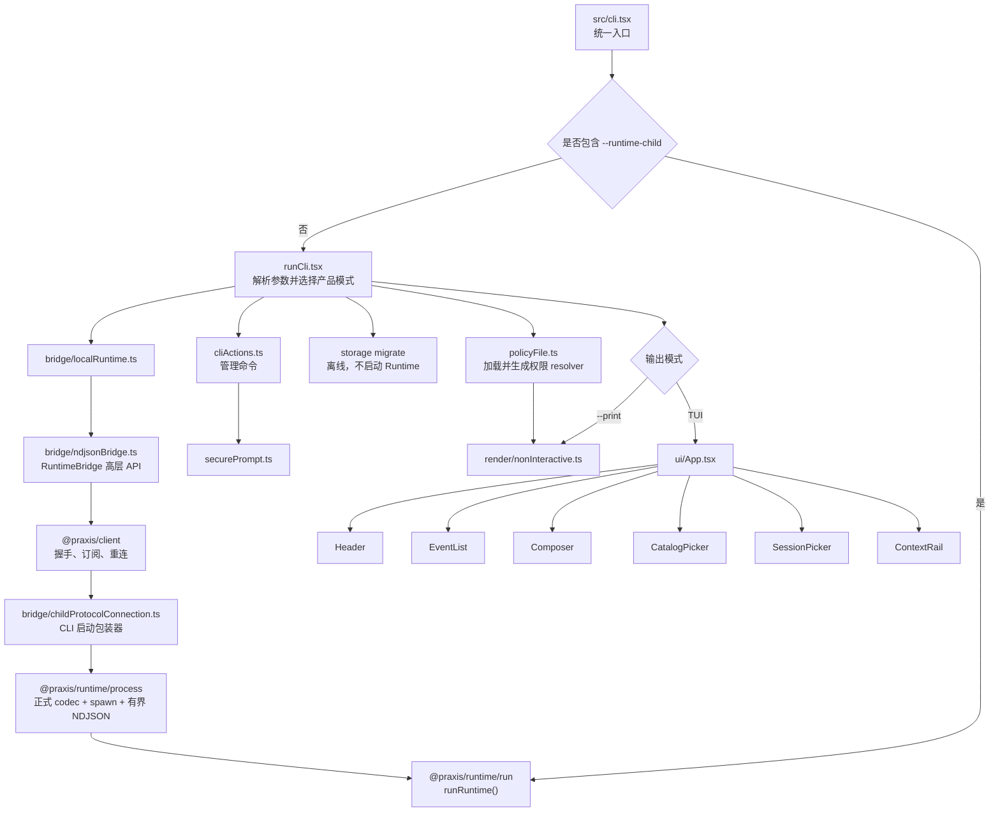
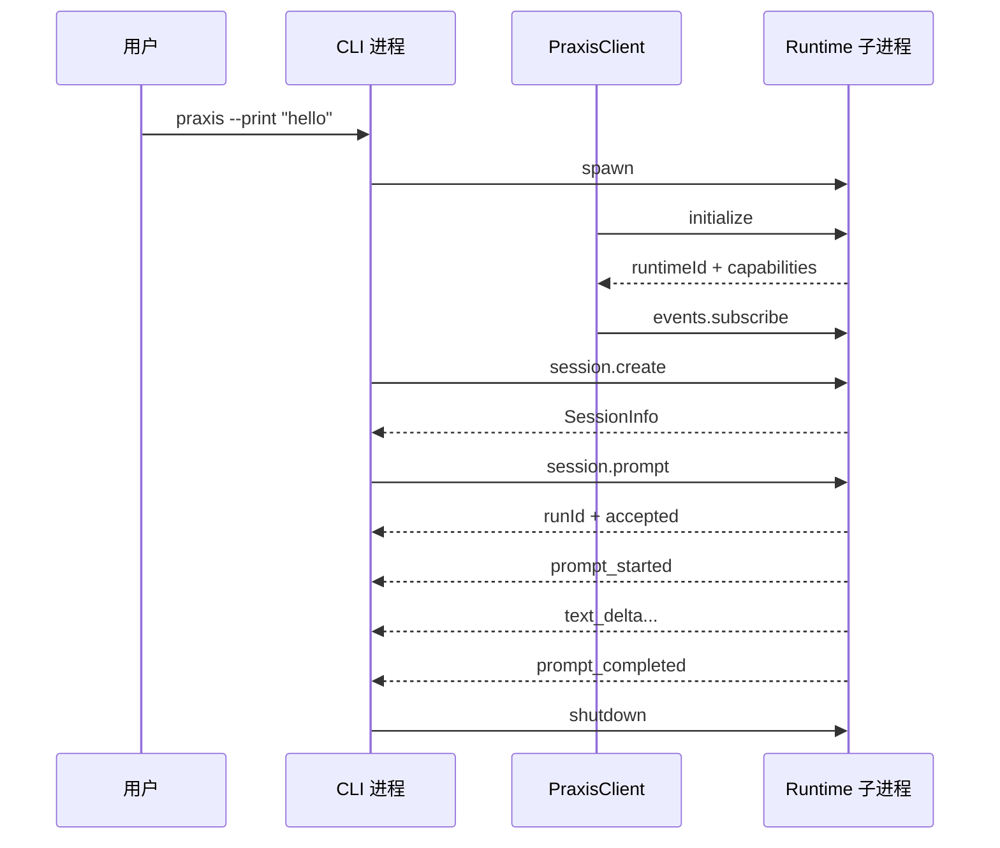

# `@praxis/cli` 模块导读

本文面向第一次阅读 Praxis 源码的开发者，目标是帮助你理解
`apps/cli` 中每个文件的职责，以及一次用户输入如何从终端进入独立的 Runtime 子进程，
再以事件流返回终端。

第一次读源码前，建议先完成根目录 [README](../../README.md) 的 Mock Smoke，并阅读
[项目状态](../../docs/project-status.md)与 [Runtime 协议](../../docs/protocol.md)。本文是源码地图，
不是用户命令参考；精确命令以 [CLI 参考](../../docs/cli-reference.md)和实际 `praxis --help` 为准。

> 本文中的代码块是为了讲解而摘取或压缩的“注释版关键路径”。需要修改代码时，请以对应
> 源文件为准，不要直接复制本文的节选替换实现。

English summary: this guide maps the terminal application's source and follows
one input through process launch, the typed protocol client, print/TUI modes,
permissions, and terminal cleanup. CLI renders and collects decisions; Runtime
retains all execution authority.

## 1. 模块职责

`@praxis/cli` 是 Praxis 的终端前端。它负责：

- 解析 `praxis` 命令及其参数；
- 启动并管理独立的 Runtime 子进程；
- 通过 NDJSON JSON-RPC 与 Runtime 通信；
- 在 Print 模式下输出文本或 JSON；
- 使用 React + Ink 渲染交互式终端 UI；
- 为新 Session 选择 `auto|solo|workflow` policy（旧值只作迁移别名），并把 V3 JSONL/SQLite Session 后端选择传给 Runtime；
- 在不启动 Runtime 的情况下编排离线 `storage migrate`；
- 收集并转发用户或非交互策略给出的权限决定、模型选择和 Session 操作。

CLI **不负责**：

- 直接调用模型；
- 保存 Provider 密钥；
- 最终校验并授权 Tool 执行；CLI 只采集决定，Runtime 才拥有授权权威；
- 执行文件写入或 Shell 命令；
- 保存完整 Session 真相。

这些执行权都属于 `@praxis/runtime`。可以把两者理解为：

```text
CLI      = 遥控器 + 显示器
Runtime  = 状态存储 + 权限控制 + 真正执行任务的主机
```

## 2. 目录结构

```text
apps/cli/
├─ package.json                  包、命令和依赖声明
├─ tsconfig.json                 TypeScript Workspace 配置
├─ src/
│  ├─ cli.tsx                    统一进程入口
│  ├─ runCli.tsx                 命令行总调度器
│  ├─ processMode.ts             CLI/Runtime 子进程角色判断
│  ├─ cliActions.ts              非 TUI 管理命令执行器
│  ├─ securePrompt.ts            API Key 安全输入
│  ├─ policyFile.ts              Print 模式权限策略
│  ├─ bridge/                    Runtime 连接与协议适配
│  ├─ protocol/                  CLI 协议兼容入口
│  ├─ render/                    非交互输出
│  └─ ui/                        Ink TUI、状态模型和终端适配
└─ dist/                         自动生成的 Bundle 和类型声明
```

`dist/` 是构建产物，不是另一套源码。阅读和修改时始终从 `src/` 开始。

## 3. 总体调用关系



## 4. 一次 Prompt 的完整生命周期

以命令为例：

```powershell
npm run dev -- --provider mock --model mock-v1 --print "hello"
```

实际过程如下：

下面 1–12 步描述的是 `--print` 示例。TUI 复用相同的握手、Session 和 Run 协议，但会在一
次 Run 完成后继续驻留。

1. Node/tsx 执行 `src/cli.tsx`。
2. 当前参数没有 `--runtime-child`，所以进入 `runCli()`。
3. `runCli()` 调用 `startLocalRuntime()` 创建 Runtime Bridge。
4. Bridge 通过 CLI 的 `ChildProtocolConnection` 启动包装器创建共享
   `RuntimeProtocolConnection`，由后者启动 Runtime 子进程并校验正式协议。
5. `PraxisClient` 向 Runtime 发送 `initialize`，然后发送 `events.subscribe`。
6. CLI 发送 `session.create` 或 `session.resume`。
7. Print 模式发送 `session.prompt`，Runtime 先返回 `{ runId, accepted: true }`。
8. Runtime 随后发送 `prompt_started`、`text_delta`、`tool_*` 等事件。
9. CLI 根据 `runId` 把事件送入对应的异步事件队列。
10. Print 模式按照 `text`、`json` 或 `stream-json` 格式消费并输出事件。
11. 收到 `prompt_completed`、`prompt_failed` 或 `prompt_aborted` 后，本次 Run 结束。
12. Print 输出完成后，CLI 请求 `shutdown`，随后关闭连接并回收 Runtime 进程树。

TUI 的差异是：

- 第一次输入通常使用 `session.prompt`，已有对话后的输入使用 `session.follow_up`；
- 活动 Run 中再次输入会发送 `session.steer`；
- `prompt_completed` 只结束当前 Run，TUI 和 Runtime 继续存在；
- 只有用户退出 TUI 时才请求 `shutdown` 并回收 Runtime。

若命令是 `praxis storage migrate jsonl|sqlite`，流程在第 3 步之前分流：CLI 直接调用 Runtime 包公开的
离线迁移编排，不创建会持有 Session lease 的 Runtime 子进程。普通启动的 `--storage` 只是放进子进程
环境，让 Runtime 打开已选 authority；它不是迁移命令。



### 4.1 关键术语

| 术语 | 含义 |
| --- | --- |
| Session | 一段可持久化和恢复的对话，包含 Provider、模型、消息和 Memory；同一 Session 同时最多有一个活动 Run。 |
| Run | 用户一次 Prompt 或 Follow-up 触发的执行过程，从 `prompt_started` 到唯一终态事件。 |
| RuntimeBridge | CLI 使用的高层接口，隐藏 JSON-RPC 细节，提供 `prompt()`、`listSessions()` 等方法。 |
| Provider | 模型服务适配器，例如 Mock、Kimi 或 OpenAI；真正的调用、重试和认证由 Runtime 管理。 |
| Tool | 模型可以请求的受控能力，例如 `read`、`write`、`edit` 或 `shell`；CLI 只显示其生命周期和权限请求。 |
| TUI / Ink | TUI 是交互式终端界面；Ink 是使用 React 组件渲染终端内容的库。 |
| NDJSON | Newline-Delimited JSON，一行一个完整 JSON 对象；这里用来划分 stdin/stdout 上的协议消息。 |
| JSON-RPC | 请求包含 `id`、`method`、`params`，响应通过相同 `id` 关联；Runtime 事件是主动 Notification。 |
| Event Sequence | Runtime 为事件分配的单调递增序号；CLI 用它检测遗漏、乱序并决定是否可回放。 |
| Epoch | 一次 Runtime 进程身份周期，以 `runtimeId` 区分；新 `runtimeId` 表示旧活动 Run 不能继续回放。 |
| Transcript | Runtime 持久化的 Session 消息记录，TUI 分页读取后转换成显示事件。 |
| ProviderMessage | Runtime/Provider 使用的持久化消息结构，与仅供 UI 展示的 `SessionEvent` 不同。 |
| Memory | Session 的持久化辅助状态，例如上下文摘要检查点和紧凑计划，不等同于完整 Transcript。 |
| Steer | Run 仍在执行时追加的用户修正，会在下一个安全边界进入上下文。 |
| `clientRequestId` | CLI 为变更请求生成的幂等键；重复提交时 Runtime 返回原 Run，而不是重复执行。 |

### 4.2 异常连接与非正常终止

三种 `prompt_*` 事件是 Runtime 已接受 Run 后的业务终态，但传输层自身也可能失败：

- Runtime stdout 出现损坏 JSON 或不符合 Schema 的消息：共享 `RuntimeProtocolConnection` 让等待中的请求和 Notification Stream 失败；错误再经 `PraxisClient` 和 Bridge 传播，使活动 Run 队列失败；
- Runtime 子进程意外退出：活动异步迭代器抛出连接错误，不能被当成 `prompt_completed`；
- 事件 Sequence 出现缺口：`PraxisClient` 抛出协议错误，避免静默漏掉 Tool 或终态事件；
- 重连得到新的 `runtimeId`：Bridge 进入新 Epoch，让旧活动 Run 队列失败，并从持久化 Session 重新同步；
- TUI 捕获连接错误后显示 `RUNTIME_CONNECTION_LOST` 警告；Print 路径把异常交给顶层错误和退出码处理。

因此，“每个被 Runtime 正常接受并管理的 Run 只有一个业务终态”不等于“传输损坏时 CLI 要
伪造一个终态事件”。协议失败必须显式暴露。

## 5. 关键代码注释

> **本节所有代码块都是带注释的逻辑节选或伪代码，不保证可以独立编译。** 参数类型、错误
> 分支和部分辅助函数会被省略；请点击章节中的源文件路径阅读实际实现。

### 5.1 统一入口：`src/cli.tsx`

这是最适合开始阅读的文件。一个发布后的 `praxis` 可执行程序同时承担两种进程角色。

```tsx
import { runRuntime } from '@praxis/runtime/run'
import { isRuntimeChild } from './processMode.js'
import { cliExitCode, runCli } from './runCli.js'

// 发布版 CLI 重新启动自身作为 Runtime 时会加 --runtime-child。
// 源码开发模式会直接启动 apps/runtime/src/entry.ts，不经过这个判断。
if (isRuntimeChild(process.argv)) {
  // 子进程角色：不创建 Commander 或 Ink，直接启动 Runtime。
  // Runtime 将 stdin 当作协议请求输入，将 stdout 专用于协议响应和事件。
  runRuntime()
} else {
  // 普通用户启动时进入这里：解析命令、启动子 Runtime、显示结果。
  await runCli().catch((error) => {
    // 将不同类型的错误映射为稳定的 CLI 退出码，便于脚本判断失败类型。
    const exitCode = cliExitCode(error)

    // Commander 自己产生的帮助/参数错误不重复打印普通异常格式。
    if (!(error instanceof CommanderError)) {
      process.stderr.write(`praxis: ${error instanceof Error ? error.message : String(error)}\n`)
    }
    process.exitCode = exitCode
  })
}
```

要点：

- `--runtime-child` 是内部实现参数，不是安全机制；
- CLI 和 Runtime 虽然来自同一个发布入口，但运行在不同进程中；
- Runtime 的异常不会被误认为一次正常 Agent 完成。

### 5.2 CLI 总调度：`src/runCli.tsx`

`runCli()` 前半部分使用 Commander 声明命令；后半部分才是真正的产品模式分流。

```tsx
// 1. Commander 已经解析完 argv，此时可以读取全局选项。
const options = program.opts()

// 2. storage migrate 必须离线执行，所以在创建 Runtime lease 前直接返回。
if (storageMigration) {
  await migrateSessionStorageV3(storageMigration.target, { root: storageMigration.home })
  return
}

// 3. Planner/Storage 启动选择通过受控环境交给独立 Runtime。
const runtimeEnvironment = {
  ...process.env,
  PRAXIS_PLANNER_MODE: options.planner,
  PRAXIS_SESSION_STORE: options.storage,
}
const bridge = await startLocalRuntime(undefined, runtimeEnvironment)

// 4. auth/model/session/plugin 等一次性管理命令走这条路径。
if (managementAction) {
  try {
    renderActionResult(await executeManagementAction(bridge, managementAction))
  } finally {
    // 即使命令失败也必须释放 Runtime 子进程。
    await bridge.dispose()
  }
  return
}

// 5. --session 恢复旧 Session 且保留其 Planner；否则创建带初始 Planner 的新 Session。
const session = options.session
  ? await bridge.resumeSession(options.session)
  : await bridge.createSession({
      cwd: process.cwd(),
      provider: options.provider,
      model: options.model,
      plannerMode: options.planner,
      contextLimitTokens: options.contextTokens,
    })

// 5. --print 是非交互路径，适合脚本和自动化。
if (options.print) {
  try {
    // policy-file 是可选的；没有它时非交互 Tool 请求默认拒绝。
    const policy = options.policyFile
      ? await loadPolicyFile(options.policyFile)
      : undefined

    await renderNonInteractive(
      bridge.prompt({
        sessionId: session.sessionId,
        text: options.print,
        budget: {
          maxTurns: options.maxTurns,
          maxToolCalls: options.maxToolCalls,
          maxTokens: options.maxTokens,
        },
        timeoutMs: options.timeoutMs,
      }),
      options.outputFormat,
      (requestId, decision) => bridge.decidePermission(requestId, decision),
      // 第四个参数负责把 permission_request 映射为 policy-file 决定。
      policy ? (event) => policyDecision(policy, event) : undefined,
    )
  } finally {
    await bridge.dispose()
  }
  return
}

// 6. 没有 --print 时启动 Ink TUI。
const terminalOutput = new NativeTerminalOutput(process.stdout)
const app = render(<App bridge={bridge} session={session} />, {
  ...TUI_RENDER_OPTIONS,
  stdout: terminalOutput,
})

try {
  await app.waitUntilExit()
} finally {
  terminalOutput.finish()
  await bridge.dispose()
}
```

这个文件最重要的设计点是：三种产品模式共享同一个 Runtime Bridge。

```text
管理命令  ─┐
Print     ─┼─> RuntimeBridge ─> Runtime
TUI       ─┘
```

### 5.3 Runtime 启动选择：`bridge/localRuntime.ts`

开发环境和发布环境的启动方式不同，但最终都会得到一个 `NdjsonRuntimeBridge`。

```ts
export function startLocalRuntime(runtimeEntry?: string, env?: NodeJS.ProcessEnv) {
  // 根据当前模块是 .ts 还是构建后的 .js，计算正确的启动命令。
  const launch = resolveLocalRuntimeLaunch(import.meta.url, runtimeEntry)

  // 真正创建子进程连接、协议客户端和事件泵。
  return NdjsonRuntimeBridge.start(launch.command, launch.args, { env })
}

export function resolveLocalRuntimeLaunch(moduleUrl: string, runtimeEntry?: string, facts?) {
  // 测试可以显式注入一个 Runtime 入口。
  if (runtimeEntry) {
    return {
      command: facts?.execPath ?? process.execPath,
      args: runtimeEntry.endsWith('.ts')
        ? ['--import', 'tsx', runtimeEntry]
        : [runtimeEntry],
    }
  }

  // npm run dev：直接通过 tsx 启动 apps/runtime/src/entry.ts。
  if (fileURLToPath(moduleUrl).endsWith('.ts')) {
    return {
      command: facts?.execPath ?? process.execPath,
      args: ['--import', 'tsx', runtimeSourceEntry],
    }
  }

  // 发布后的 Node/Bun 可执行程序：重新启动自身并添加 --runtime-child。
  return runtimeLaunch(moduleUrl, facts)
}
```

### 5.4 子进程传输：`bridge/childProtocolConnection.ts`

这一层现在只是 CLI 启动策略的薄包装器。真正的 spawn、字节缓冲、NDJSON 分帧、请求关联、
超时、stderr 上限和进程树回收位于 `@praxis/runtime/process` 的
`NdjsonProcessConnection`；正式 Runtime Schema/result/error codec 位于同一导出面的
`RuntimeProtocolConnection`。CLI wrapper 只选择继承的环境和 stderr 策略，不负责握手、重连策略
或 Session 业务。这样 CLI 与 Subagent host 复用同一正式协议 adapter，而不是各自维护一份 codec。

```ts
export class ChildProtocolConnection extends RuntimeProtocolConnection {
  constructor(command: string, args: string[], env?: NodeJS.ProcessEnv) {
    super(command, args, { env, stderr: 'inherit' })
  }
}
```

安全边界：Runtime stdout 出现普通日志、损坏 JSON 或不符合 Schema 的消息时，CLI 会把它当作
协议失败，而不是忽略。共享层在找到换行前就执行字节上限，避免超长单行先被无界缓存。

### 5.5 高层 Bridge：`bridge/ndjsonBridge.ts`

这一层把底层 JSON-RPC 转换成 UI 方便调用的 TypeScript 方法。

```ts
export class NdjsonRuntimeBridge implements RuntimeBridge {
  private readonly client: PraxisClient

  // 每个活动 runId 有自己的事件队列。
  private readonly runQueues = new Map<string, EventQueue>()

  // 可能先收到 prompt_started，后拿到 session.prompt 的 RPC 返回值；
  // 因此未知 runId 的早到事件需要暂存。
  private readonly bufferedRunEvents = new Map<string, SessionEvent[]>()

  private constructor(command: string, args: string[], env?: NodeJS.ProcessEnv) {
    this.client = new PraxisClient(
      // 每次连接或重连都创建一个新的子进程传输实例。
      async () => new ChildProtocolConnection(command, args, env),
      {
        reconnectAttempts: 1,
        client: { name: 'praxis-cli', version: PRAXIS_PRODUCT_VERSION },
        onRuntimeEpoch: (transition) => this.handleRuntimeEpoch(transition),
      },
    )
  }

  static async start(command: string, args: string[] = [], options = {}) {
    const bridge = new NdjsonRuntimeBridge(command, args, options.env)

    // connect() 内部完成 initialize 和 events.subscribe。
    await bridge.client.connect()

    // 后台持续消费 Runtime 全局事件流。
    bridge.startEventPump()
    return bridge
  }

  prompt(input: PromptInput): AsyncIterable<SessionEvent> {
    return this.startRun('session.prompt', input)
  }

  private async *startRun(method, input): AsyncIterable<SessionEvent> {
    // clientRequestId 用于 Runtime 端幂等：重复请求不会启动第二个 Run。
    const result = await this.request(method, {
      ...input,
      clientRequestId: input.clientRequestId ?? this.newClientRequestId(),
    })

    const queue = this.getRunQueue(result.runId)
    for (;;) {
      const next = await queue.next()
      if (next.done) return
      yield next.value

      // 每个接受的 Run 必须且只能以一个终态事件结束。
      if (isTerminalEvent(next.value)) {
        queue.close()
        this.runQueues.delete(result.runId)
        return
      }
    }
  }
}
```

这里需要特别区分：

- `NdjsonProcessConnection`：共享的子进程生命周期、有界字节/行传输、pending request 和通知队列；
- `RuntimeProtocolConnection`：CLI/Subagent 共用的正式 Runtime Schema/result/error 适配；
- `ChildProtocolConnection`：CLI 的环境/stderr 启动包装器；
- `PraxisClient`：initialize、订阅、事件 Sequence、重连；
- `NdjsonRuntimeBridge`：CLI 所需的 Session、Provider、Plugin 和 Run API。

### 5.6 Print 模式：`render/nonInteractive.ts`

Print 模式把事件流变成稳定的命令行输出，不渲染 React。

```ts
export async function renderNonInteractive(events, format, decidePermission, resolvePermission) {
  let text = ''
  let finalEvent: SessionEvent | undefined

  for await (const event of events) {
    finalEvent = event

    // text 模式只需要累计模型文本增量。
    if (event.type === 'text_delta') text += event.text

    if (event.type === 'permission_request' && decidePermission) {
      await decidePermission(
        event.requestId,
        // 自动化默认拒绝 Tool；只有显式 policy-file 才能允许。
        resolvePermission?.(event) ?? {
          type: 'deny',
          reason: 'Non-interactive mode does not auto-approve tools.',
        },
      )
    }

    // stream-json 保留每个事件，适合其他程序逐行消费。
    if (format === 'stream-json') {
      process.stdout.write(`${JSON.stringify(toAutomationEnvelope(event))}\n`)
    }
  }

  if (format === 'text') process.stdout.write(`${text}\n`)

  // json 模式在 Run 结束后一次性输出文本和终态；与逐事件 stream-json 不同。
  if (format === 'json') {
    process.stdout.write(JSON.stringify({
      schemaVersion: 1,
      kind: 'result',
      text,
      terminal: finalEvent,
    }))
  }

  // Agent 失败和用户取消使用不同退出码。
  if (finalEvent?.type === 'prompt_failed') process.exitCode = 1
  if (finalEvent?.type === 'prompt_aborted') process.exitCode = 130
}
```

### 5.7 TUI 总控制器：`ui/App.tsx`

`App` 是 CLI 中最大的文件。它同时持有 UI 状态、读取键盘、调用 Bridge，并组合所有展示组件。

```tsx
export function App({ bridge, session: initialSession }: Props) {
  // 当前 Runtime Session，可在 /new、/resume、/model 后替换。
  const [session, setSession] = useState(initialSession)

  // TerminalEditorModel 负责文本和光标；React State 负责触发显示更新。
  const [editor] = useState(() => new TerminalEditorModel())
  const [input, setInput] = useState('')
  const [cursorIndex, setCursorIndex] = useState(0)

  // 历史事件来自持久化 Transcript；events 是当前进程收到的实时事件。
  const historyEvents = useSessionHistory(bridge, session.sessionId, runtimeEpoch)
  const [events, setEvents] = useState<SessionEvent[]>([])
  const displayEvents = useMemo(() => [...historyEvents, ...events], [historyEvents, events])

  const [activeRunId, setActiveRunId] = useState<string>()
  const [pendingPermission, setPendingPermission] = useState<PermissionRequest>()

  // 全局事件没有特定 runId，例如 Runtime 重启或认证状态变化。
  useEffect(() => {
    let cancelled = false
    void (async () => {
      for await (const event of bridge.events()) {
        if (!cancelled) setEvents((previous) => appendEvent(previous, event))
      }
    })()
    return () => {
      cancelled = true
    }
  }, [bridge])

  async function runInput(text: string): Promise<void> {
    // Slash Command 在 CLI 本地解释，不作为普通 Prompt 发给模型。
    const command = await executeSlashCommand(text, {
      bridge,
      session,
      cwd: session.cwd,
      latestAssistantText: latestAssistantText(displayEvents),
      copyText: copyTextToClipboard,
    })

    if (command.handled) {
      if (command.session) setSession(command.session)
      if (command.message) appendLocalMessage(command.message)
      return
    }

    // 第一次用户请求使用 prompt，已有历史后使用 follow_up。
    const run = hasRunRef.current
      ? bridge.followUp({ sessionId: session.sessionId, text })
      : bridge.prompt({ sessionId: session.sessionId, text })

    for await (const event of run) {
      setEvents((previous) => appendEvent(previous, event))

      if (event.type === 'prompt_started') setActiveRunId(event.runId)
      if (event.type === 'permission_request') setPendingPermission(event)

      if (isTerminal(event)) setActiveRunId(undefined)
    }
  }

  return (
    <Box flexDirection="column">
      <Header session={session} activeRunId={activeRunId} />
      <EventList events={displayEvents} />
      <Composer input={input} cursorIndex={cursorIndex} />
    </Box>
  )
}
```

当前实现把 Transcript 和交互 Footer（Composer/Picker）拆成独立 React 子树。Transcript/EventList/Markdown
都使用 memo；Spinner 的 80 ms state 位于 Footer 内，只会更新输入区，不会重新解析历史 Markdown。
`EventList` 还按终端实际行数构造可见窗口：即使一个聚合 `text_delta` 有几千行，也只把尾部可见行交给
Ink。完整 Transcript 仍在 V3 SessionJournal，可通过恢复、分页和导出读取。统一 Workflow 会在这里
先读取 durable Workflow projection，再叠加实时 `workflow_update`；Node 的
`CHILD_DEADLINE_EXCEEDED` 等稳定错误码不会再交给模型猜测。

注意，源码中的 `App` 还处理：

- Ctrl+C 在活动 Run 中执行 Abort，空闲时退出；
- 活动 Run 中再次输入时发送 Steer；
- Provider 登录、登出和模型选择；
- Session 搜索、恢复和切换；
- `/planner` 查询/修改 Session 的下一次 Run 模式；`/storage` 只读显示 Runtime 的 V3 authority；
- 权限快捷键 `a`、`w`、`d`；
- 终端尺寸变化和紧凑/宽屏布局。

这两个新命令仍遵守 CLI/Runtime 边界：CLI 只通过 `commands.invoke` 发送 typed command，Planner mode 的
idle 检查与持久化、storage authority 的真实值都由 Runtime 返回。`/storage` 不接受目标参数，避免用户把
UI 命令误认为在线后端切换。

### 5.8 事件状态：`ui/eventState.ts`

Provider 可能每次只返回几个字符。如果每个 Delta 都保留为独立 React 节点，长回答会产生大量
渲染对象，因此相邻事件会被合并。

```ts
export function appendEvent(events: SessionEvent[], event: SessionEvent): SessionEvent[] {
  const previous = events.at(-1)

  // 相同 Run 的连续文本 Token 合并成一个 text_delta。
  if (
    previous?.type === 'text_delta' &&
    event.type === 'text_delta' &&
    previous.runId === event.runId
  ) {
    return [
      ...events.slice(0, -1),
      { ...previous, text: `${previous.text}${event.text}` },
    ]
  }

  // Tool stdout/stderr 的连续进度也采用类似策略合并。
  // 最后只保留 1000 个实时渲染事件，避免 TUI 内存无限增长。
  return [...events, event].slice(-MAX_RENDER_EVENTS)
}
```

持久化 Session 并没有被截断；这里只限制当前 TUI 的渲染状态。

### 5.9 持久化历史：`ui/useSessionHistory.ts`

```ts
export function useSessionHistory(bridge, sessionId, runtimeEpoch): SessionEvent[] {
  const [events, setEvents] = useState<SessionEvent[]>([])

  useEffect(() => {
    // Session 或 Runtime Epoch 改变时，重新读取最新一页持久化 Transcript。
    bridge
      .transcriptSession(sessionId, undefined, 200)
      .then((page) => {
        // Runtime 返回的是 ProviderMessage；UI 统一渲染 SessionEvent，
        // 因此先做一次只用于显示的转换。
        setEvents(sessionMessagesToEvents(sessionId, page.messages))
      })

    return () => {
      // 实际源码使用 cancelled 标志，避免旧异步请求覆盖新 Session 状态。
    }
  }, [bridge, runtimeEpoch, sessionId])

  return events
}
```

历史事件和实时事件的关系：

```text
session.transcript 返回的持久化消息
                ↓ sessionMessagesToEvents()
        historyEvents
                ├────────────┐
Runtime 实时事件 → events    │
                └─ 合并成 displayEvents → EventList
```

### 5.10 权限请求显示与决定

权限由 Runtime 判定是否需要，CLI 只展示请求并收集用户决定。

```text
Runtime
  └─ permission_request
       ├─ tool
       ├─ risk
       ├─ canonical target
       └─ bounded input
              ↓
App.pendingPermission
              ↓
Composer.PermissionPanel
       ├─ a: allow_once
       ├─ w: allow_always
       └─ d: deny
              ↓
bridge.decidePermission(requestId, decision)
              ↓
Runtime PolicyEngine
```

`ui/permissionPreview.ts` 只对 `write` 和 `edit` 生成有界预览，并过滤控制字符。CLI 不会自行
创建授权规则，`allow_always` 的持久化语义仍由 Runtime 决定。

### 5.11 终端输入和输出

`ui/terminalEditor.ts` 与 `ui/terminalOutput.ts` 分别处理输入和输出的底层细节。

```text
键盘字节 / Ink useInput
        ↓
TerminalEditorModel
  - Unicode Grapheme 光标
  - 多行移动
  - 历史记录
  - Slash 补全
  - Bracketed Paste
        ↓
App React State
        ↓
Ink 完整 Frame
        ↓
NativeTerminalOutput
  - 比较前后 Frame
  - 只更新变化行
  - 控制硬件光标
  - 保持主屏幕与原生选择；只渲染可见窗口，完整历史由 SessionJournal 提供
        ↓
真实 stdout
```

这两个文件平台细节较多，建议理解主链路后再读。

## 6. 全部源码文件职责索引

### 6.1 根源码

| 文件 | 职责 |
| --- | --- |
| [`src/cli.tsx`](src/cli.tsx) | 统一入口，根据 `--runtime-child` 选择 CLI 或 Runtime 角色，并处理顶层错误。 |
| [`src/runCli.tsx`](src/runCli.tsx) | 定义 Commander 命令，启动 Bridge，分流管理命令、Print 和 TUI。 |
| [`src/processMode.ts`](src/processMode.ts) | 判断进程角色，并生成发布版 Node/Bun Runtime 子进程启动参数。 |
| [`src/cliActions.ts`](src/cliActions.ts) | 执行 auth、model、session、trace、plugin、resource 和 doctor 管理动作。 |
| [`src/securePrompt.ts`](src/securePrompt.ts) | 从隐藏 TTY 或 stdin 安全读取单行 Provider 密钥。 |
| [`src/policyFile.ts`](src/policyFile.ts) | 读取并应用非交互 Tool 权限策略文件。 |

### 6.2 Bridge、协议和输出

| 文件 | 职责 |
| --- | --- |
| [`src/bridge/localRuntime.ts`](src/bridge/localRuntime.ts) | 选择源码或发布环境的 Runtime 启动方式。 |
| [`src/bridge/childProtocolConnection.ts`](src/bridge/childProtocolConnection.ts) | 为共享 `RuntimeProtocolConnection` 提供 CLI 专属环境与 stderr 启动策略。 |
| [`src/bridge/ndjsonBridge.ts`](src/bridge/ndjsonBridge.ts) | 正式 RuntimeBridge，把高层方法转换成 RPC，并按 Run 分发事件。 |
| [`src/bridge/mockBridge.ts`](src/bridge/mockBridge.ts) | 测试用内存 RuntimeBridge，模拟 Session、Prompt、Tool 和权限事件。 |
| [`src/protocol/schema.ts`](src/protocol/schema.ts) | 向旧的 CLI 本地导入路径转发 `@praxis/protocol` 校验函数。 |
| [`src/render/nonInteractive.ts`](src/render/nonInteractive.ts) | 将 Run 事件转换成 text、json 或 stream-json 输出。 |

### 6.3 TUI 组件

| 文件 | 职责 |
| --- | --- |
| [`src/ui/App.tsx`](src/ui/App.tsx) | TUI 状态、键盘交互和 RuntimeBridge 调用的总控制器。 |
| [`src/ui/Header.tsx`](src/ui/Header.tsx) | 显示 Workspace、模型、认证、上下文和 Run 状态。 |
| [`src/ui/EventList.tsx`](src/ui/EventList.tsx) | 渲染 Prompt、模型文本、Tool、警告和终态事件。 |
| [`src/ui/MarkdownText.tsx`](src/ui/MarkdownText.tsx) | 在终端中渲染轻量 Markdown 和代码块。 |
| [`src/ui/Composer.tsx`](src/ui/Composer.tsx) | 显示输入编辑器、命令建议、Steer 模式和权限面板。 |
| [`src/ui/ContextRail.tsx`](src/ui/ContextRail.tsx) | 宽屏侧栏，显示 Session 和用量统计。 |
| [`src/ui/CatalogPicker.tsx`](src/ui/CatalogPicker.tsx) | Provider、模型和凭据选择器的展示层。 |
| [`src/ui/SessionPicker.tsx`](src/ui/SessionPicker.tsx) | Session 搜索、排序、选择和切换界面。 |

### 6.4 TUI 状态与辅助模块

| 文件 | 职责 |
| --- | --- |
| [`src/ui/catalogPickerModel.ts`](src/ui/catalogPickerModel.ts) | Catalog 的过滤、排序、搜索、翻页和选择状态。 |
| [`src/ui/commandCatalog.ts`](src/ui/commandCatalog.ts) | Slash Command 定义和命令补全窗口。 |
| [`src/ui/slashCommands.ts`](src/ui/slashCommands.ts) | 解析并执行 TUI Slash Command。 |
| [`src/ui/terminalEditor.ts`](src/ui/terminalEditor.ts) | Unicode 多行编辑器、历史、补全和外部编辑器支持。 |
| [`src/ui/terminalOutput.ts`](src/ui/terminalOutput.ts) | 将 Ink 完整 Frame 转换为原生终端差分更新。 |
| [`src/ui/tuiModel.ts`](src/ui/tuiModel.ts) | 计算布局、编辑器窗口、事件投影、统计和上下文压力。 |
| [`src/ui/eventState.ts`](src/ui/eventState.ts) | 合并流式 Delta，并限制实时渲染事件数量。 |
| [`src/ui/sessionTranscript.ts`](src/ui/sessionTranscript.ts) | 将持久化 ProviderMessage 转成用于显示的 SessionEvent。 |
| [`src/ui/useSessionHistory.ts`](src/ui/useSessionHistory.ts) | 加载有界 Session 历史，并在 Runtime 重启后重新同步。 |
| [`src/ui/steerDelivery.ts`](src/ui/steerDelivery.ts) | 发送 Steer，并处理 Run 恰好结束时的竞态。 |
| [`src/ui/permissionPreview.ts`](src/ui/permissionPreview.ts) | 为写入和编辑权限生成安全、有界的内容预览。 |
| [`src/ui/clipboard.ts`](src/ui/clipboard.ts) | 跨平台系统剪贴板与 OSC 52 回退。 |
| [`src/ui/renderOptions.ts`](src/ui/renderOptions.ts) | 配置 Ink，把终端差分渲染交给 Praxis。 |
| [`src/ui/theme.ts`](src/ui/theme.ts) | 集中定义颜色和紧凑格式化函数。 |

## 7. `dist/` 构建产物

构建后会生成：

- `dist/cli.js`：可执行 JavaScript Bundle；
- `dist/**/*.d.ts`：与 `src` 文件一一对应的 TypeScript 声明。

例如：

```text
src/runCli.tsx                 → dist/runCli.d.ts
src/bridge/ndjsonBridge.ts     → dist/bridge/ndjsonBridge.d.ts
src/ui/App.tsx                 → dist/ui/App.d.ts
全部运行时代码                → dist/cli.js
```

不要直接修改 `dist`。修改 `src` 后运行构建命令重新生成：

```powershell
npm run build --workspace @praxis/cli
```

## 8. 推荐阅读顺序

### 第一遍：只追主链路

```text
src/cli.tsx
→ src/runCli.tsx（先看 397 行以后）
→ src/bridge/localRuntime.ts
→ src/bridge/ndjsonBridge.ts（先看 start、prompt、startRun）
→ src/bridge/childProtocolConnection.ts
→ ../runtime/src/process/ndjsonProcessConnection.ts
→ src/render/nonInteractive.ts
```

完成标准：能够解释 CLI 如何启动 Runtime、发送 Prompt 和判断 Run 已经结束。

### 第二遍：理解 TUI

```text
src/ui/App.tsx
→ src/ui/terminalEditor.ts
→ src/ui/eventState.ts
→ src/ui/EventList.tsx
→ src/ui/Composer.tsx
→ src/ui/useSessionHistory.ts
```

完成标准：能够解释一次按键如何变成 Prompt，以及 Runtime Event 如何出现在屏幕上。

### 第三遍：理解产品细节

```text
src/cliActions.ts
src/ui/slashCommands.ts
src/ui/CatalogPicker.tsx
src/ui/catalogPickerModel.ts
src/ui/SessionPicker.tsx
src/ui/terminalOutput.ts
```

完成标准：能够增加一个管理命令、Slash Command 或新的 UI Event 展示。

## 9. 本地运行和调试

### 离线启动

```powershell
npm run dev -- --provider mock --model mock-v1 --print "hello praxis"
```

### 观察完整事件流

```powershell
npm run dev -- --provider mock --model mock-v1 `
  --output-format stream-json `
  --print "hello praxis"
```

重点观察：

```text
prompt_started
thinking_delta / text_delta
tool_planning
permission_request
tool_start / tool_update / tool_end
prompt_completed / prompt_failed / prompt_aborted
```

### 打开 TUI

```powershell
npm run dev -- --provider mock --model mock-v1
```

### 静态检查和测试

```powershell
npm run check
npm test
```

CLI 相关测试主要位于根目录 `test/`：

- `protocol.integration.test.ts`：CLI/Runtime 协议闭环；
- `client-v2.test.ts`：协议客户端和编辑器行为；
- `tui-*.test.ts`：TUI 输入、渲染、Session 连续性和 Steer；
- `native-terminal-output.test.ts`：终端差分输出；
- `cli-command-surface.test.ts`：命令面；
- `cli-exit-codes.test.ts`：退出码。

## 10. 修改 CLI 时必须保持的边界

1. CLI 不能绕过 Runtime 直接执行 Tool。
2. CLI 不能自行创建或扩大持久化权限规则。
3. Runtime stdout 只能包含合法协议消息，诊断写入 stderr。
4. Print 模式默认不能自动批准 Tool。
5. 正常协议路径必须等待唯一业务终态；连接或协议损坏时必须以显式错误结束，不能伪装成成功。
6. Runtime 重启意味着新的 Epoch；活动 Run 不能伪装成继续执行。
7. TUI 实时事件可以有界，但持久化 Session 历史仍属于 Runtime。
8. API Key 不得进入命令参数、Prompt 历史或普通诊断。
9. `dist` 只能由构建生成，不能作为源码手工维护。

## 11. 常见扩展入口

### 新增顶层 CLI 命令

通常需要修改：

```text
src/runCli.tsx          声明 Commander 命令和参数
src/cliActions.ts       执行管理动作和格式化输出
@praxis/protocol        如果需要新的 Runtime 方法
@praxis/runtime         实现真正的执行逻辑
test/                   添加命令面和集成测试
```

### 新增 TUI Slash Command

通常需要修改：

```text
src/ui/commandCatalog.ts    添加命令名称、用法和描述
src/ui/slashCommands.ts     实现命令行为
src/ui/App.tsx              如果命令需要打开新的交互状态
test/tui-*.test.ts          添加输入和渲染测试
```

### 新增 SessionEvent 的显示

通常需要修改：

```text
@praxis/protocol             定义和校验事件
src/ui/eventState.ts         决定是否合并事件
src/ui/tuiModel.ts           决定是否进入 Transcript
src/ui/EventList.tsx         渲染事件
src/render/nonInteractive.ts 决定自动化事件分类
test/                        更新协议和渲染测试
```

跨越 CLI/Runtime 边界的改动必须同时更新协议 Schema、类型和集成测试。
