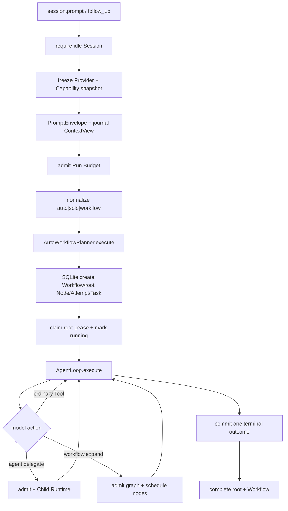
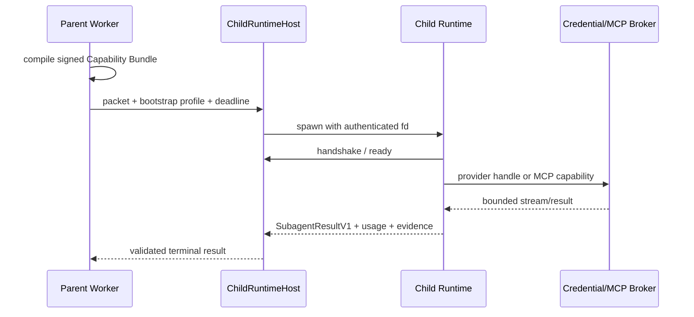

# RuntimeKernel、统一 Workflow 与 AgentLoop

本文沿真实调用顺序解释 `session.prompt`。新 Session 默认 `auto`；旧 Direct/Supervisor 不再是产品实现。

## 1. Composition Root

`RuntimeKernel` 构造并连接：SessionRepositoryV3、SqliteWorkflowAuthorityV1、SessionService、RunCoordinator、AgentLoop、AutoWorkflowPlannerV1、ProviderRouter、ToolRuntime、PolicyEngine、CredentialService、ArtifactStore、TraceService 与扩展系统。

父 Runtime bootstrap 时先初始化 Session backend，再初始化 `workflow-platform-v1.sqlite` 并调用 `recoverExpired()`。Child Runtime 因携带 `RuntimeAuthority`，不会打开父 Workflow DB，也不能处理父协议全部方法。

## 2. Prompt 主流程

每个 Prompt 都经过 Workflow fast lane。简单任务只多几次 SQLite 事务，不额外调用路由模型，也不创建 Child。

## 3. Policy

`PlannerRouter` 返回统一实现，只产生路由事实：

- `auto`：允许模型提案拓扑变化；
- `solo`：child budget 为零，不向模型暴露拓扑工具；
- `workflow`：使用同一工具和 Orchestrator，复杂副作用必须图化；
- `direct/supervisor`：解析期迁移别名。

v4 长生命周期策略取消默认累计执行预算：Root/Child 不再隐式设置 turns、Tool calls、tokens、wall clock、Child 总数、嵌套深度、loop 次数或图演化次数上限；只有 CLI、用户、组织策略或节点 Proposal 显式提供的 budget/deadline 才会终止健康任务。仍然逐轮记录 usage，取消传播、权限、上下文窗口和协议校验保持不变。内部仍要求数字的 v1 边界使用 `Number.MAX_SAFE_INTEGER`/Date-safe wall-clock 作为“unlimited”编码，而不是产品配额。Local Runtime 同时启动 Child 的容量仍为 256，这是 worker-pool 资源并发度，不限制生命周期内累计 Child 数。历史 Profile v1-v3 保持不可变以支持恢复。

## 4. SQLite Workflow Authority

SQLite 是 Workflow 的唯一当前本地 authority，不是 Session SQLite 的 sidecar projection。关键表：

| 表 | 内容 |
| --- | --- |
| `workflows` | 当前 projection、revision、sequence、state |
| `workflow_events` | append-only 领域事件 |
| `workflow_transactions` | transactionId 幂等结果 |
| `workflow_tasks` | ready/leased/completed/failed/unknown task |
| `workflow_outbox` | 与状态事务一起提交的待发布消息 |
| `workflow_timers` | durable timer 记录 |
| `workflow_signals` | `(workflowId, signalId)` 去重输入 |
| `workflow_human_tasks` | durable approval/input 记录 |
| `agent_profiles` | 版本化 Profile |

Create/transact/claim/recovery 使用 `BEGIN IMMEDIATE`，PRAGMA 为 WAL、FULL synchronous 和 foreign keys。Projection 由 reducer 应用 Event 得到；expectedSequence 提供 CAS。

### Lease

Task claim 写入随机 lease token、workerId、acquired/expires/heartbeat/progress 时间。Heartbeat 只延长拥有相同 token 的活跃 Lease。Conflict key 防止同一工作区的多个写 Agent 并发。

### Recovery

启动扫描过期 Lease：read/pure/idempotent effect 在 attempts 未耗尽时创建新 Attempt 和 ready Task；尝试耗尽进入 manual；workspace write 与 non-idempotent effect 进入 unknown。恢复不会把一次失联伪装成同一 Attempt 继续。

## 5. Root AgentLoop

AgentLoop 只处理一个 AgentTask：构造 Provider request、流式消费事件、验证 Tool Call、请求权限、并行执行无冲突 Tool、提交结构化消息、累计 usage、处理 steer/abort/compaction，并通过 terminal claim 保证一次结束。

Workflow Orchestrator 不解释模型文本；AgentLoop 不直接修改 Workflow graph。两者只通过 model-facing RuntimeTool 和结构化 proposal 连接。

## 6. agent.delegate

模型参数包含 Profile、objective、reason codes、tool/skill/MCP、workspace/network/delegation 和预算请求。Orchestrator：

1. 检查 mode、父节点 `mayDelegate` 和 Profile delegation policy；
2. 将请求与父 grant、Profile allowlist 求交；
3. GraphPatch 增加 Node；
4. 同一事务创建 Attempt、ready Task 与 Outbox；
5. Local Worker claim Lease、mark running；
6. Child 完成后 ack Task 并推进 Attempt/Node；
7. 结果作为 ToolResult 返回根 Agent。

如果 Child 超时或失败但已有 output/artifact/recovery path，这些内容仍在 ToolResult 中。父可以基于证据继续，不必从头读取。

## 7. workflow.expand

模型提交命名节点、Profile、objective、dependencies 和 workspace access。Runtime 拒绝重复 ID、悬空依赖和环。Graph 事件持久化后，ready 只读节点可并行；写节点按 conflict key 串行。每个节点仍由同一个 Local Worker Port 执行。

当前产品工具展开 AgentTask DAG；核心 NodeKind 中更长生命周期的 timer/human/subworkflow 等尚未全部开放。

## 8. 受授权 Child Runtime

Child 不是线程或 prompt 片段，而是 `ChildRuntimeHost` 启动的正式 Runtime 进程：

Bootstrap profile 指定 workspace、method allowlist、ephemeral roots、Provider target、bundle digest、deadline 和 trace parent。Child Session 使用 `solo`，因此不能再创建 Child；除此以外，它可拥有获准的 Builtin、Skill、MCP、Shell 和 workspace write。

Credential handle 有 deadline/token ceiling，不把 API Key 写入 child 环境、Prompt 或 Artifact。MCP capability 由父 broker 绑定具体 Tool descriptor 与 bundle digest。

## 9. Child Deadline 与预算

节点 timeout 合同仍包含 `totalMs/noProgressMs/heartbeatMs`，但 v4 默认不启用 Child no-progress 终止，且默认 total 使用内部 unlimited 编码；显式 deadline 仍取 Node、父 Run 和用户请求的较早者。超过 Node.js 原生约 24.8 天 timer 范围的显式期限由分段 timer 重挂，避免溢出后立即超时。Child turns/tools/tokens 只有在父 budget、Profile 或 Proposal 显式声明时才成为硬上限；普通 Child 的 descendant 权限仍为零，这是能力隔离而不是任务预算。

DeepSeek/Kimi/OpenAI-compatible Provider stream、Shell command、MCP Tool 与 Process Plugin capability invocation 在 v4 均无隐式执行超时；部署者可通过对应配置或调用参数显式设置。初始化、协议发现、取消和关闭等控制面握手仍有短 liveness deadline，它们不限制已经接受的任务生命周期。

超时 code 和 retryable 标志进入 Node/ToolResult。Lease expiry recovery 再依据 effect 决定 retry/unknown/manual。

## 10. 可写 Child

Child workspace access 为 `write` 时，Local Worker 先创建隔离目录。Git 仓库使用 detached worktree；非 Git 目录使用 Praxis 私有快照仓库。Capability Bundle 的 root 是隔离目录，而不是主目录。Git 路径成功后：

1. 检查 status；无变化则安全清理；
2. `git add --all` 并用禁用 hooks 的固定身份创建候选 commit；
3. 读取 binary full-index patch；
4. ControlledWorkspaceMerge 校验 commit 单父、base、patch digest、真实 changed files、授权 scope；
5. 验证主 HEAD 和 clean state；
6. `git merge --ff-only`；
7. 保存 merge artifact 并清理 worktree。

非 Git 路径复制安全文件、记录主目录基线摘要、在快照内运行 Child，然后把权限目标映射回用户工作区，并校验 changed files、授权 scope、RuleVerifier 和基线稳定性，在单写锁内回写。Praxis 不会修改用户目录的 Git 状态。Child 在已完成写工具后才超时时，完整工具证据与候选差异仍可进入相同的父侧验证；二者不一致则保留快照而不回写。任一条件不满足都返回结构化 blocked code 和 recovery path。

## 11. Session 双后端与 Context

SessionRepositoryV3 可选 JSONL 或 SQLite。JSONL 普通启动读取已校验 Catalog/Projection，Commit 只增量更新索引；`doctor --deep` 完整重放。两后端实现同一 SessionJournalPort，一次运行不双写。

父 Agent 的 ContextBuilder 使用 `journalContextView`。新 Run 会清除旧 `SessionMemory.plan`，Compaction 不再接收 CompactPlan。`session.plan` 查询最近 Workflow projection。

默认 Prompt 程序、唯一 Trusted Instructions、ContextView 冻结、Provider-only editing 和 checkpoint/native replay 的精确顺序见[Prompt、Context 与 Compaction](../../../docs/prompt-assembly.md)。

## 12. 终态

AgentLoop terminal 先完成根 Attempt/Node/Task，但根 AgentTask 成功不再直接等于 Workflow 完成。Authority reconciliation 按 `all_required` 独立检查持久化图：仍有 descendant 活动时 Workflow 保持 `running`，从 Node/Edge 重建后继调度并解析 decision join；全部 required 节点收敛后才写入 `workflow.terminal`。若 descendant 进入未被成功 quorum/any join 吸收的 failed/cancelled/unknown/manual，Workflow 使用 `WORKFLOW_DESCENDANT_FAILED` 或具体 code 失败。

进程重启后，后台 durable Worker 会先推进非根 DAG；成功节点保持原 Attempt，被打断的 Lease 才生成新 Attempt。Root 的恢复 Attempt 被推迟到 Child DAG 和 join 收敛之后，并接收所有 descendant 的持久化 `resultRef`。并行 Node 状态提交遇到 SQLite sequence CAS 冲突时读取新 projection 重试；被条件裁剪或依赖确定阻断的未领取 Task 会与 Node/Attempt 原子取消。

这是当前代码合同；实测证据仍要保守表述。旧实验曾出现 Workflow `completed` 而 reviewer 仍
`running`、synthesis/join 仍 `admitted` 的投影矛盾；当前主干随后完成一次确定性 MiniMax 硬重启
复测：相同 Workflow ID、成功节点 Attempt 不变、中断节点新 Attempt 接管、synthesis/quorum/root 收敛，
且最终没有非终态 Node、ready Task 或 leased Task。该问题已有单次端到端机器判据，但仍缺重复故障、
不同故障点和跨机统计，不能据此宣称生产级恢复 SLA。

UI 的 `workflow_update` 来自每次持久 projection。没有 UI callback 时，状态推进仍必须执行；通知只是副作用，不能包裹 `markRunning/complete`。

## 13. 入口文件

| 文件 | 作用 |
| --- | --- |
| `src/framework/runtimeKernel.ts` | 产品 composition 与 RPC |
| `src/workflow/autoWorkflowPlanner.ts` | Prompt → Workflow/root AgentTask |
| `src/workflow/workflowOrchestrator.ts` | admission 和状态推进 |
| `src/workflow/sqliteWorkflowAuthority.ts` | SQLite Task/Lease/event authority |
| `src/workflow/agentDelegateTool.ts` | 单 Agent 委派 Tool |
| `src/workflow/workflowExpandTool.ts` | Graph expansion Tool |
| `src/workflow/localWorkflowAgentWorker.ts` | Child、broker、worktree/snapshot merge |
| `src/planner/directoryWorkspaceIsolation.ts` | 非 Git 快照隔离与校验回写 |
| `src/loop/index.ts` | AgentTask ReAct |
| `src/planner/agentTaskPlanner.ts` | 内部 AgentLoop adapter |

## 14. 已验证边界与尚未完成

真实 Provider smoke 已覆盖 3 Child quorum、5 Child cross-review、结构化 Child 提交、失败后只恢复 synthesis 和 DeepSeek semantic compaction。pause/resume/cancel/terminate、Timer/HumanTask wake、认证远程 Authority/Artifact 边界和 receipt 驱动 Saga 账本已经接线。

尚未交付 PostgreSQL Authority、租户级分布式熔断、高可用通知、任意递归 subworkflow 和连接器声明驱动的自动补偿；重启终态一致性已有单次完整复测，但跨天 soak、重复故障和高并发远程 Worker 仍没有规模化证据。详见[项目状态](../../../docs/project-status.md)与[最终测评总结](../../../docs/evaluation-final-2026-08-09.md)。
