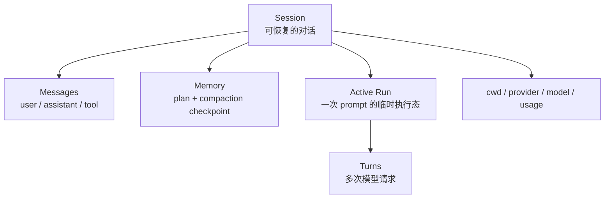
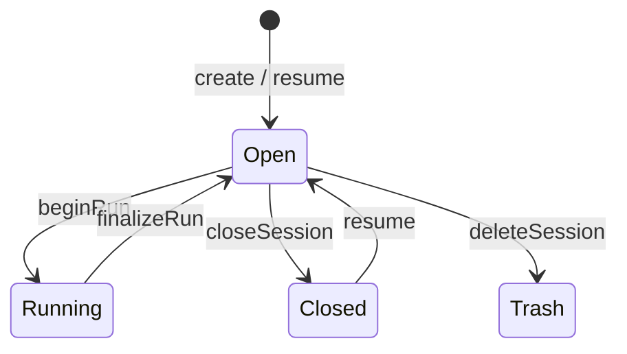
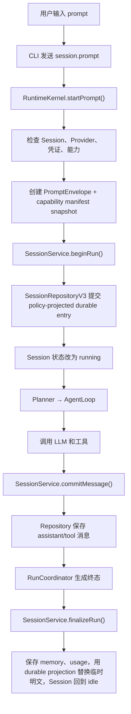
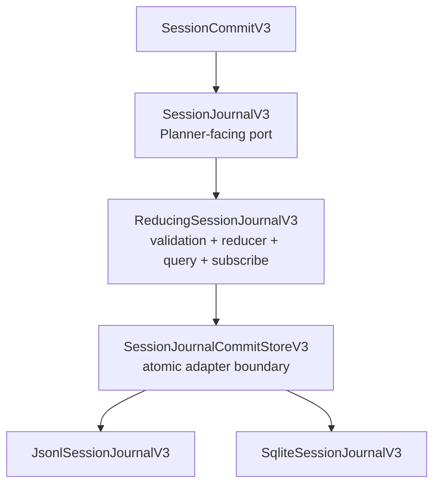
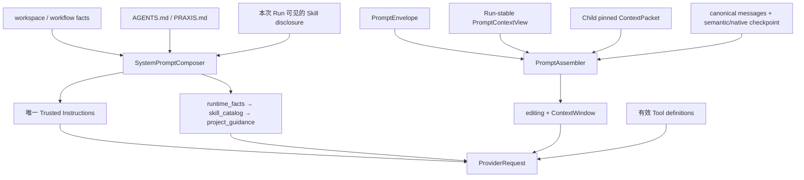

# 02：会话、持久化、Prompt 与上下文

> 阅读入口：[Runtime 总览](../readme.md) ·
> [Praxis 当前分层架构新手导读](../../../docs/planner-prompt-context-storage-guide.md) ·
> [会话恢复](../../../docs/session-recovery.md) · [Prompt 与上下文](../../../docs/prompt-assembly.md)。
> 普通产品的持久化事实是一个 `SessionJournalV3`
> authority：JSONL 默认、SQLite 显式；切换只走离线校验迁移，不双写。

## 先区分 Session、Run、Message、Memory



- Session 可以跨进程恢复，包含工作目录、模型选择、消息和 memory。
- Run 是一次 prompt 或 follow-up 的执行；结束后不再是 active run。
- Message 是提供给模型的对话单元，也是会话历史的主要内容。
- Memory 不是另一份完整聊天记录，而是计划与压缩 checkpoint 等派生状态。

## 1. `SessionService`：生命周期规则所在处

[`sessionService.ts`](../src/session/sessionService.ts) 位于 Kernel 与 repository 之间。Kernel 不应自己拼接会话文件；repository 也不应决定一个忙碌 session 能否再开 run。这些业务规则集中在 service 中。

主要路径：



`beginRun()` 会检查：会话是否可执行、是否已经有 active run、`clientRequestId` 是否重复，并以原子顺序保存用户消息和运行状态。`finalizeRun()` 负责提交终态相关数据；若持久化失败，调用者会得到明确的 persistence failure，而不是伪装成成功。

`RunCoordinator` 专门把 terminal event 映射为会话终态、usage 和 plan/memory 更新。把这段逻辑从 Kernel 拆出，能更容易测试“完成、失败、取消”三条路径是否一致。



## 2. `SessionRepositoryV3`：产品管理接口

`SessionService` 仍依赖稳定的 `SessionRepository`/`SessionManagementRepository`，但默认实现已经是
[`sessionRepositoryV3.ts`](../src/session-db/sessionRepositoryV3.ts)。Facade 把 create/update、message、
client request id、memory/checkpoint、terminal usage、list/search/export/fork/delete 等调用转换成 V3
entries/commits，并从 reducer projection 重建旧接口所需的 `SessionRecord` 与 `SessionMemory`。

这层兼容很重要：AgentLoop、SessionService 和 CLI 管理命令不需要了解 Backend。Planner mode、
`contextLimitTokens`、完整 compaction checkpoint、message 和
terminal usage 都能从同一个 Journal 重建。启动时还把未完成 Run/Plan 标记为 interrupted，避免进程崩溃后
把旧执行伪装成仍在运行。

删除不是直接擦掉 Journal：Repository 先在 `trash/session-journal-v3/` 写可移植 Session export，再追加
`session.deleted` tombstone。当前没有在线 Restore 命令。Fork 在指定 message 边界创建新 Session，并记录
父 Session 来源；branch 仍是 Praxis Session tree，不是 Git branch。

Legacy [`jsonlRepository.ts`](../src/session-db/jsonlRepository.ts) 仍服务三种明确场景：旧 v2 数据的一次性
迁移来源、child Ephemeral Root 的轻量隔离 Store、尚未纳入 Session Journal 的 Policy compatibility
store。它不再是普通产品 Session authority。`sessionV2.ts` 继续提供管理接口/导出兼容类型，不能据此推断
磁盘仍由 v2 主导。

## 3. `SessionJournalV3`：JSONL + SQLite 双后端

Session v3 把“领域事件怎样形成 Session/Run/Plan Projection”和“Commit 怎样原子落到某种介质”拆成两层：

先约定本节术语：`Composition` 是把 Port、Reducer 和一个 Backend 组装成可运行对象的代码；`Root` 是这组
数据的磁盘根目录；`Session Domain` 是该 Root 下所有 Session 共用的逻辑数据域；`Durable Authority` 是
该数据域唯一允许继续接受写入的后端。Parity 只表示后端可替换，绝不表示两个 Authority 同时工作。



`SessionJournalV3` 对 Planner 暴露 `appendCommit/readEntries/loadProjection/loadSnapshot/querySession/subscribe`；
它没有文件 Path、Offset、SQLite Connection 或 Transaction。`ReducingSessionJournalV3` 负责共享的验证、
Projection、Query、Subscription 与 Accepted Event；JSONL/SQLite Adapter 实现底层
`SessionJournalCommitStoreV3` 的 Atomic Commit 和固定 Head 读取。下文说“两个后端行为一致”时，指的是
“共享 Wrapper + 所选 Adapter”组成的完整 `SessionJournalV3`，不是两个 Adapter 各复制一份 Query 逻辑。

### 3.1 Atomic Commit 合同

一个 `SessionCommitV3` 包含：

- `sessionId`、`commitId`、`idempotencyKey`；
- `expectedRevision`，用于 Compare-and-swap；
- 一到 1,024 条同 Revision、Sequence 连续的 `SessionEntryV3`；
- Canonical Payload 的 SHA-256 Checksum。

两个后端都必须满足：

1. 新 Session 只能从 Revision 0、Sequence 1、`session.created` 开始；
2. Head Revision 或首个 Sequence 不匹配时返回 Conflict，不能自动覆盖；
3. 相同 Commit/Idempotency 身份与内容重试返回同一个 Receipt，并标记 `duplicate: true`；
4. 身份相同但内容不同属于冲突，不能把第二份内容当成 Retry；
5. `appendCommit()` Resolve 时，Commit 与幂等身份已经 Durable；Observer 只在 Durable Success 后收到
   `session.commit.accepted`；
6. 分页第一次返回的 Head 固定 `throughSequence`，后续页不能混入并发追加；
7. 两个后端必须经同一 `reduceSessionEntriesV3()` 得到一致 Projection。

### 3.2 JSONL 后端

正常启动使用经过 checksum 校验的 `catalog.json` + `catalog-delta.jsonl` + Projection 快速路径。
Commit 在追加 Journal 前建立 per-session `pending/` 标记，在 Projection 和 Catalog Delta 持久化后清除；
进程崩溃后只重放这些被标记的 Session。完整 Commit 重放、Projection 重建和 Catalog 压实只由
`praxis doctor --deep`（或旧 Store 首次升级）触发。Catalog 因而是“偶尔重建的基表 + 每 Commit 一条
增量”，而不是每次 Commit 重写全部会话。普通 `loadProjection` 也直接读取 Adapter 提供的已校验物化
Projection；没有该能力的自定义 Adapter 才回退到 Commit reducer。

`JsonlSessionJournalV3` 是 V3 Composition 的默认 Adapter：

```text
${PRAXIS_HOME}/session-journal-v3/
├─ commits/<encoded-session-id>.jsonl
├─ projections/<encoded-session-id>.json
├─ catalog.json
├─ catalog-delta.jsonl
├─ catalog-state.json
├─ pending/<encoded-session-id>.json
├─ authority.json
├─ migration-report.json
└─ artifacts/
```

每行不是裸 Entry，而是一个带 `formatVersion: 3`、完整 `SessionCommitV3` 和 `recordChecksum` 的 Commit
Record。写入顺序为：

```text
取得 session lock
→ 读取并校验已有 record/checksum
→ 修复唯一允许的 truncated final record
→ duplicate/CAS/sequence/reducer 验证
→ 写入并 fsync per-session pending marker
→ append record + fsync
→ 原子刷新 projection cache
→ 在 catalog lock 下 append catalog delta + fsync
→ 清除 pending marker
```

Commit 已 fsync、但 Projection/Delta 刷新失败时，下一次启动会按 pending marker 定点重放；调用方重试仍
按 Idempotency 识别 Durable Commit，不会追加第二份。中间 Record、Checksum 或 Sequence 损坏一律 Fail
Closed，并由显式 `doctor --deep` 全量发现。发现 Session v2 `sessions.json` 且 V3
Root 尚不存在时，Adapter 先创建 Migration Backup，再把 v2 Catalog/History/Memory 转成 V3 Commit Stream，
最后写入带 Source Digest 的 Migration Report。

这只是初始化时的一次性 Snapshot Migration，不会监听后续 v2 写入。安全产品切换必须先停止所有 v2
Writer，再初始化 V3；V3 Composition 一旦认领 `session-authority.json`，新的 v2 `JsonlRepository`
初始化会以 `SESSION_STORE_LEGACY_AUTHORITY_DISABLED` 拒绝，但框架不能替你终止已经在运行的旧进程。

### 3.3 SQLite 后端

`SqliteSessionJournalV3` 使用 Node `node:sqlite` 的 `DatabaseSync`，数据库文件为：

```text
${PRAXIS_HOME}/session-journal-v3.sqlite
```

初始化时固定并验证：

```sql
PRAGMA busy_timeout=5000;
PRAGMA journal_mode=WAL;
PRAGMA synchronous=FULL;
PRAGMA foreign_keys=ON;
```

Schema 由 STRICT `metadata`、`sessions`、`commits`、`entries` 表组成；`user_version` 高于支持版本时拒绝
启动。Commit 写入由进程内 Writer Queue 串行，再进入一个数据库事务：

```text
BEGIN IMMEDIATE
→ duplicate identity lookup
→ revision/sequence CAS
→ 读取旧 entries 并运行 shared reducer
→ INSERT commit
→ INSERT every entry
→ UPSERT session head + projection_json
→ COMMIT
```

Commit Row、Entries 或 Projection 任一点注入故障都会 `ROLLBACK`。Database Unique Constraint 同时保护
`(session, revision)`、Commit ID、Idempotency Key、Entry Sequence 与 Entry ID；Domain Validator 仍是第一
层，不能只依赖 SQLite Constraint 猜测业务错误。

### 3.4 Composition 选择一个 Authority

`createSessionJournalCompositionV3()` 接受 `configuration.session.store`，但默认 Factory Registry **只有
JSONL**：

```ts
const jsonl = await createSessionJournalCompositionV3({ root })
```

选择 SQLite 时必须显式注入 Adapter Factory：

```ts
const sqlite = await createSessionJournalCompositionV3({
  root,
  configuration: { session: { store: 'sqlite' } },
  factories: [sqliteSessionJournalFactoryV3()],
})
```

这是底层 Composition API 的注入规则。产品 `SessionRepositoryV3` 已注册 SQLite Factory：新数据根默认
JSONL，CLI `--storage sqlite` 或 `PRAXIS_SESSION_STORE=sqlite` 显式选择 SQLite。若 Node 运行时不提供
`node:sqlite`，返回 `SESSION_STORE_UNAVAILABLE`，不会静默回退。

Composition 在 `${PRAXIS_HOME}/session-authority.json` 保存：Store Kind、Generation ID、Created At 与
Checksum；选择过程由 `locks/session-authority.lock` 串行。它还检测实际 Backend Authority：JSONL 的
`session-journal-v3/authority.json` 和 SQLite 的 `session-journal-v3.sqlite`。

两层证据不要混为一谈：

| 层次 | 文件 | 作用 |
| --- | --- | --- |
| Composition 选择记录 | `session-authority.json` | 声明整个 Session Domain 被配置为哪个 Store Kind |
| Backend 实体证据 | JSONL `authority.json` 或 SQLite 数据库 | 证明磁盘上实际存在并可能包含数据的后端 |

启动时同时检查两层；一致才继续，不一致就 Fail Closed。全局 Marker 不会覆盖 Backend 实体，Backend 文件也
不会反向静默改配置。

| 情况 | 结果 |
| --- | --- |
| 没有旧 Authority，选择 JSONL | 创建 JSONL Marker 并初始化 |
| 选择 SQLite 且注入 Factory | 创建 SQLite Marker/Schema 并初始化 |
| 选择 SQLite 但没注入 Factory | `SESSION_STORE_UNAVAILABLE` |
| 配置与 Marker/实际 Backend 不一致 | `SESSION_STORE_SWITCH_REQUIRES_IMPORT` |
| Root 中同时检测到 JSONL 和 SQLite Authority | `SESSION_STORE_AUTHORITY_AMBIGUOUS` |
| Marker Checksum/Schema 无效 | `SESSION_STORE_AUTHORITY_INVALID` |
| Factory 重复、类型错误或接口不完整 | `SESSION_STORE_FACTORY_INVALID` |

因此双后端要求的正确表达是：

> JSONL 和 SQLite 都必须满足同一个 Port/Parity Contract，但一个 Composition、一个 Root、一个 Session
> Domain 同时只能有一个 Durable Authority。

### 3.5 Export/Import 切换，永不双写

后端切换的底层数据迁移通过 Core SDK 的 Portable Archive：

```text
source: exportSessionJournalV3()
→ validate ordered sessions/commits/checksums/reducer
→ target: importSessionJournalV3()
→ target re-export
→ compare archive checksum + canonical session/commit identity
→ verified: true
```

Target 必须为空，或者只能包含 Source 的完全相同前缀；额外 Session、Diverged Commit 或较长 Target 都
返回 `SESSION_IMPORT_TARGET_DIVERGED`。Import 可安全重试并统计 Accepted/Duplicate，但不会让 Source 与
Target 进入长期 Mirror。Portable SQLite → JSONL Fallback 也是一次 Export/Import；Source 在迁移期间及
之后都不由框架自动双写。

产品 CLI 已把两个临时 Root 的 Primitive 包成离线 Cutover：

```bash
praxis storage migrate sqlite
praxis storage migrate jsonl --json
praxis storage migrate sqlite --home <PRAXIS_HOME>
```

命令必须在所有共用该 Root 的 Runtime 停止后运行。它持有 migration lock，拒绝存活 Runtime lease，清理
PID 已不存在的 crash-stale lease；随后 Export Source → staging Import → 使用同一 `exportedAt` 回读并比较
Checksum → 把旧 marker/backend 移到 `migration-backups/` → 安装 Target → 原子写新 marker。安装异常会把
旧 backend/marker 恢复到原位。`--storage` 只声明 Runtime 预期后端，`/storage` 只读查询；都不触发迁移。

### 3.6 Parity 与当前产品边界

以下合同对 `jsonl|sqlite` 两个 Backend 使用同一组场景：Atomicity Fault Points、CAS/Idempotency、固定
Head 分页、Projection/Query、Compaction、DAG Recovery、Replan、Portable Transfer、随机 Commit Stream
和 Export Checksum。对应测试集中在：

- `test/session-journal-sqlite-v3.test.ts`
- `test/session-journal-transfer-parity.test.ts`
- `test/session-journal-composition.test.ts`
- `test/session-compaction-v3.test.ts`
- `test/dag-recovery.test.ts`
- `test/replan-coordinator.test.ts`

当前接线矩阵：

| 消费者 | 接线状态 |
| --- | --- |
| 普通 CLI / `RuntimeKernel` | `SessionRepositoryV3`；JSONL 默认，SQLite 显式 |
| 受认证 child Runtime | 自己 Ephemeral Root 下的轻量 `JsonlRepository`，不打开 Parent authority |
| Root Agent/Compaction | 共用 Parent `SessionJournalV3`，不建聊天 sidecar |
| Workflow/Recovery/写隔离 | 使用独立 Workflow SQLite authority；未知副作用 crash continuation 禁用 |
| Authority 运维 | `--storage` 启动选择、`/storage` 只读查询、`storage migrate` 离线 Cutover |

所以准确结论是：普通用户路径已使用 V3，默认选择 JSONL；SQLite 需要显式选择并要求可用的
`node:sqlite`。Portable Fallback 是停止 Runtime 后经校验切换单一 Authority，不是在线 Mirror 或自动
故障转移。

## 4. Prompt 不是只有用户那句话

给 Provider 的请求通常由以下部分组成：



### `ProjectInstructionLoader`

从当前 Session 的 workspace 根目录读取 `AGENTS.md` 与 `PRAXIS.md`，并限制单文件、总字节和目录边界。它只读取可信范围内的普通文件，避免一个超大说明文件吞掉上下文。

### `ContextBuilder`

把 cwd、Provider 能力、工具定义、项目指令和 skill disclosures 汇总为 `PromptBuildInput`。它负责收集，不负责最后的排版与裁剪。

### `SystemPromptComposer`

默认 `iron-law-lean-v1` 恰好生成一个 `praxis.trusted-instructions`，再把 `runtime_facts`、`skill_catalog` 和 `project_guidance` 作为按预算裁剪的中性 context message 返回。manifest 记录 variant、唯一 block、各 section 的 included/digest/token 和 project instruction 决策，供 trace 和调试使用。`baseline-v1` 只用于显式回滚/A-B；所有调用点的默认都来自 `promptRegistry.ts` 的 `DEFAULT_PROMPT_VARIANT`。

这里的工具定义不直接拼进 system prompt，而是作为 `ProviderRequest.tools` 单独发送；ContextWindow 会为工具 schema 预留 token。完整的输入路由、ProviderRequest 字段、compaction 现状和目标设计见 [`docs/prompt-assembly.md`](../../../docs/prompt-assembly.md)。

[`PromptAssembler`](../src/prompt/promptAssembler.ts) 是 Root/Child AgentTask 共用的组装边界。它按 pinned Child ContextPacket、`PromptContextView`、native/semantic checkpoint、最近消息后缀的顺序生成 Provider context，并生成不含 Prompt plaintext 的 assembly manifest。父产品 Session 使用 `session_journal_v3` authority；没有 Journal Port 的兼容 repository/Child 临时 Session 才生成 `compatibility_v2` view。Backend 切换仍必须离线 Cutover，不能双写。

`AgentLoop` 最后拼成：Trusted Instructions → composer context → assembler context → recent messages；Tool definitions 独立发送。一次 Run 的 ContextView 首次选择后冻结，成功 compact 才换代，新 Tool/Workflow 状态继续作为 durable messages 追加。这既保留状态，又避免每轮变化的 ContextView 打断 Provider cache 前缀。

## 5. 上下文窗口选择

模型有最大上下文，不能把整个历史无条件塞进去。`selectContextWindow()` 的预算大致是：

```text
contextWindow
- system prompt
- PromptContextView
- tool schemas
- 预留 response tokens
- safety margin
= 可用于历史消息的 tokens
```

assembler 先为有界 ContextView 预留 token；选择器再优先保留精确匹配的 Provider-native context，其次使用 portable semantic checkpoint，并追加最新消息，返回
selection report，说明选了多少、丢了多少、估算 token 数是多少。窗口按 message 从后向前选择，但会
移除 token cut 留下的开头孤立 Tool result；Compaction cut point 则只落在完整 turn/tool/skill 边界。
因此 Provider 不会收到缺少 assistant Tool call 的结果，PromptEnvelope/ContextView 合同保持不变。

[`tokenizer.ts`](../src/memory/tokenizer.ts) 提供按 Provider 选择的估算器。这里的计数用于预算控制，不承诺与远端计费 token 完全相同；最终 usage 仍以 Provider 返回为准。

## 6. Compaction 不是删除历史

[`CompactionService`](../src/memory/compactionService.ts) 把较早消息压缩成 checkpoint，其中保留：目标、约束、决策、工具状态、skill 调用和未解决事项等。原始历史仍由 repository 保存；checkpoint 是以后组装模型上下文时的浓缩入口。

checkpoint 有两层。portable semantic checkpoint 始终生成，是跨 Provider、切换模型和故障恢复的底座；若当前 Provider 暴露 `compact()`，Runtime 还可把实际 ProviderRequest 交给原生 compact 端点，并把 opaque items 与 semantic checkpoint 一起原子持久化。下一轮只有 provider、model、instructions digest 和覆盖范围匹配且预算容纳时才重放 native state，否则自动回退 semantic。当前 OpenAI Responses 已接独立 `/v1/responses/compact`，Child 可通过独立 credential-broker compact RPC 使用同一能力且拿不到 API key；DeepSeek、Kimi、通用 Chat-compatible 与 Anthropic 当前使用 semantic fallback。

Child 还有独立于 checkpoint 的 pinned ContextPacket。它来自已认证 bootstrap，包含完整 objective、约束、禁止项、output schema、criterion ID 和前驱引用，每轮固定重放，不能被窗口选择或 compaction 删除。checkpoint 只压缩执行进度；其中的 `relevantRefs` 在模型摘要遗漏或多次 checkpoint replacement 时仍由 deterministic overlay 保留。这样长 Child 不会在压缩后丢失原任务或前驱 Artifact 权限线索。

触发方式包括：

- 手动 `session.compact`。
- 上下文达到阈值。
- Provider 报 context overflow 后尝试压缩再执行。

`ContextPolicy` 显式控制 threshold、hysteresis、reserve、保留 token、64K 软阈值和
`body_after_checkpoint/total` 计数范围；`CompactionPolicy` 控制最小收益、
摘要上限、overflow retry 以及模型摘要的 deadline/cost。cut point 只落在稳定 entry boundary：不拆未配齐
的 tool call/result、Skill turn 或最新未完成后缀，完成的 tool round 则可以增量进入 checkpoint。

默认 `DeterministicSummaryGenerator` 生成可重复摘要。Runtime composition 可以注入模型摘要器，但其输出
必须通过 deadline、成本、结构和 token 上限，失败回退 deterministic generator。checkpoint 始终 low
trust 并绑定 parent/child Session scope；fork 不复制 parent checkpoint。这里的 estimated tokens/gain 只用于
上下文预算，不会伪装成 Provider 计费 usage。overflow 每个 Provider turn 最多重试一次，无进展返回稳定错误。

在窗口选择之前还有一层 provider-only context editing。非 Skill Tool result 先受单结果 token 预算约束；
累计的可重放 `read/none` 结果超过阈值后，只清理最旧结果，保留最近结果和 tool call/result ID。
`write/process/network`、Agent/Workflow Tool 和 Skill invocation 不做陈旧结果清理。这个视图不会写回
SessionJournal；Trace 只记录编辑前后 token 与清理数量，不记录 payload。默认策略和工业界比较见
[`docs/prompt-assembly.md`](../../../docs/prompt-assembly.md)。

Reasoning/thinking 使用独立的 Provider-only editor，并且先于 Tool result editing 执行。默认总量超过约 8K 估算 token 才清理旧 block，保留最近一个 reasoning-bearing assistant turn；text、tool call 和 canonical SessionJournal 都不改写。OpenAI Responses 与 Anthropic adapter 不把展示 reasoning 伪造成普通 assistant text；DeepSeek 最近的 Tool-thinking 仍按 `reasoning_content` 协议重放。

原生 compact 状态和 SessionJournal 单条事件不设整包字节硬上限；校验仍要求合法 JSON、有限嵌套深度、固定字段/ID/digest、有限列表和合法 reducer 转移。这样长任务不会因 1 MiB/8 MiB 的不一致上限在落盘时失败。

## 7. ArtifactStore：让大结果离开主上下文

工具输出超过该工具 descriptor 的 `maxInlineBytes` 时，`ToolRuntime` 会自动写入 artifact store，只把 `artifact_ref` 和摘要留在结果中。当前内置上限通常是 64 KiB，`write/edit` 为 16 KiB；插件工具未声明执行 descriptor 时采用保守的 64 KiB。artifact id 由内容摘要构造，读取时再次校验格式和内容。这既降低上下文成本，也避免客户端事件携带无限大 payload。

`ToolRuntime` 默认会额外注册 `artifact_read`，所以模型能分段取回引用内容；`artifacts.list` RPC 供客户端列出 artifact。`ArtifactReadTool` 位于工具专题，因为它是模型侧入口；`ArtifactStore` 位于本篇，因为它是状态保存组件。两者默认使用相同的 `${PRAXIS_HOME}/artifacts` 路径。

## 8. Settings 与兼容类型

[`UserSettingsStore`](../src/settings/userSettingsStore.ts) 保存 `settings.json`，目前主要是默认 Provider/model preference。它是用户默认值，不是 session 的最终值：新建会话时会解析设置和可用能力，已有 session 则保留自身配置。

`store/sessionStore.ts` 只是把核心 SDK 的 `SessionRecord` 以旧名称 `StoredSession` 重新导出，没有独立数据库实现。

## 本篇文件索引

| 文件 | 作用 |
| --- | --- |
| [`src/artifacts/artifactStore.ts`](../src/artifacts/artifactStore.ts) | 按内容摘要保存、列出和读取大对象 artifact。 |
| [`src/session/index.ts`](../src/session/index.ts) | Session 模块统一导出。 |
| [`src/session/sessionService.ts`](../src/session/sessionService.ts) | 会话与 run 生命周期、业务约束和 repository 协调。 |
| [`src/session/runCoordinator.ts`](../src/session/runCoordinator.ts) | 把 run 终止事件转换成持久化状态与 usage。 |
| [`src/session-db/index.ts`](../src/session-db/index.ts) | Session DB 模块统一导出。 |
| [`src/session-db/sessionRepositoryV3.ts`](../src/session-db/sessionRepositoryV3.ts) | 产品 Repository Facade，把管理接口映射到一个 V3 authority。 |
| [`src/session-db/jsonlRepository.ts`](../src/session-db/jsonlRepository.ts) | Legacy v2 migration、child 临时 Store 与 Policy compatibility。 |
| [`src/session-db/sessionV2.ts`](../src/session-db/sessionV2.ts) | 管理/导出兼容接口和 legacy v2 类型。 |
| [`src/session-db/sessionJournalComposition.ts`](../src/session-db/sessionJournalComposition.ts) | 选择一个 V3 Backend Factory，持有 Authority Marker/Lock，并拒绝双权威。 |
| [`src/session-db/sessionStorageMigration.ts`](../src/session-db/sessionStorageMigration.ts) | Runtime lease 检查、staging 校验、备份、Cutover 与回滚。 |
| [`src/session-db/jsonlSessionJournalV3.ts`](../src/session-db/jsonlSessionJournalV3.ts) | V3 JSONL Commit Store、v2 Migration、Projection/Cache 和 Tail Repair。 |
| [`src/session-db/sqliteSessionJournalV3.ts`](../src/session-db/sqliteSessionJournalV3.ts) | V3 SQLite Transaction Store、STRICT Schema、Profile 与 Factory。 |
| [`packages/core-sdk/session-journal-port.ts`](../../../packages/core-sdk/src/session-journal-port.ts) | Backend-neutral Commit/Read/Projection/Query Port 与 Reducer Wrapper。 |
| [`packages/core-sdk/session-journal-transfer.ts`](../../../packages/core-sdk/src/session-journal-transfer.ts) | Portable Archive、Import Prefix 验证与回读 Checksum。 |
| [`src/memory/index.ts`](../src/memory/index.ts) | Memory 模块统一导出。 |
| [`src/memory/contextWindow.ts`](../src/memory/contextWindow.ts) | 按预算选 checkpoint 与近期消息。 |
| [`src/memory/reasoningContextEditing.ts`](../src/memory/reasoningContextEditing.ts) | 清理 Provider 视图中的旧 reasoning/thinking block。 |
| [`src/memory/contextEditing.ts`](../src/memory/contextEditing.ts) | Provider-only Tool result 裁剪与陈旧结果清理。 |
| [`src/memory/compactionService.ts`](../src/memory/compactionService.ts) | 把旧历史压缩为有界结构化 checkpoint。 |
| [`src/memory/tokenizer.ts`](../src/memory/tokenizer.ts) | Provider 对应的保守 token 估算器。 |
| [`src/prompt/index.ts`](../src/prompt/index.ts) | Prompt 模块统一导出。 |
| [`src/prompt/promptRegistry.ts`](../src/prompt/promptRegistry.ts) | Prompt variant、唯一默认、Trusted Instructions 编译与 program manifest。 |
| [`src/prompt/contextBuilder.ts`](../src/prompt/contextBuilder.ts) | 收集构建 system prompt 所需上下文。 |
| [`src/prompt/contextView.ts`](../src/prompt/contextView.ts) | 把 V2 compatibility/V3 journal projection 映射成同一 ContextView。 |
| [`src/prompt/promptAssembler.ts`](../src/prompt/promptAssembler.ts) | 组合 envelope、ContextView、窗口、capability/target manifest。 |
| [`src/prompt/promptPersistence.ts`](../src/prompt/promptPersistence.ts) | 按 policy 持久化输入并 redact 敏感 command/provider 回显。 |
| [`src/prompt/projectInstructionLoader.ts`](../src/prompt/projectInstructionLoader.ts) | 安全发现和读取项目指令文件。 |
| [`src/prompt/systemPromptComposer.ts`](../src/prompt/systemPromptComposer.ts) | 在预算内组合 prompt，并生成 manifest。 |
| [`src/settings/index.ts`](../src/settings/index.ts) | Settings 模块统一导出。 |
| [`src/settings/userSettingsStore.ts`](../src/settings/userSettingsStore.ts) | 读取/原子写入用户默认模型设置。 |
| [`src/store/sessionStore.ts`](../src/store/sessionStore.ts) | `SessionRecord` 的兼容类型导出。 |

## 新手验证题

如果关闭 CLI 再恢复会话，历史为什么还在？因为它已经进入 V3 durable commit；如果 Runtime 在一次 Run
中途崩溃，为什么不能只看 `catalog.json` 或 SQLite `sessions` 表判断发生了什么？因为它们只是 projection，
恢复必须以完整 Journal entries、commit identity 和 reducer/终态规则为准。
