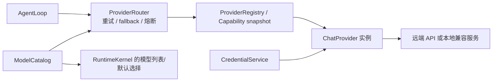
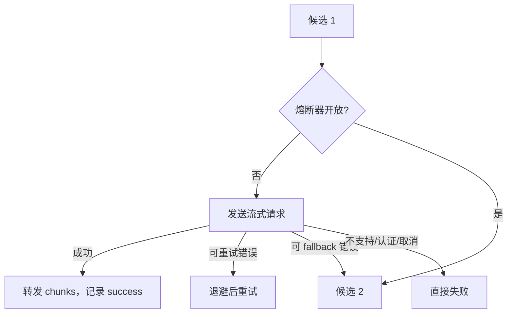
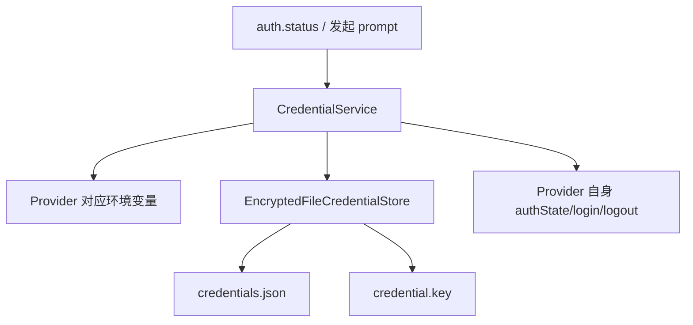

# 03：Provider、模型路由、认证与设置

> 阅读入口：[Runtime 总览](../readme.md) · [Provider 配置](../../../docs/provider-setup.md) ·
> [项目状态](../../../docs/project-status.md)。Router 支持显式 Fallback 机制，但 Shipping CLI 没有配置
> Production Fallback Route；Reasoning Level 仍只是 Catalog Metadata。

## 模块分工

Provider 是“怎样和某类模型 API 对话”的适配器；Router 是“这次该用哪个 Provider、失败后怎么办”的运行策略；ModelCatalog 是“模型有哪些能力和限制”的数据；CredentialService 是“认证信息从哪里拿”。这四者不要混为一个 registry。

## 1. 统一 Provider 契约

Provider 实现 `ChatProvider`，核心行为是接收统一 `ProviderRequest`，异步产生 `ProviderChunk`。Chunk 可以表达文本、reasoning、tool call、usage 和结束原因。`providers/types.ts` 重新导出核心类型，让具体适配器不必依赖协议层。

所有适配器都要完成两次转换：

- 请求侧：Praxis message/tool schema → 厂商请求体。
- 响应侧：厂商 SSE/流式对象 → Praxis `ProviderChunk`。

因此 AgentLoop 不需要知道 Anthropic content block 和 OpenAI response item 的差异。

## 2. 内置 Provider

[`llm-provider/builtinProviders.ts`](../src/llm-provider/builtinProviders.ts) 创建随 Runtime 注册的内置集合：mock、Kimi、DeepSeek V4、Anthropic、OpenAI Responses、Qwen、MiniMax、本地 OpenAI-compatible 和 OpenAI Chat-compatible。“已注册”不等于“已认证”或“已选中”。

新建 session 时，显式请求优先，其次是可用的用户默认设置；都没有时，已认证的 Kimi 会成为默认，否则回退到 `mock`。因此 mock 不只是测试类：它还是零配置启动时的确定性默认 Provider，但不会调用真实模型服务。

| 实现 | 说明 |
| --- | --- |
| `AnthropicProvider` | 生成 Anthropic Messages 请求并解析流式事件。 |
| `OpenAIResponsesProvider` | 面向 OpenAI Responses API 的适配器。 |
| `OpenAICompatibleProvider` | 面向 Chat Completions 兼容协议；也提供本地服务工厂。 |
| `KimiProvider` | 在兼容适配器上固定 Moonshot base URL 与能力。 |
| `DeepSeekProvider` | 适配 DeepSeek V4，并在思考模式 Tool-call 后回传 `reasoning_content`。 |
| Qwen/MiniMax factories | 按不同 token plan/端点创建多个 Provider；MiniMax 的区域 ID、endpoint、环境变量和默认模型统一来自 `minimaxConfig.ts`。 |
| `MockProvider` | 本地确定性响应和简单工具调用，适合开发测试。 |

Anthropic-compatible 流的 usage 不能只读取 `message_start`：MiniMax 会在开始事件返回零占位，并在 `message_delta` 返回最终 `input_tokens`/`output_tokens`。adapter 会合并两个位置并取合法最大值，避免把真实输入记成 0，缓存读写计数也采用同样规则。

MiniMax CN 的 M2.7 与 M3 已分别完成真实最小 smoke，均 exit 0 并返回预期文本；同一个 CN token 对国际 endpoint 返回 `PROVIDER_AUTH_REQUIRED`，所以 region/provider ID 必须与 token plan 对应，不能静默跨区 fallback。结果索引见[最终测评总结](../../../docs/evaluation-final-2026-08-09.md)。

`providers/registry.ts` 与 `llm-provider/providerRegistry.ts` 名字相近：前者是基础 Provider 实例 registry；后者保存带来源/优先级语义的通用注册条目。当前主要运行路径还会通过扩展 capability registry 获得 run 级快照。

## 3. 能力与 ModelCatalog

能力声明包括工具调用模式、流式支持、最大上下文、最大输出等。Provider 自身声明接口能力，`modelCatalog.ts` 再描述具体模型差异；`effectiveProviderCapabilities()` 取安全交集。

这意味着：Provider 代码“理论上支持工具”不代表每个模型都支持。Router 在请求前校验有效能力，避免把不支持的工具 schema 或超限输出发给模型。

ModelCatalog 也保存价格、生命周期和来源信息，供 `models.list`、默认模型选择和指标使用。新增模型时不要只在环境变量里改默认名，还要考虑 catalog 与真实能力。

## 4. `ProviderRouter.stream()`

Router 主要处理：

1. 解析候选 Provider/model。
2. 检查 capability 与 circuit 状态。
3. 为每次尝试准备请求，包括重新计算有效输出上限。
4. 流式转发 chunk，不缓存完整回答才交给上层。
5. 规范化错误，按错误类别决定退避重试或 fallback。
6. 更新健康状态并记录 trace。

已经输出可见内容后切换 Provider 很危险，可能产生两个回答拼接。因此 fallback 受“是否已越过输出边界”等条件限制，不能理解为任何错误都透明换模型。

## 5. SSE 与内容转换

[`sse.ts`](../src/providers/sse.ts) 是通用 SSE 帧解析器，也读取 retry/rate-limit 相关响应头。各 Provider 仍负责解释自己事件里的字段。

[`contentConversion.ts`](../src/providers/contentConversion.ts) 把结构化 Provider content（文本、引用等）变成适合会话和显示的文本，同时保留语义边界。它不是网络层，也不决定 token 预算。

## 6. 凭证解析与保存

`CredentialService` 统一登录、登出、状态和刷新，并按 Provider 解析常见环境变量名。解析优先级为显式传入值 → Provider 专属 store → Runtime 环境变量；`auth.status` 还能报告来源与对应变量名。默认 store 是 `EncryptedFileCredentialStore`：凭证值加密后写入 `credentials.json`，本地密钥单独保存在 `credential.key`。

`credentialStore.ts` 还提供明文文件 store 接口/实现，主要便于替换与测试；生产默认不使用它保存裸值。`credentials/index.ts` 是统一导出。

重要结论：prompt RPC 通常不包含 API key。Runtime 在自己的进程环境或凭证存储里解析 key，Provider 发 HTTP 请求时才使用它。

## 7. Process Provider

扩展可以在独立进程里实现 Provider。`extensions/processProvider.ts` 把 process plugin client 包装成标准 `ChatProvider`，并用异步 chunk queue 将插件事件转换为 Provider 流。它属于 Provider 路径，但生命周期由扩展专题中的 activation service 管理。

## 本篇文件索引

| 文件 | 作用 |
| --- | --- |
| [`src/llm-provider/builtinProviders.ts`](../src/llm-provider/builtinProviders.ts) | 创建内置 Provider 集合。 |
| [`src/llm-provider/providerRegistry.ts`](../src/llm-provider/providerRegistry.ts) | 带来源信息的 Provider 注册表。 |
| [`src/provider-router/index.ts`](../src/provider-router/index.ts) | Router 模块统一导出。 |
| [`src/provider-router/providerRouter.ts`](../src/provider-router/providerRouter.ts) | 能力校验、流式请求、重试、fallback、熔断和健康状态。 |
| [`src/providers/types.ts`](../src/providers/types.ts) | Provider 公共类型的重导出。 |
| [`src/providers/registry.ts`](../src/providers/registry.ts) | 基础 Provider 实例注册和查找。 |
| [`src/providers/modelCatalog.ts`](../src/providers/modelCatalog.ts) | 模型能力、限制、价格、生命周期与来源目录。 |
| [`src/providers/sse.ts`](../src/providers/sse.ts) | SSE 流解析与限流头辅助。 |
| [`src/providers/contentConversion.ts`](../src/providers/contentConversion.ts) | 结构化 Provider content 的文本化转换。 |
| [`src/providers/anthropicProvider.ts`](../src/providers/anthropicProvider.ts) | Anthropic Messages API 适配。 |
| [`src/providers/openAIResponsesProvider.ts`](../src/providers/openAIResponsesProvider.ts) | OpenAI Responses API 适配。 |
| [`src/providers/openAiCompatibleProvider.ts`](../src/providers/openAiCompatibleProvider.ts) | OpenAI Chat-compatible 与本地模型适配。 |
| [`src/providers/kimiProvider.ts`](../src/providers/kimiProvider.ts) | Kimi/Moonshot 兼容 Provider 配置。 |
| [`src/providers/deepSeekProvider.ts`](../src/providers/deepSeekProvider.ts) | DeepSeek V4、思考模式和 Tool-call 历史兼容配置。 |
| [`src/providers/qwenTokenPlanProvider.ts`](../src/providers/qwenTokenPlanProvider.ts) | 创建 Qwen 不同 token plan Provider。 |
| [`src/providers/minimaxProvider.ts`](../src/providers/minimaxProvider.ts) | 创建 MiniMax Provider 集合。 |
| [`src/providers/minimaxConfig.ts`](../src/providers/minimaxConfig.ts) | MiniMax 区域 ID、endpoint、凭据环境变量和默认模型的唯一配置源。 |
| [`src/providers/mockProvider.ts`](../src/providers/mockProvider.ts) | 确定性 mock Provider，支持简单工具调用测试。 |
| [`src/credentials/index.ts`](../src/credentials/index.ts) | Credential 模块统一导出。 |
| [`src/credentials/credentialService.ts`](../src/credentials/credentialService.ts) | 认证状态、登录/登出、刷新及环境变量解析。 |
| [`src/credentials/credentialStore.ts`](../src/credentials/credentialStore.ts) | 凭证存储接口与明文文件实现。 |
| [`src/credentials/encryptedCredentialStore.ts`](../src/credentials/encryptedCredentialStore.ts) | 默认的本地加密凭证 store。 |
| [`src/extensions/processProvider.ts`](../src/extensions/processProvider.ts) | 将进程插件 Provider 包装为 `ChatProvider`。 |

## 增加 Provider 时的检查表

- 明确 Provider id、默认模型和认证环境变量。
- 声明真实 capabilities 与上下文/输出限制。
- 把所有厂商事件转换为统一 chunk，并响应 `AbortSignal`。
- 返回准确 usage，规范化限流、认证、超时和服务错误。
- 加入内置 registry 或扩展注册路径，并补充 ModelCatalog。
- 用 mock/replay 覆盖纯文本、工具调用、取消、限流和半途失败。
