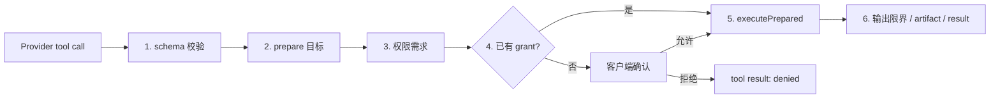

# 04：工具、权限与安全边界

> 阅读入口：[Runtime 总览](../readme.md) · [工具策略](../../../docs/tool-policy.md) ·
> [威胁模型](../../../docs/security-threat-model.md)。Policy 控制 Praxis 是否执行动作，不是 OS Sandbox；
> 允许后的文件、Shell 或进程副作用不会自动回滚。

## 工具调用的六道关

模型返回一个 tool call，不会直接变成 `writeFile()` 或子进程。标准路径是：

`ToolRuntime` 是这条边界的统一实现。具体工具只负责自己的参数、目标和动作；Loop 负责把权限事件和 tool result 接回对话。

## 1. 内置工具集合

`createBuiltinTools()` 提供八个基础工具；`ExtensionService` 随后构造 `ToolRuntime`，后者默认再补上 `artifact_read`，所以正常 run 的稳定基础集合是九个：

| 工具 | 作用 | 主要风险 |
| --- | --- | --- |
| `read` | 按行读取文本文件 | 读取工作区外或敏感文件 |
| `glob` | 用 glob 模式查找路径 | 大范围枚举 |
| `grep` | 在文件中搜索文本/正则 | 大范围读取与输出 |
| `ls` | 列目录 | 暴露目录信息 |
| `find` | 按名称递归寻找 | 大范围枚举 |
| `write` | 创建/覆盖文件 | 数据破坏、竞态、越界写入 |
| `edit` | 精确替换已有文本 | 错文件/错位置修改 |
| `shell` | 执行 PowerShell 或 POSIX shell | 任意进程和系统副作用 |
| `artifact_read` | 分段读取 Runtime 已保存的大工具结果 | 读取已知 artifact；不访问任意文件路径 |

内置插件的静态 descriptor 给 `write/edit/shell` 高权限等级，给 `read/ls/find` 条件权限，给 `glob/grep` 标为 none；`artifact_read` 是 ToolRuntime 后加的工具。真正执行时，动态规则更具体：`read/ls/find` 只有目标在 workspace 外才请求 medium 权限；`write/edit/shell` 对解析后的目标请求 high 权限；`glob/grep/artifact_read` 没有额外动态请求。等级是能力元数据，Runtime 执行判断以准备后的 input、workspace、target 和 policy rule 为准。

`ArtifactReadTool` 虽不由 `createBuiltinTools()` 返回，但 `ToolRuntime` 默认注册它。工具结果超过 descriptor 的 `maxInlineBytes` 时会自动落入共享 ArtifactStore，并返回 `artifact_ref`；模型随后可用 `artifact_read` 分段读取。`ToolRuntime.fork()` 只派生本 run 的工具注册视图，不创建 session、进程或子智能体。

## 2. `ToolRuntime`

[`toolRuntime.ts`](../src/tools/toolRuntime.ts) 的重要方法：

- `register()`：编译并保存工具 JSON schema，拒绝重名。
- `definitions()`：给 Provider 的工具定义快照。
- `validateInput()`：使用 AJV 校验模型参数，错误转为 `ToolResult`。
- `prepare()`：让工具解析目标并返回 `PreparedToolInvocation`。
- `permissionRequirement()`：结合 descriptor 和准备结果生成风险、rule、target。
- `executePrepared()`：确认准备目标未改变，再执行并标准化失败/输出。
- `fork()`：为某个 run 从稳定工具集派生额外工具，例如 skill tool。

Runtime 对外提供的是工具定义快照，实际调用仍按名称回到注册实例。这样 Provider 只能请求已公布的工具。

## 3. 工作区路径与 TOCTOU

`resolveWorkspacePath()` 不只是 `resolve(cwd, input)`。它会生成规范目标、检查路径是否仍在允许范围，并尽可能捕获文件身份。执行前 `matchesTargetIdentity()` 再比较，减少以下攻击/竞态：

1. 授权时路径指向工作区内普通文件。
2. 等待用户点击期间，路径被换成 symlink 或文件被替换。
3. 执行时实际操作了另一个目标。

`canonicalGrantPath()` 把授权目标规范为包含 `${workspace}` 占位符的稳定规则，避免把同名相对路径错误复用于其他工作区。归档入口也先经 `validateArchiveEntryPaths()`，防止 `../` 路径穿越。

## 4. Policy 与客户端权限决定

`PolicyEngine` 初始化时加载持久 grant。调用工具时：

1. Kernel 询问 `policy.allows({workspace, tool, rule, target})`。
2. 没有匹配规则则发 `permission_request` 事件。
3. CLI 展示工具、输入、风险和目标，并调用 `permission.decide`。
4. `allow_always` 写入 grant；其他决定写审计记录。
5. 对应 Promise 被 resolve，工具继续或返回拒绝结果。

权限等待保存在 Runtime 内存的 `pendingPermissions`。run 被取消或 Runtime shutdown 时，这些等待都会以 deny 结束，不能悬空。

不要把“客户端可以发 allow”理解为客户端拥有无限权限。Runtime 仍负责 request id 对应、运行状态、准备目标校验、policy persistence 和执行边界。

## 5. 文件工具的实现要点

### 只读/搜索

- `read` 限制最大文件大小、起始行和返回行数，并拒绝疑似二进制内容。
- `grep/glob/find/ls` 都限制最大结果数；walker 忽略 `.git`、`node_modules`、`.praxis` 等目录。
- `filesystemFailure()` 把常见 errno 转为结构化失败，避免把原始异常栈直接送给模型。

### 修改

- `write` 限制写入字节数，支持预期存在/不存在与 digest 等防覆盖条件。
- `edit` 要求旧文本唯一匹配，保留主导换行风格，并返回变更摘要。
- `MutationCoordinator` 按规范目标串行化修改，避免同时 edit/write 同一文件互相覆盖。
- `textEdit.ts` 将“查找唯一旧文本”和“实际替换”拆成纯函数，便于测试 CRLF/LF 与歧义情况。

## 6. Shell 与进程树

`ShellTool` 在 Windows 使用 PowerShell，在 POSIX 使用系统 shell；限制命令、stdin、运行时间和输出字节，并响应 `AbortSignal`。取消/超时时不只结束最外层 PID，而由 `terminateProcessTree()` 尽量清理其子进程。

进程终止采用先温和信号、短暂 grace period、再强制结束的策略。它是资源清理机制，不是安全沙箱。

## 7. 隔离后端

`IsolationBackend` 抽象用于启动不可信的 process plugin：

- `TrustedOnlyIsolationBackend`：平台没有可用沙箱时，只允许明确信任的启动。
- `LinuxBubblewrapIsolationBackend`：在 Linux 上用 bubblewrap 限制文件系统/环境等。
- `platformIsolationBackend()`：按平台和支持情况选择。

普通内置 `ShellTool` 与 process plugin isolation 是两个概念。前者以用户授权为边界执行命令；后者试图限制扩展进程本身能接触的系统范围。

## 本篇文件索引

| 文件 | 作用 |
| --- | --- |
| [`src/builtin-tools/builtinTools.ts`](../src/builtin-tools/builtinTools.ts) | 创建默认八个内置工具。 |
| [`src/builtin-tools/toolRegistry.ts`](../src/builtin-tools/toolRegistry.ts) | 工具 descriptor/factory 注册表。 |
| [`src/tools/types.ts`](../src/tools/types.ts) | 工具公共类型重导出。 |
| [`src/tools/toolRuntime.ts`](../src/tools/toolRuntime.ts) | schema、prepare、权限和执行的统一边界。 |
| [`src/tools/workspacePathResolver.ts`](../src/tools/workspacePathResolver.ts) | 规范工作区路径并捕获/复核目标身份。 |
| [`src/tools/filesystemFailure.ts`](../src/tools/filesystemFailure.ts) | 将常见文件系统异常变成工具失败。 |
| [`src/tools/fileWalker.ts`](../src/tools/fileWalker.ts) | 安全递归遍历与 glob pattern 辅助。 |
| [`src/tools/mutationCoordinator.ts`](../src/tools/mutationCoordinator.ts) | 按目标串行化文件修改。 |
| [`src/tools/textEdit.ts`](../src/tools/textEdit.ts) | 唯一文本匹配、换行识别和 edit 准备。 |
| [`src/tools/readTool.ts`](../src/tools/readTool.ts) | 有大小/行数限制的文本读取。 |
| [`src/tools/lsTool.ts`](../src/tools/lsTool.ts) | 有界目录列表。 |
| [`src/tools/findTool.ts`](../src/tools/findTool.ts) | 递归文件名查找。 |
| [`src/tools/globTool.ts`](../src/tools/globTool.ts) | glob 路径匹配。 |
| [`src/tools/grepTool.ts`](../src/tools/grepTool.ts) | 文本/正则搜索与匹配数限制。 |
| [`src/tools/writeTool.ts`](../src/tools/writeTool.ts) | 有前置条件和大小限制的文件写入。 |
| [`src/tools/editTool.ts`](../src/tools/editTool.ts) | 精确、唯一匹配的文本替换。 |
| [`src/tools/shellTool.ts`](../src/tools/shellTool.ts) | 有超时、取消与输出上限的 shell 执行。 |
| [`src/tools/artifactReadTool.ts`](../src/tools/artifactReadTool.ts) | 分段读取 artifact 内容的工具实现。 |
| [`src/policy/index.ts`](../src/policy/index.ts) | Policy 模块统一导出。 |
| [`src/policy/policyEngine.ts`](../src/policy/policyEngine.ts) | grant 匹配、保存与权限审计。 |
| [`src/security/index.ts`](../src/security/index.ts) | Security 模块统一导出。 |
| [`src/security/pathSafety.ts`](../src/security/pathSafety.ts) | 授权路径规范化与归档路径防穿越。 |
| [`src/security/isolationBackend.ts`](../src/security/isolationBackend.ts) | 可信模式和 Linux bubblewrap 隔离。 |
| [`src/process/processTree.ts`](../src/process/processTree.ts) | 跨平台终止进程树。 |

## 修改工具时的最小思考模型

问自己四个问题：模型能传入多大的输入？目标在授权和执行之间会不会变化？取消时留下什么进程/半写文件？结果能否无限增长？如果四个问题没有答案，工具还没有形成可靠的 Runtime 边界。
