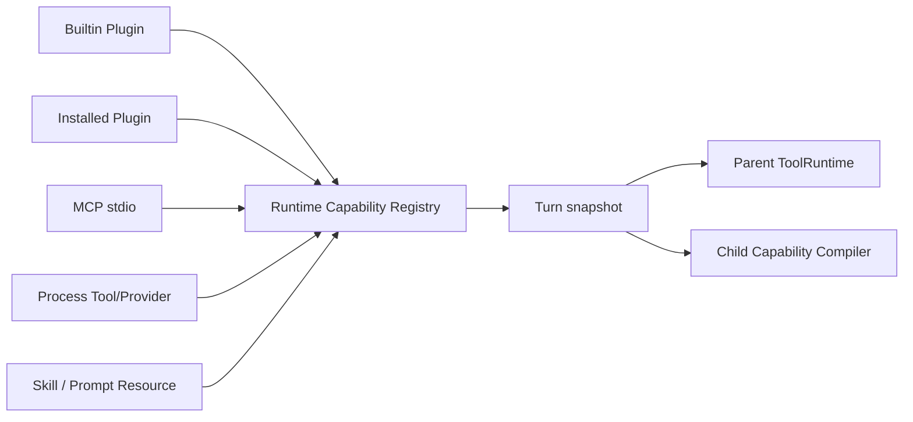

# Extensions、Plugins、MCP、Skills 与 Child Agent

本文解释扩展能力怎样进入父 Agent 和 Child。核心规则是：所有能力先进入父 Runtime 的 Capability Registry，再按 Workflow/Profile/Node/Attempt 单向衰减；Skill 或 Child 不能凭名字扩大授权。

## 1. 能力来源



Turn 开始后 snapshot 冻结，防止运行中插件或 MCP descriptor 漂移。

## 2. ExtensionService 与 PluginManager

`ExtensionService` 安装 BuiltinPlugin，启动 PluginManager，收集 Provider、Tool 和内部 AgentTask Planner capability。Builtin 的 Planner ID 是 `agent-task`，只执行一个已准入 AgentTask；用户不能通过它切换 Direct 产品流。

Plugin lifecycle：install、inspect、enable、permissions、health、update、rollback、disable、uninstall。工作区 grant 和 descriptor digest 进入审计。插件不能注册未声明能力或覆盖内置命令。

## 3. Skills

ResourceCatalog 发现 `SKILL.md`，先发布名称、description、digest 和 capability 摘要。模型或用户选择后，SkillInvocationService 再读取固定 digest 的正文并生成结构化 PromptEnvelope part。

Child 的 Skill 集合是：父 Turn 已发现 Skills ∩ Profile allowlist ∩ Delegate request。Inline Skill 允许进入 Child Bundle，但不附带 Tool、网络或 credential。

## 4. MCP

McpActivationService 根据工作区 selection 启动 `McpStdioClient`，读取远端 tools/list，并将 descriptor 包装成 RuntimeTool。健康、deadline、并发、stderr 和 shutdown 由扩展 supervisor 管理；这里的 “supervisor” 是进程生命周期组件，不是旧 Planner 产品模式。

Server environment 使用最小注入：只有 MCP manifest 声明、workspace 明确批准且父进程实际存在的变量才进入 stdio 子进程；未声明的 ambient 变量不可见。该路径已用 AgentDojo 的真实 MCP bridge 和专门的可见/不可见回归用例验证。

Child MCP 采用 parent broker：

1. 父为每个获准 MCP Tool 创建 broker capability ID；
2. capability 绑定 parent/child run、workspace、bundle ID/digest；
3. Child 只看到 descriptor 与 capability ID；
4. 调用回到父 Runtime 的实际 MCP Tool 与权限通路；
5. credential 和任意 ambient MCP session 不进入 Child。

Read Child 只获得 none/read effect MCP。Write Child 可请求写 MCP，但仍必须通过 workspace/effect grant 和权限；不能因为 MCP 名字被列出就绕过审批。

## 5. Process Tool 与 Provider

ProcessActivationService/ProcessPluginHost 使用独立进程、结构化握手、method allowlist、timeout、健康和 shutdown。Provider process 输出统一 Provider stream；Tool process 输出统一 ToolResult。平台隔离能力会在 doctor/status 中说明，不能把 trusted-only 当作 OS sandbox。

## 6. Child Capability Bundle

编译链：

```text
parent snapshot
  ∩ workflow root grant
  ∩ parent node mayDelegate
  ∩ AgentProfile allowlists
  ∩ DelegateProposal request
  ∩ workspace/effect policy
  = ChildCapabilityBundleV1
```

Bundle 含 workspace root/access、Provider target + handle、Tool descriptors/digests、Skill descriptors、MCP mode/grants、method allowlist 和 bundle digest。Child bootstrap 会重新验证 Packet 与 Bundle 一致，不信任父 Prompt 文本。

## 7. Child Runtime

Child 完成 ReAct 后通过 Runtime 内部 `praxis_submit_child_result` Tool 提交完整 result envelope。若模型先输出普通文本，AgentLoop 下一轮会强制该 Tool；Tool 参数与精确 success-criterion ID 在 Child 和父 Host 两侧 fail-closed 校验，成功提交立即终结，超限 output 才由父 Host 外置为 Artifact ref。该协议不依赖 Provider 原生 `json_schema`。

LocalWorkflowAgentWorker 使用 ChildRuntimeHost 启动真实 Runtime。Child：

- 有独立 Session/Trace/Artifact 临时目录；
- 使用正式 AgentLoop、PromptAssembler、ToolRuntime 和 Provider adapter；
- 通过父 CredentialBroker 调用模型；
- 通过父 MCP broker 调用获准工具；
- 权限请求回传父 TUI；
- 返回验证后的 `SubagentResultV1`、usage、checks、changed files 和 evidence；
- 模型一次性返回完整 result envelope，父 Host 在终态后把超限 output 保存为 Artifact ref；
- Tool evidence 接近 64-ref 协议上限时增量写入分层 `subagent_evidence_manifest`，结果只携带 manifest ref，完整审计链不丢失；
- 后继节点只获得签名 bootstrap profile 列出的前驱 Artifact 闭包，能读取 result wrapper、完整 overflow output 和 manifest，但不能枚举或读取其他父 Artifact；
- `retain_on_failure` 由父 Host 在观察到 prompt 终态后执行；child 进程的正常 shutdown 不会提前删除失败 Session/Trace；
- 固定禁止 descendant。

Child 不是旧 Supervisor 固定 worker，也不要求用户切换模式。默认 `auto` 根模型可随时提出委派。

Child Prompt 与 Root 使用同一个 Prompt program 和 assembler；差异来自 role contract、签名 pinned ContextPacket 与衰减后的 capability snapshot，不靠 `researcher/coder/reviewer/verifier` 四套专用 Runtime。精确装配顺序见[Prompt、Context 与 Compaction](../../../docs/prompt-assembly.md)。

## 8. Budget 与 Deadline

Root policy：auto/workflow 的 v4 默认不限制累计 AgentTask、turns、Tool calls、tokens、wall clock、depth 或 loop iterations；solo 的 Child 能力仍为零。Local Runtime 的 256 parallel 是 worker 资源并发度，而非累计任务配额。Child Profile v4 的 `defaultBudget` 为空，实际硬限制只来自父级、Proposal、部署策略或用户显式 deadline。Host 默认不启用 no-progress 熔断，长 deadline 使用可重挂 timer。历史 v1-v3 的预算和 digest 原样注册，仅用于旧 Workflow 恢复。

这些是宽 ceiling。正常 Child 可以多轮读写、Shell、Skill 和 MCP，不再被旧的 4 turn/只读调查模板限制。任务寿命与 context 工作集分离：默认在 64K 未压缩 replay token 触发 durable checkpoint，以控制长工具循环每轮重复发送的成本；这不会终止 Child，也不会降低 Provider 的真实 context 安全上限。

## 9. 写 Child

写 Bundle 的 workspace 始终是隔离目录。Git 仓库使用受管 worktree；Child 成功后父 Worker 创建候选 commit，ControlledWorkspaceMerge 做 preflight 和 fast-forward。非 Git 目录使用私有 snapshot repo，父侧按原目录基线、授权路径、changed files 和 verifier 结果受控回写，不会隐式 `git init`。失败时保留 worktree/snapshot recovery path。Child 本身不能 push、发布或删除主仓库，除非未来增加独立外部 effect contract 和审批。

## 10. 权限请求

ChildPermissionGate 将 child request 关联 parentRunId/childRunId/toolCallId。父 Runtime 验证活动 Run、bundle 和 workspace 后再向客户端发 `permission_request`。取消 Child 时所有 pending request 一并取消，避免孤儿 Promise。

## 11. 与 Workflow 的关系

`agent.delegate` 和 `workflow.expand` 先在 SQLite 创建 Node/Attempt/Task，再启动 Child。状态和执行顺序不由 Child process 引用决定。Worker 崩溃后 Lease expiry 触发 RecoveryPolicy；安全 effect 可创建新 Attempt，写/未知 effect 不盲重试。

## 12. 主要文件

| 文件 | 作用 |
| --- | --- |
| `src/extensions/extensionService.ts` | 能力组装 |
| `src/extensions/mcpActivationService.ts` | MCP 激活 |
| `src/extensions/processActivationService.ts` | Process 扩展 |
| `src/subagent/childCapabilityBundle.ts` | Child Bundle 编译/验证 |
| `src/subagent/childRuntimeHost.ts` | Child 进程与协议 |
| `src/subagent/credentialDelegation.ts` | credential handle |
| `src/subagent/mcpBrokerIpc.ts` | Child MCP broker |
| `src/subagent/childPermissionGate.ts` | 权限转发 |
| `src/workflow/localWorkflowAgentWorker.ts` | 产品 Local Worker |
| `src/planner/workspaceIsolationManager.ts` | worktree ownership |
| `src/planner/controlledWorkspaceMerge.ts` | 候选提交验证与合并 |
| `src/planner/directoryWorkspaceIsolation.ts` | 非 Git 快照隔离与回写 |

## 13. 当前边界

已用真实 Provider 运行 3 Child quorum、5 Child cross-review，以及只复用既有 reviewer Artifact 的 synthesis recovery；这证明 Child 是真实 subagent、结构化提交和受限 Artifact 传递可用。Child 仍不能创建 descendant。

认证远程 Authority/Artifact Worker 边界、外部 effect receipt/Saga 账本和 HumanTask/Timer wake 已接线；尚未交付容器 Worker 作为独立隔离级别、PostgreSQL Authority、任意递归 subworkflow、租户级高可用调度和连接器声明驱动自动补偿。重启接管机制已观察，但完整长 DAG 的终态一致性仍是部分验证。准确状态见[统一 Workflow 与多 Agent](../../../docs/workflow-platform.md)和[最终测评总结](../../../docs/evaluation-final-2026-08-09.md)。
