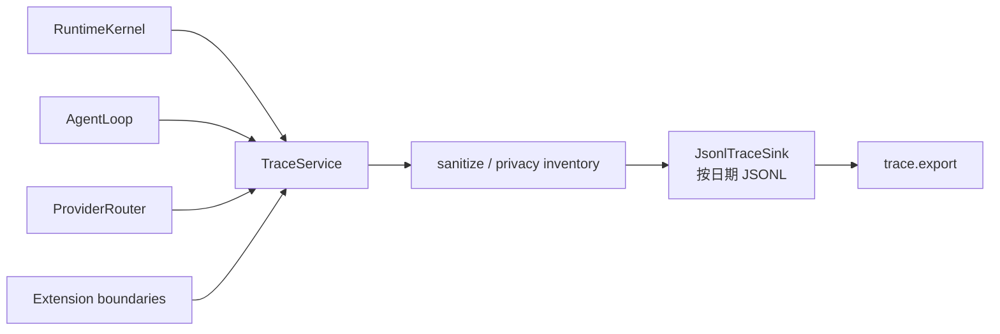
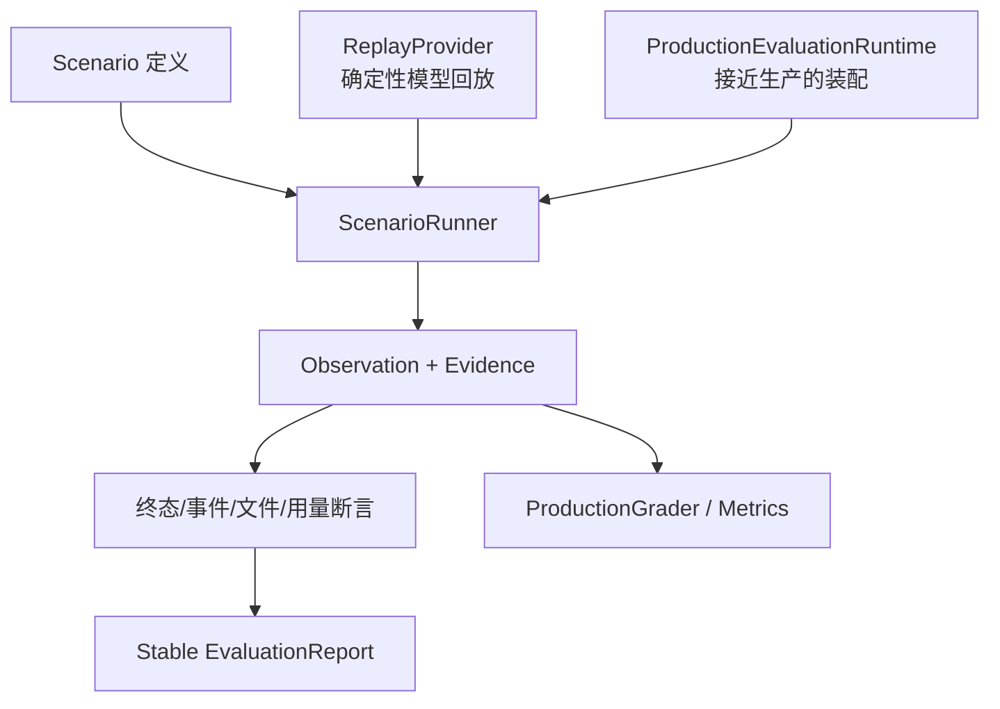
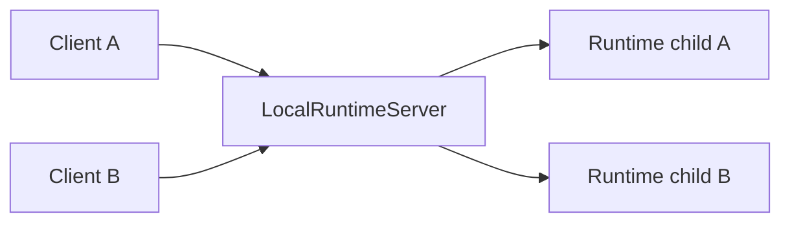

# 06：Trace、运维指标、评测与本地 Server

> 阅读入口：[Runtime 总览](../readme.md) · [当前架构](../../../docs/architecture.md) ·
> [Runtime 协议](../../../docs/protocol.md)。可选本地 Server 仅支持 Loopback、Token、单用户和每连接一个
> Runtime child；它不是远程托管或多租户安全边界。

## 四类“观察结果”不要混淆

| 数据 | 回答的问题 | 是否给模型当上下文 |
| --- | --- | --- |
| Session history | 用户和智能体说过/调用过什么 | 是，经窗口选择 |
| Event stream | 客户端现在应该显示什么 | 否，属于传输 |
| Trace records | 内部每个边界耗时、重试、选择和错误是什么 | 否，用于诊断/评测 |
| Evaluation report | 某个固定场景是否满足断言 | 否，测试产物 |

## 1. Trace 写入与隐私边界

`TraceService.createContext()` 产生 trace/runtime/session/run 等关联 id；`record()` 接受结构化 kind、attributes 和 metrics；`export()` 读取指定 trace 并附带 privacy inventory。

Trace 设计目标是可诊断而非复制所有 prompt 内容。`TracePrivacyInventory` 明确哪些字段可能出现，service 对 context/attributes 做验证和裁剪。`NoopTraceService` 让测试或嵌入方完全关闭记录而不改变核心流程。

`context.selected` 还记录 Provider-only context editing 的聚合值：Tool result 与 reasoning 编辑前后 token、单条裁剪/陈旧清理/旧 thinking 清理的数量和释放 token。`context.compacted` 记录原因、checkpoint/omission 和辅助模型 usage；`prompt.manifest` 记录 variant 与无正文 digest。它们不记录 Tool 输入、输出或 Prompt plaintext，因而可以分析长任务成本而不复制 Session 内容。

`JsonlTraceSink` 负责磁盘细节：

- 限制每行大小。
- 校验 trace id，防止把 id 当路径穿越。
- 按日期组织 JSONL。
- 读取时验证目录/文件身份和包含关系。
- 清理或截断不可安全保存的字段。

默认文件模板是 `${PRAXIS_HOME}/traces/YYYY-MM-DD/<traceId>.jsonl`，日期取每条 record 的 ISO 时间；读取某个 trace 时会搜索所有日期目录。当前该模块没有自动 retention/轮转删除逻辑。`trace.export` 不移动或删除原 JSONL，而是在调用者指定目录生成 `<traceId>.json`，其中包含隐私清单和该 trace 的全部 records。

trace 写入失败通常不应掩盖用户任务的真实结果；关键持久化失败则不同，会影响 session 终态。因此代码常对 trace 使用 best-effort，对 session finalization 使用强一致处理。

## 2. OperationalMetrics 与 PerformanceProfiler

`OperationalMetrics` 接收有界 label、count 和 Provider usage，汇总 Runtime 的运行记录。它避免把任意高基数字符串直接当指标标签。

`PerformanceProfiler` 针对声明的性能指标记录样本，计算 p50/p95 等快照，并与 budget 比较。它适合回答“Provider 首 token、工具执行或完整 run 是否变慢”，不替代详细 trace。

## 3. Evaluation 的基本结构

### Scenario

`scenario.ts` 定义评测输入：workspace fixture、请求序列、Provider replay、权限决定、预期终态、事件、文件系统结果、trace 和 usage bounds。解析器对 YAML/JSON 形状、相对路径和枚举值做严格校验。

`portablePath.ts` 拒绝绝对路径、`.`/`..`、Windows 保留名和非法字符，使同一 fixture 能在 Windows/Linux 运行，也阻止场景文件逃离临时 workspace。

### ReplayProvider

按预先声明的 turns 返回确定性 chunks，并验证收到的 model、messages、tools 等是否符合 expectation。相比 `MockProvider`，replay 更适合精确复现多轮文本/工具/错误序列。

### ScenarioRunner

Runner 创建临时工作区与 Runtime，执行场景请求，订阅事件，自动作出指定权限决定，收集 trace/文件快照/usage，最后逐项断言。它还可装配故意崩溃的 process plugin、延迟 Provider 和 finalization failure，用于验证边界故障。

不要把 700 多行 Runner 当生产请求路径。它是测试编排器，调用真实 Runtime 组件来证明生产路径满足契约。

## 4. 生产评测辅助

`productionRuntime.ts` 创建更接近生产装配的 evaluation runtime，并提供延迟、失败、首次持久化失败等受控替身。它用于测试超时、取消、重试和恢复，而不是把真实用户 API key 写进 fixture。

`productionMetrics.ts` 从 trace records 汇总 Provider attempts、fallback、工具/持久化耗时和 usage，并输出 cache hit tokens、miss tokens 与总输入命中率。compatible adapters 归一化 `prompt_tokens_details.cached_tokens`、`prompt_cache_hit_tokens` 和 `cache_read_input_tokens`；Anthropic-compatible usage 会合并 `message_start/message_delta` 并取合法最大值，避免零占位覆盖终值。`productionGrader.ts` 把 session/export/workspace 实际结果与预期比较，输出可机器读取的 grade。

`report.ts` 把多个 scenario result 汇总，并规范化临时根路径、随机 id 和时间相关值，使报告在不同机器/运行间稳定。稳定化很重要：否则快照 diff 只会显示随机噪声。

`evaluation/cli.ts` 是评测命令入口，选择场景、运行并写报告；`evaluation/index.ts` 汇总导出评测 API。

## 5. 本轮外部 benchmark 与证据边界

Runtime 内建 Scenario Eval 主要测确定性合同；外部小样本补充测真实模型、终端、MCP 和攻击环境：

| Benchmark | 本轮覆盖 | 最终结果 | 主要测量 |
| --- | --- | --- | --- |
| Harness-Bench | Praxis/Pi 各 3 题 | Praxis combined `0.9219`，Pi `0.8319` | 文件、迭代修复、分解与过程质量 |
| Harbor / Terminal-Bench 2 | Praxis 3 题 | 3/3 正常结束，reward `1/3` | 真实容器终端任务；框架稳定与任务正确性分开 |
| AgentDojo | Praxis 7 次 | 7/7 completion，clean 3/3，attack goal 0/2 | MCP 动态工具、环境状态和小样本 prompt injection |
| Multi-agent smoke/long task | quorum、cross-review、restart、recovery | quorum/cross-review/局部 recovery 通过；restart 仅部分验证 | Child DAG、Artifact 传递、结构化终态和崩溃接管 |
| Context/cache | DeepSeek compact 与 paired A/B | compact 成功；lean 后四轮 input -6.1%，命中率近似 | 长上下文恢复、Prompt 体积与稳定前缀 |

这些是单次小样本。报告必须同时给出 framework terminal、官方 reward/utility、usage、subagent 数和结果路径，不能用 `prompt_completed` 掩盖任务错误，也不能用模型答错反推 Runtime crash。重启实验中一次 after projection 的 Workflow 已 `completed`，但后继 Node 仍 `running/admitted`，所以恢复只标“部分验证”。完整数字和永久修复见[最终小样本测评与优化总结](../../../docs/evaluation-final-2026-08-09.md)。

## 6. LocalRuntimeServer 与默认 CLI 模式

[`localRuntimeServer.ts`](../src/server/localRuntimeServer.ts) 监听本地 socket。连接先提交认证信息；验证后，server 为连接启动 Runtime 子进程，把 socket 与子进程 stdin/stdout 双向桥接，并在断开时清理进程树。

这和普通 CLI 直接拥有一个 Runtime child 的区别主要在宿主和生命周期：

- CLI child 模式：关系简单，CLI 退出时它的 Runtime 一起清理。
- Local server 模式：客户端先连 server，由 server 认证并管理每连接 Runtime，适合其他宿主或集中入口。

二者最终都进入同一个 RuntimeKernel 和 JSON-RPC 契约。server 不负责 AgentLoop，也不保存 prompt 业务状态。

## 7. 怎样用这些模块排查问题

| 现象 | 首先检查 |
| --- | --- |
| CLI 没有实时文本 | event subscription、Provider chunks、`AgentLoop.emit` trace |
| 重复回答/重复工具 | `clientRequestId`、LoopProgressGuard advisory、Provider retry 输出边界；只有显式预算、取消或外部 policy 可以终止整个 Run |
| 会话显示成功但磁盘没有终态 | persistence trace 与 `RunCoordinator.finalize` |
| 某 Provider 偶发切换 | router attempt/fallback/circuit trace |
| 插件卡住整个请求 | supervisor deadline、process/MCP invoke trace |
| 回归只在 Windows 出现 | portable path、换行、PowerShell 与进程树场景 |

## 本篇文件索引

| 文件 | 作用 |
| --- | --- |
| [`src/trace/index.ts`](../src/trace/index.ts) | Trace 模块统一导出。 |
| [`src/trace/traceService.ts`](../src/trace/traceService.ts) | Trace context、记录、隐私清单、导出与 noop 实现。 |
| [`src/trace/jsonlTraceSink.ts`](../src/trace/jsonlTraceSink.ts) | 安全、有界的按日期 JSONL trace store。 |
| [`src/operations/index.ts`](../src/operations/index.ts) | Operations 模块统一导出。 |
| [`src/operations/operationalMetrics.ts`](../src/operations/operationalMetrics.ts) | 有界运维记录与 Provider usage 汇总。 |
| [`src/operations/performanceProfiler.ts`](../src/operations/performanceProfiler.ts) | 性能样本、分位数和 budget 检查。 |
| [`src/evaluation/index.ts`](../src/evaluation/index.ts) | Evaluation API 统一导出。 |
| [`src/evaluation/cli.ts`](../src/evaluation/cli.ts) | 评测命令入口与场景选择。 |
| [`src/evaluation/portablePath.ts`](../src/evaluation/portablePath.ts) | 校验跨平台安全的 fixture 相对路径。 |
| [`src/evaluation/scenario.ts`](../src/evaluation/scenario.ts) | 场景、回放、请求、权限和断言的类型/解析。 |
| [`src/evaluation/replayProvider.ts`](../src/evaluation/replayProvider.ts) | 严格按 fixture 回放并验证请求的 Provider。 |
| [`src/evaluation/scenarioRunner.ts`](../src/evaluation/scenarioRunner.ts) | 装配 Runtime、执行场景、收集证据并断言。 |
| [`src/evaluation/productionRuntime.ts`](../src/evaluation/productionRuntime.ts) | 接近生产的评测装配及延迟/失败替身。 |
| [`src/evaluation/productionMetrics.ts`](../src/evaluation/productionMetrics.ts) | 从 trace 汇总生产路径指标。 |
| [`src/evaluation/productionGrader.ts`](../src/evaluation/productionGrader.ts) | 对 session 与 workspace 结果评分。 |
| [`src/evaluation/report.ts`](../src/evaluation/report.ts) | 生成并稳定序列化评测报告。 |
| [`src/server/index.ts`](../src/server/index.ts) | Local server 模块导出入口。 |
| [`src/server/localRuntimeServer.ts`](../src/server/localRuntimeServer.ts) | 认证本地 socket，并为连接代理 Runtime 子进程。 |

## 阅读终点

当你能用一次 evaluation replay 解释以下链条，本轮 Runtime 入门就完成了：fixture 产生 prompt → Kernel 建 run → ReplayProvider 发 tool call → ToolRuntime 执行 → session 落盘 → trace 记录边界 → Runner 断言终态和文件 → report 规范化结果。
