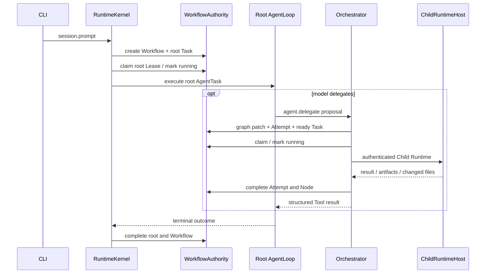

# Praxis Runtime 源码导读

本目录是独立 Runtime 进程。它接收 CLI 的 NDJSON JSON-RPC，管理 Session、Provider、Prompt、Tool、权限、扩展、Workflow、Child Runtime、Artifact 和 Trace。

如果你是新手，先读根 [README](../../README.md)、[快速入门](../../docs/quickstart.md)和[模块地图](../../docs/module-map.md)，再按本文顺序看代码。模块地图解释七个 Workspace 与 Runtime 全部源码域；本文只深挖 Runtime 主链路。

## 一句话架构

每条 Prompt 都由 `AutoWorkflowPlannerV1` 创建 durable Workflow 和根 `AgentTask`，再进入 `AgentLoop`；模型可在同一个循环中调用普通 Tool、`agent.delegate`、`agent.handoff`、`workflow.expand`、`workflow.loop`、`workflow.wait` 或 `workflow.subworkflow`。`PlannerRouter` 只解析 `auto|solo|workflow` policy，不选择不同 Planner。

`workflow.expand` 只负责提交模型 Proposal；图、Task、Attempt 和依赖状态由 `DurableWorkflowSchedulerV1` 推进。SQLite claim 必须看到 Node 已持久化为 `scheduled`，不能依赖调用 Tool 的进程内 completed 集合。Agent 结果先存 Artifact，再写 projection，scheduler 重建后会跳过已经成功的节点。

## 推荐阅读顺序

1. `src/framework/runtimeKernel.ts`：composition root、协议 dispatch、Prompt 启动和产品接线。
2. `src/workflow/autoWorkflowPlanner.ts`：每条 Prompt 怎样变成 Workflow。
3. `src/workflow/workflowOrchestrator.ts`：确定性 admission、Node/Attempt/Task 推进。
4. `src/workflow/sqliteWorkflowAuthority.ts`：SQLite 事务、Lease 与恢复。
5. `src/loop/index.ts`：一个 AgentTask 内部的 ReAct。
6. `src/workflow/*Tool.ts`：delegate、handoff、DAG、bounded loop、durable wait 与 subworkflow 的模型入口。
7. `src/workflow/localWorkflowAgentWorker.ts`：Child Runtime、Capability Bundle、MCP broker 和 worktree/snapshot merge。
8. `src/session-db/`、`src/prompt/`、`src/tools/`、`src/extensions/`。

## 启动与初始化

`src/entry.ts` 创建 `RuntimeKernel`。父 Runtime 初始化：

- SessionRepositoryV3（JSONL 或 SQLite）；
- Workflow SQLite authority，并执行 expired Lease recovery；
- Credential、ProviderRouter、ModelCatalog；
- ExtensionService、CapabilityRegistry、MCP/Process activation；
- AgentLoop、AutoWorkflowPlanner、Policy、Artifact、Trace；
- JSON-RPC handlers。

受授权 Child Runtime 会收到 `RuntimeAuthority` 和 bootstrap profile，使用独立 ephemeral Session/Trace/Artifact root。Child 不打开父 Workflow DB，Session policy 固定为 `solo`。

## 统一 Workflow 主链路



`solo` 不添加 topology tools；`auto` 和 `workflow` 添加相同的 delegate、handoff、DAG、loop 与 subworkflow 工具。`workflow` 的额外图化约束属于 admission policy，不会实例化旧 Supervisor。

## Workflow SQLite

文件默认为 `%USERPROFILE%\.praxis\workflow-platform-v1.sqlite`。表包括：

- `workflows`、`workflow_events`、`workflow_transactions`；
- `workflow_tasks` 与 Lease 字段；
- `workflow_outbox`、`workflow_timers`、`workflow_signals`；
- `workflow_human_tasks`；
- `agent_profiles`。

所有 projection/event/task enqueue/ack 使用 `BEGIN IMMEDIATE`。Claim 检查 readyAt、kind、workflow/node filter 和 conflict keys。Heartbeat 同时记录存活与进展时间。

Recovery 按 effect 处理：pure/read/idempotent 可以在 retry budget 内创建新 Attempt；workspace write/non-idempotent 失联进入 unknown，避免重复副作用。

## Root 与 Child 的能力

根 Agent 从当前 capability snapshot 获得 Tool、Skill、MCP 和 workspace grant。委派时 Runtime 求交集：父 grant ∩ Profile allowlist ∩ proposal request。

模型面对的是一个统一的装配申请，而不是五种 Child Runtime。`agent.delegate` 和 `workflow.expand.nodes[]` 都可逐 Child 声明：

- `profile: default | worker | explorer` 与任务专用 `instructions`；
- `tools`、`skills`、`mcpServers`、`workspace`、`network`；
- 显式模型或 `fast | balanced | powerful` 档位，以及 `none | low | medium | high` 推理强度；
- wall-clock/token/tool/turn 预算、`text | markdown | json` 结果合同和成功标准；
- DAG dependencies，用于并行、串行与独立交叉审查。

Runtime 把这些字段当作不可信 Request，编译为 effective assembly。Task 保存原请求；不可变 execution snapshot 保存请求、最终 Provider/模型/推理、有效 Capability Bundle 和拒绝项。模型可以申请能力，不能更改父 grant、沙箱、模型目录、剩余预算或 descendant 禁令。

Child 能使用被授权的：

- read/write/edit/shell 等 Builtin；
- 当前 Turn 已选择并 digest-pinned 的 Skills；
- 通过父 broker 的 MCP；
- 父 Provider 权限范围内、当前模型目录可用的模型 target，凭证由 credential broker 提供短期 handle；
- interactive permission 转发。

Child 唯一强制能力差异是不能创建 descendant。它的 `maxChildRuns/maxParallelChildren/maxDepth` 为零；正常 Tool/turn 上限保持宽松并受父 budget 收紧。

## 写任务

`LocalWorkflowAgentWorkerV1` 对 Git 工作区中的 `workspace_write`：

1. 验证主目录是 Git repo 并读取 HEAD；
2. 用 `WorkspaceIsolationManagerV1` 创建受管 detached worktree；
3. 将 Child Bundle workspace 绑定到 worktree；
4. Child 成功后 stage 并创建候选 commit；
5. `ControlledWorkspaceMergeV1` 重新计算 binary patch、changed paths 和 commit shape；
6. 父 Runtime 重新校验主工作区仍在原 base 且 clean 后，才执行 fast-forward；

非 Git 工作区不会失败，也不会被隐式 `git init`。`DirectoryWorkspaceIsolationManagerV1` 复制安全文件到 `workflow-snapshots` 私有仓库，Child 只写快照；权限请求会把快照目标映射回用户工作区，父侧再使用目录基线摘要、授权路径、changed files、RuleVerifier 和单写锁校验后回写。敏感文件与依赖目录不进入快照，失败时保留 recovery path。Child 若在完成写工具后才超时，已完成变更不会被丢弃：只有候选差异、工具结果和 changed files 一致时才继续父侧校验与回写。
7. blocked/failure 时保留 recovery path。

不要把“Child 有 write Tool”理解为它能直接覆盖主目录。

## AgentLoop

`AgentLoop` 负责一个 AgentTask 内部的模型回合：Prompt assembly、Provider stream、Tool schema/policy、并行安全 Tool batch、usage、steer、abort、compaction 和唯一 terminal claim。它不拥有跨 Agent 调度或 Workflow state。

内部 `AgentTaskPlanner` 仅把一个已准入 execution 交给 AgentLoop，是 ExtensionService 的 Planner capability adapter，不是用户可选 Direct 模式。

## Session 双后端

`SessionRepositoryV3` 暴露统一 SessionJournal：

- JSONL：commit + Catalog/Projection；Catalog 增量更新，普通启动走快速路径；
- SQLite：同一领域合同的事务实现。

一次 Runtime 只使用一个 Session authority，不双写。完整 JSONL replay 在 `doctor --deep` 或 scrub 中执行。Workflow SQLite 与 Session 后端独立。

## Prompt 与 Compaction

父 Runtime 使用 `journalContextView`。默认 `iron-law-lean-v1` 的装配顺序是：唯一 Trusted Instructions；`runtime_facts/skill_catalog/project_guidance`；Child pinned ContextPacket；Run-stable Session ContextView；native/semantic checkpoint；最近完整消息；独立 Tool definitions。reasoning/Tool-result editing 只生成 Provider 发送视图，成功 compact 后才更换 ContextView。旧 `SessionMemory.plan` 只在读取旧数据时被清理，不再进入 compaction 或模型 Prompt。完整规范见 [`docs/prompt-assembly.md`](../../docs/prompt-assembly.md)。

本轮真实 Provider 小样本已覆盖 Harness-Bench、Harbor、AgentDojo、quorum、cross-review、局部 synthesis recovery、DeepSeek compaction/cache 和 MiniMax CN smoke。Restart recovery 的持久接管机制已观察，但一次最终 projection 不一致，因此仍是部分验证。见[最终测评总结](../../docs/evaluation-final-2026-08-09.md)。

Compaction checkpoint 只压缩对话 Context。Workflow projection、Task、Lease 和副作用 receipt 永远从 Workflow authority 恢复。

## Provider 错误

Provider Router 统一能力、认证、模型目录、usage 和 fallback。429/暂时性 5xx 保留稳定分类与 retryable 标志；是否重试由 Run/Task Budget、RetryPolicy 和 deadline 决定。任何 Planner/Child 失败都应以真实 code 进入 Tool result、Workflow Node 和终态。

## Protocol 投影

Runtime handlers：`workflow.get/list/events/signal`。`workflow_update` 事件是 TUI 的实时投影。`session.plan` 返回最近 Workflow 的兼容视图。旧 `supervisor_update` 只为 v1 历史兼容保留。

## 目录说明

下面按职责合并展示源码域；逐目录边界、主要入口和跨模块修改路径见[模块地图](../../docs/module-map.md)。

| 目录 | 职责 |
| --- | --- |
| `framework/` | composition root 与协议入口 |
| `workflow/` | 统一 Workflow、SQLite/远程 authority、durable worker、model tools、Local Worker |
| `loop/` | AgentTask ReAct |
| `planner/` | 可复用 Graph/Verifier/Worktree 底层组件；不再有 ProductSupervisor 总控 |
| `session/`、`session-db/` | Session 生命周期和 JSONL/SQLite V3 |
| `prompt/`、`memory/` | Prompt view、assembly、token 与 compaction |
| `tools/`、`builtin-tools/` | ToolRuntime 与内置工具 |
| `subagent/` | Child host、bundle、broker、credential、permission、result contract |
| `extensions/`、`plugin/` | 插件、Skill、MCP、Process activation |
| `providers/`、`provider-router/` | Provider adapters 与路由 |
| `policy/`、`security/` | 权限与平台隔离 |
| `trace/`、`evaluation/` | 可观测性与评测 |

## 远程 Worker

Authority 进程：

```powershell
$env:PRAXIS_WORKFLOW_AUTHORITY_LISTEN='127.0.0.1:7777'
$env:PRAXIS_WORKFLOW_AUTHORITY_TOKEN='replace-with-at-least-32-random-characters'
praxis
```

远程 Runtime/Worker：

```powershell
$env:PRAXIS_WORKFLOW_AUTHORITY_URL='http://authority-host:7777'
$env:PRAXIS_WORKFLOW_AUTHORITY_TOKEN='replace-with-the-same-random-token'
praxis
```

远程端通过认证 RPC claim/heartbeat/commit Task，并通过同一边界读写内容寻址 Artifact；不要把 SQLite 文件放到网络共享目录。生产公网部署仍应在该端口前增加 TLS/mTLS、网络 ACL 与密钥轮换。

## 测试

核心新增测试：

- `test/workflow-contract.test.ts`
- `test/workflow-sqlite-authority.test.ts`
- `test/workflow-orchestrator.test.ts`
- `test/workflow-delegate-tool.test.ts`
- 既有 `workspace-isolation-manager` 与 `controlled-workspace-merge` 测试

常用命令：

```powershell
npm run typecheck
npm run lint
npm run build
node --import tsx --test test/workflow-contract.test.ts test/workflow-sqlite-authority.test.ts
```

完整测试会启动真实 Runtime/PTY，必须关注子进程清理。

## 当前边界

本目录已交付统一 auto、模型驱动的 `default/worker/explorer` Child 装配、逐 Child Prompt/Tool/Skill/MCP/模型/推理/预算/结果合同、条件与 `all/any/quorum` join、有界循环、handoff、durable wait、所有可变 Tool 的统一 effect broker、调用前幂等预留、双 receipt Saga、不可变执行快照、重启恢复 Worker pump、认证远程 Authority/Artifact 协议和非递归独立 subworkflow。PostgreSQL、高可用外部通知、任意递归 subworkflow、跨 Provider 凭证授权、租户级分布式熔断和连接器驱动自动补偿仍是部署/扩展边界。准确状态见 [项目状态](../../docs/project-status.md)。
