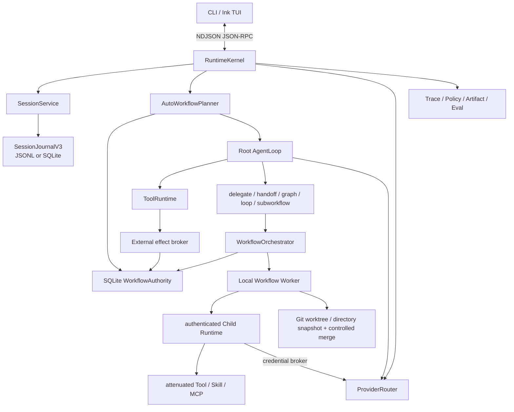

# 当前架构

本文描述已经接入产品路径的事实。想先知道每个目录和包的职责，请读[模块地图](module-map.md)；长期目标与尚未交付的分布式能力见 [Planner Platform RFC](planner-platform-rfc.md)。

## 系统总览



## 1. CLI 与 Runtime

`apps/cli` 不直接调用 Provider 或工具。它启动 `apps/runtime`，完成协议初始化和事件订阅。Runtime stdout 只能输出 NDJSON 协议；诊断写 stderr。Runtime 崩溃时 CLI 会显示关闭原因，不把半条流式响应当成完成。

TUI 将 Composer、Transcript、Sidebar 和 Spinner 分离。Transcript 使用有界事件缓冲与可见窗口，持久历史从 SessionJournal 分页恢复；Workflow 面板从 Workflow API 恢复 projection。

## 2. Composition Root

`RuntimeKernel` 负责组装而不拥有各领域算法：

- `SessionService` 与 `RunCoordinator`；
- `AutoWorkflowPlannerV1`、`WorkflowOrchestratorV1` 与 `SqliteWorkflowAuthorityV1`；
- `AgentLoop`、`ProviderRouter` 与 `ToolRuntime`；
- Credential、Policy、Artifact、Trace；
- Extension/Plugin/MCP/Process activation；
- JSON-RPC dispatch 与事件投影。

父 Runtime 初始化 Workflow SQLite 并回收过期 Lease。受授权 Child Runtime 使用独立 ephemeral Session/Trace/Artifact 目录，不再次打开父 Workflow authority。

## 3. 统一执行

`PlannerRouter` 只解析 policy，不选择实现：

```text
direct -> solo
supervisor -> workflow
auto|solo|workflow -> AutoWorkflowPlannerV1
```

每个 Prompt 先事务创建 Workflow、根 Node、Attempt 和 ready Task。Root Worker claim Lease 后运行同一个 AgentLoop。`solo` 不暴露拓扑工具；`auto/workflow` 暴露 delegate、handoff、graph、bounded loop 和 subworkflow 工具。

内部 `AgentTaskPlanner` 只是“一个已准入 AgentTask 如何进入 AgentLoop”的 adapter，不是 Direct 产品模式。

## 4. Workflow 领域

领域合同位于 `packages/core-sdk/src/workflow*.ts`：

- `WorkflowSpecV1`：拓扑、节点、边、预算和图 revision；
- `WorkflowProjectionV1`：Workflow/Node/Attempt 当前状态；
- `WorkflowTaskV1`：可调度任务、effect、retry、deadline、conflict keys；
- `WorkflowTaskLeaseV1`：Worker、token、heartbeat、progress 和 expiry；
- `DelegateProposalV1`、`GraphProposalV1`、`GraphPatchProposalV1`；
- `AgentProfileV1` 与 CapabilityRequest。

SQLite 表在同一事务中保存 workflows、events、transactions、tasks、outbox、timers、signals、human tasks 和 profiles。Projection 是事件 reducer 的物化结果。

## 5. Agent 与 Child Runtime

根 AgentLoop 和 Child AgentLoop 使用相同的 Provider/Tool/Prompt 基础设施。区别来自 Capability Bundle：

```text
parent capability snapshot
  ∩ workflow grant
  ∩ profile allowlist
  ∩ node request
  ∩ policy/permission
  = attempt capability bundle
```

Child 通过 fd 认证和 bootstrap profile 启动；Provider 凭证由 broker handle 提供；MCP 通过父 broker 调用。Child 的 policy 固定禁止 descendant，因此不能递归启动 Praxis 绕过账本。

## 6. 写工作区

`workspace_write` AgentTask 不直接写主目录。Git 仓库使用受管 detached worktree；普通目录使用 Praxis 私有的快照仓库。Git 路径由 `ControlledWorkspaceMergeV1` 校验 commit shape、base、patch、changed paths、digest、main state 后 `--ff-only`；非 Git 路径由目录基线摘要、授权范围、Child changed files、单写锁和 verifier 校验后回写，并且不会在用户目录执行 `git init`。失败时两条路径都会保留 recovery path，成功后安全清理。

根 Agent 自己的普通 write/edit/shell 仍在主工作区；它们同时受 PolicyEngine 控制并作为 durable Activity 写入 effect broker。Child 的候选 worktree/快照合并与根 Agent 原地修改仍是两种不同 workspace 语义。

## 7. Session 与 Workflow 存储

Session authority 可选：

- JSONL V3：Commit 文件 + 增量 Catalog/Projection；
- SQLite V3：同一 SessionJournalPort 的事务实现。

一个运行只选择一个 Session 后端，不双写。JSONL 普通启动信任已校验 Catalog/Projection，`doctor --deep` 才完整 replay。

Workflow authority 默认是本地 SQLite。设置 `PRAXIS_WORKFLOW_AUTHORITY_LISTEN=127.0.0.1:PORT` 与至少 32 字符的 `PRAXIS_WORKFLOW_AUTHORITY_TOKEN` 可同时暴露认证的 Authority/Artifact RPC；远程 Runtime 设置同一 token 和 `PRAXIS_WORKFLOW_AUTHORITY_URL=http://HOST:PORT` 后，通过相同 Port 竞争 Lease，不直接打开服务端 SQLite。Session conversation 与 Workflow execution 用 ID 关联，但拥有独立的 schema 和生命周期。

## 8. Prompt 与上下文

默认 `iron-law-lean-v1` 由 `SystemPromptComposer` 与 `PromptAssembler` 分段装配：唯一 Trusted Instructions；runtime facts、Skill catalog、project guidance；Child pinned ContextPacket；Run-stable Session ContextView；native/semantic checkpoint；最近完整消息后缀。Tool definitions 是独立 Provider 字段，不拼进 system 文案。父 Agent 始终读取 journal context view；旧 CompactPlan 不再创建、注入或作为 `/plan` 来源。

Reasoning 与 Tool-result editing 只生成 Provider 发送视图，不改 canonical SessionJournal。Compaction 始终保存 portable semantic checkpoint；OpenAI Responses 可叠加与 provider/model/instructions 精确绑定的 opaque native state。Workflow 恢复只读取 Workflow journal，不读取自然语言摘要。详细装配顺序和变更门禁见 [Prompt、Context 与 Compaction](prompt-assembly.md)。

## 9. Provider 与错误

Provider adapters 输出统一 stream event。Router 负责模型能力、认证、fallback 和 usage。上游 429/暂时性 5xx 保留分类并标记 retryable，Scheduler/AgentLoop 只能在 Budget 内重试。Protocol/TUI 显示真实 terminal/error code。

## 10. Tool、扩展与权限

Builtin、MCP 与 Process 工具都编译成 RuntimeTool descriptor。ToolRuntime 校验 JSON Schema、side effect、target、parallel safety、timeout 和 inline output。PolicyEngine 与 Child permission gate 处理审批；Skill 只提供指令，不能扩权。

所有 `write/process/network` Tool（拓扑控制 Tool 除外）在普通检查之后进入统一 effect broker。Child 的 MCP/process/API 调用使用父 `ToolRuntime` brokered view，不会绕过这条路径。broker 为每次调用创建 `tool_activity`/Task/Lease；幂等动作在调用前原子 reserve，成功结果落 Artifact receipt，结果不确定的动作进入 unknown。补偿必须引用另一份已经 committed 的外部 receipt，不能靠模型文本改变账本。

## 11. 可观测性

Trace 关联 Session、Run、Workflow、Attempt、Provider、Tool、Policy 和 persistence。`workflow_update` 只投影持久化事实；旧 `supervisor_update` 保留在 Protocol 中用于历史 Session 回放，但新产品路径不生成它。

## 12. 当前边界

已接入：SQLite/认证远程 Authority 边界、统一 auto、动态 AgentTask DAG、Local/远程 durable Worker、后台 Lease recovery、不可变执行快照、带 digest 的 Profile、显式预算计费与取消、Skill/MCP、隔离 Git 写入和 Workflow projection。真实 Provider smoke 已覆盖 quorum、cross-review、结构化 Child 提交、局部 synthesis recovery 和 semantic compaction。

未接入：PostgreSQL authority、租户级分布式熔断、高可用通知渠道、任意递归 subworkflow 和连接器声明驱动自动补偿。MiniMax 单次确定性硬重启已验证相同 Workflow 接管、成功 Attempt 不变、中断 Attempt 重试、后继 synthesis/join/root 收敛且无非终态 Task；这补齐了端到端合同证据，但仍不是重复故障或跨机 SLA。代码中的旧 DAG/PlanGenerator/Verifier 类可作为底层库和测试资产，但不构成第二条产品执行路径。完整证据见[最终小样本测评与优化总结](evaluation-final-2026-08-09.md)。
