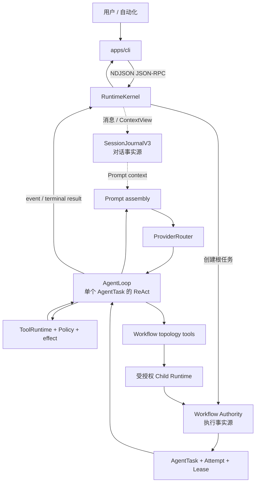
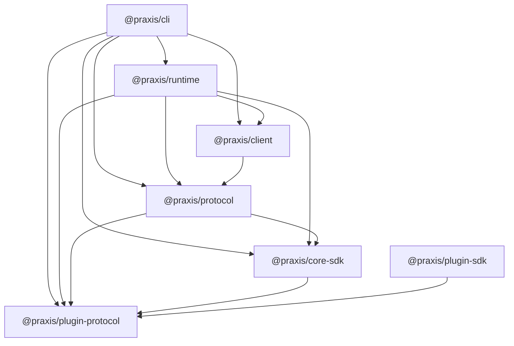

# Praxis 模块地图 / Module Map

本文面向第一次阅读 Praxis 源码的人，回答三个问题：仓库为什么这样分层、每个模块负责什么、修改一项功能应该从哪里开始。它是源码导航，不替代各领域的详细合同。

- 想知道产品现在能不能做某件事，查[项目状态](project-status.md)。
- 想理解运行时如何协作，查[当前架构](architecture.md)。
- 想核对 RPC 字段，查[Runtime Protocol v1](protocol.md) 和 `packages/protocol`。
- 想判断“接近工业架构”是否等于“已经证明工业级”，查[最终小样本测评](evaluation-final-2026-08-09.md)。

## 1. 先建立一张心智地图

一次被接受的 Prompt 从终端进入独立 Runtime。Runtime 把对话事实写入 Session，把执行事实写入 Workflow，再由带 Lease 的 AgentTask 进入执行循环：

新手最容易混淆的边界：

1. CLI 是客户端，不拥有 Provider、Tool、权限或持久状态。
2. `AgentLoop` 只执行一个 AgentTask；跨 Agent 调度属于 Workflow。
3. Session 保存对话；Workflow 保存执行。它们通过 ID 关联，但不是同一份数据库模型。
4. 模型只能提出 Tool、能力和拓扑申请；Runtime 决定授权、预算、租约、恢复和最终状态。
5. Child 与根 Agent 共用同一套 Harness，差异来自收窄后的 Capability Bundle。

### 六个核心实体

| 实体 | 直观含义 | 常见关系与事实源 |
| --- | --- | --- |
| Session | 一段可恢复的对话 | 一个 Session 有多次 Run；消息与 ContextView 由 SessionJournal 保存 |
| Run / Prompt | 一次被接受的 `session.prompt` 或 follow-up 执行 | 当前产品路径为它创建一个根 Workflow；管理/查询 RPC 不创建 Workflow |
| Workflow | 一次请求的持久执行账本 | 保存图、Node、Attempt、Task、Lease、等待和副作用；重试留在同一 Workflow 内 |
| AgentTask | 根 Agent 或 Child 的一个可调度工作单元 | 一个 Workflow 至少有根 AgentTask，也可动态增加 Child Task |
| Attempt / Lease | 一次执行尝试 / Worker 的限时执行权 | 失败重试创建新 Attempt；Lease 过期后由恢复策略决定能否接管 |
| Child Runtime | 受收窄能力约束的独立 Agent 进程 | 执行某个 Child AgentTask，结果回写同一 Workflow |

Session 与 Workflow 是不同逻辑模型。默认部署中 Session 可选 JSONL 或 SQLite，Workflow authority 使用独立 SQLite；“不同模型”不意味着所有部署永远必须使用两个物理数据库。

## 2. 顶层目录

| 路径 | 类型 | 责任 | 新手何时阅读 |
| --- | --- | --- | --- |
| `apps/cli` | 产品应用 | Commander CLI、Ink TUI、Runtime 子进程连接、非交互输出 | 想改命令、终端 UI、事件展示时 |
| `apps/runtime` | 产品应用 | Agent 执行、Workflow、Provider、Tool、权限、存储、扩展与恢复 | 想理解或修改 Agent 行为时 |
| `packages/*` | 公共合同 | 领域类型、Wire Schema、客户端和插件 SDK | 改跨进程/跨 Workspace 合同时 |
| `docs` | 当前文档与审计材料 | 入门、Reference、Current Architecture、ADR、RFC、评测 | 先从[文档中心](README.md)选阅读路径 |
| `examples` | 可运行示例 | Prompt、Skill、MCP、Process Tool/Provider、插件资源 | 写扩展时先复制最小示例 |
| `test` | 跨模块验证 | 单元、契约、集成、PTY、恢复、安全和 Provider 测试 | 改代码前找同领域测试 |
| `evals` | 评测输入 | Scenario、外部 benchmark 适配或固定评测资产 | 评估 Agent 效果和回归时 |
| `scripts` | 仓库自动化 | 构建、测试编排、打包、发布、审计和 benchmark | 修改工程流程时 |
| `infra` | 部署辅助 | Verdaccio 等本地/私有基础设施 | 发布或维护 Registry 时 |
| `security` | 安全资产 | 安全测试或审计相关材料 | 做威胁建模和供应链检查时 |
| `artifacts` | 本地运行证据 | 评测、Trace 或调试生成物；不是公共源码合同 | 复核运行结果时 |
| `dist` | 生成物 | 构建输出和根级兼容镜像 | 不手工修改；由 `npm run build` 生成 |

`.cache`、`.local`、`.tmp*` 和 `node_modules` 是本地状态或依赖，不属于架构模块，也不应作为文档事实来源。

## 3. 七个 Workspace 与真实依赖方向

下图是 2026-08-09 各 Workspace manifest 中的直接生产依赖；不包含传递依赖。`A --> B` 表示 A 导入 B：

| Workspace | 对外责任 | 入口或先读文件 | 不应该拥有 |
| --- | --- | --- | --- |
| `apps/cli` / `@praxis/cli` | 终端产品、Runtime Bridge、发布命令 | `src/cli.tsx`、`src/runCli.tsx`、[CLI 源码导读](../apps/cli/readme.md) | Provider 调用、Tool 执行、授权决策 |
| `apps/runtime` / `@praxis/runtime` | 独立 Runtime 与所有能力组合 | `src/entry.ts`、`src/framework/runtimeKernel.ts`、[Runtime 源码导读](../apps/runtime/readme.md) | Ink UI 或 CLI 展示状态 |
| `packages/plugin-protocol` | 最底层插件 manifest、握手、Process RPC 合同与 JSON Schema | `src/index.ts`、`src/process.ts`、`schemas/` | Runtime 生命周期和策略实现 |
| `packages/core-sdk` | Provider-neutral 领域合同 | `src/index.ts`，再按 `workflow.ts`、`llm.ts`、`tool.ts` 等领域进入 | IO、数据库、网络和应用实现 |
| `packages/protocol` | Runtime JSON-RPC 方法、事件、Schema 与校验 | `src/types.ts`、`src/schema.ts`、[协议文档](protocol.md) | CLI UI 或 Runtime 业务算法 |
| `packages/client` | 初始化、订阅、Sequence 校验和有界重连 | `src/index.ts`、[客户端教程](protocol-client.md) | 子进程传输和具体 UI |
| `packages/plugin-sdk` | Process 插件作者 API、合同校验和脚手架 | `src/index.ts`、[插件开发](plugin-authoring.md) | 安装、启用、授权和监督 |

架构规则是 `packages/*` 不得导入 `apps/*`，Runtime 不得导入 CLI 或 Ink；仓库通过 TypeScript 构建、package import smoke 和跨 Workspace 测试守住这条边界。只有暴露面发生变化时，跨 Workspace 变更才需要同步修改相应合同和消费者。

## 4. Runtime 的全部直接源码域

`apps/runtime/src` 是最大的代码树。以下分组覆盖 2026-08-09 的 29 个直接子目录和 7 个根文件；先按层理解，不要按文件名字母顺序阅读。维护者可用 `Get-ChildItem apps/runtime/src -Directory` 对照新增目录并同步本文。

### 4.1 入口、协议与组合层

| 模块 | 负责 | 主要入口 |
| --- | --- | --- |
| 根文件 | 包入口、独立进程、Server 与 Storage 导出；长期计时和显式长生命周期策略 | `entry.ts`、`run.ts`、`process.ts`、`server.ts`、`storage.ts`、`longDurationTimer.ts`、`longLivedExecutionPolicy.ts` |
| `framework` | 唯一产品 composition root、RPC dispatch 和产品接线 | `runtimeKernel.ts` |
| `process` | NDJSON 进程连接、进程树、正式 Runtime 协议连接 | `runtimeProtocolConnection.ts` |
| `server` | 本地 Runtime Server 边界 | `localRuntimeServer.ts` |
| `commands` | 内置命令目录、审计、Prompt/外部 Tool 命令适配 | `commandService.ts`、`builtinCommandRegistry.ts` |
| `settings` | 用户设置的读取、验证与兼容迁移 | `userSettingsStore.ts` |

### 4.2 Agent 与 Workflow 执行层

| 模块 | 负责 | 主要入口 |
| --- | --- | --- |
| `workflow` | 每个 Prompt 的 durable Workflow、Task/Lease、调度、拓扑 Tool、Local/远程 Worker、effect receipt | `autoWorkflowPlanner.ts`、`workflowOrchestrator.ts`、`sqliteWorkflowAuthority.ts` |
| `loop` | 单个 AgentTask 的 Provider/Tool ReAct、stream、usage、steer、abort、compaction 和唯一终态 | `index.ts` |
| `subagent` | Child admission、bootstrap、Capability Bundle、进程 host、MCP/credential broker、结果提交 | `childRuntimeHost.ts`、`childComposition.ts`、`childResultSubmissionTool.ts` |
| `planner` | Graph/Verifier、预算、恢复、worktree/snapshot merge 等可复用底层组件 | `plannerRouter.ts`、`controlledWorkspaceMerge.ts`；历史 supervisor 类不是第二条产品路径 |
| `planner-api` | Planner 能力的窄导出边界 | `index.ts` |

详细主链路见[内核与 AgentLoop](../apps/runtime/docs/01-kernel-and-loop.md)和[统一 Workflow 与多 Agent](workflow-platform.md)。

### 4.3 Session、Prompt 与数据层

| 模块 | 负责 | 主要入口 |
| --- | --- | --- |
| `session` | Session 生命周期和 Run 协调 | `sessionService.ts`、`runCoordinator.ts` |
| `session-db` | `SessionJournalV3` 的 JSONL/SQLite 实现、Repository、迁移与 composition | `sessionRepositoryV3.ts`、`sessionJournalComposition.ts` |
| `store` | SQLite 加载和兼容 Session Store 适配 | `nodeSqlite.ts`、`sessionStore.ts` |
| `prompt` | 项目指令、ContextView、Prompt registry/assembly/persistence 和 system composer | `promptAssembler.ts`、`systemPromptComposer.ts`、`promptRegistry.ts` |
| `memory` | token/context window、semantic/native compaction、reasoning 与 Tool-result editing | `compactionService.ts`、`contextWindow.ts`、`contextEditing.ts` |
| `artifacts` | 大结果和执行证据的内容寻址存储 | `artifactStore.ts` |

这里的 `sessionJournalComposition.ts`、`childComposition.ts` 是领域内部的组装 helper；产品级 composition root 仍只有 `RuntimeKernel`。必须保持：canonical SessionJournal 不被 Provider-only editing 改写；Workflow 恢复不依赖自然语言 compaction。详见[会话、Prompt 与上下文](../apps/runtime/docs/02-session-memory-prompt.md)。

### 4.4 Provider、凭证与扩展层

| 模块 | 负责 | 主要入口 |
| --- | --- | --- |
| `providers` | Anthropic、OpenAI Responses/Compatible、Kimi、MiniMax、DeepSeek、Mock 等 adapter 与 SSE/content conversion | `registry.ts`、`modelCatalog.ts`、各 `*Provider.ts` |
| `provider-router` | Provider 选择、fallback、能力/错误/usage 归一 | `providerRouter.ts` |
| `llm-provider` | 内置 Provider 能力注册表 | `builtinProviders.ts`、`providerRegistry.ts` |
| `credentials` | 凭证解析、加密持久化和服务接口 | `credentialService.ts`、`encryptedCredentialStore.ts` |
| `extensions` | Capability/Resource registry、Skill、MCP、Process activation 与监督 | `extensionService.ts`、`mcpActivationService.ts`、`skillInvocationService.ts` |
| `plugin` | 插件安装后的 Runtime 管理、Process host 与协议适配 | `pluginManager.ts`、`processPluginHost.ts` |

Provider 的精确配置见[Provider 配置](provider-setup.md)，扩展边界见[Extensions、Plugins、MCP、Skills 与 Child Agent](../apps/runtime/docs/05-extensions-plugins-subagents.md)。

### 4.5 Tool、权限与隔离层

| 模块 | 负责 | 主要入口 |
| --- | --- | --- |
| `builtin-tools` | 组装内置 Tool 目录 | `builtinTools.ts`、`toolRegistry.ts` |
| `tools` | read/find/grep/write/edit/shell/artifact Tool、Schema、路径解析、并发修改协调 | `toolRuntime.ts`、各 `*Tool.ts` |
| `policy` | Tool 风险判断、allow/deny 与 permission decision | `policyEngine.ts` |
| `security` | 路径安全和隔离后端合同 | `pathSafety.ts`、`isolationBackend.ts` |

Tool 不是一个随意调用的函数：descriptor、Schema、target、side effect、Policy、workspace 和 durable effect broker 共同决定能否执行。详见[工具、权限与安全](../apps/runtime/docs/04-tools-policy-security.md)。

### 4.6 可观测性与评测层

| 模块 | 负责 | 主要入口 |
| --- | --- | --- |
| `trace` | 关联 Run、Provider、Tool、Policy 和持久化操作的 Trace | `traceService.ts`、`jsonlTraceSink.ts` |
| `operations` | Runtime 指标和性能剖析 | `operationalMetrics.ts`、`performanceProfiler.ts` |
| `evaluation` | Scenario、ReplayProvider、Runner、grader、报告和 CLI | `scenarioRunner.ts`、`productionRuntime.ts`、`cli.ts` |

Trace、指标和 benchmark 回答的问题不同，不能互相替代。详见[Trace、运维指标与评测](../apps/runtime/docs/06-trace-evaluation-operations.md)。

## 5. CLI 的全部源码域

| 模块 | 负责 | 主要入口 |
| --- | --- | --- |
| 根文件 | Commander 命令、进程模式、管理动作、读取 policy-file、收集权限输入和安全密钥输入 | `cli.tsx`、`runCli.tsx`、`cliActions.ts` |
| `bridge` | 启动/连接 Runtime，把 RPC 和事件转换成 CLI 使用的接口 | `localRuntime.ts`、`ndjsonBridge.ts` |
| `protocol` | 对 `@praxis/protocol` 的 CLI 兼容导入 | `schema.ts` |
| `render` | `text/json/stream-json` 非交互输出与退出码 | `nonInteractive.ts` |
| `ui` | Ink App、Transcript、Composer、Picker、事件状态、终端编辑和差分输出 | `App.tsx`、`EventList.tsx`、`Composer.tsx`、`terminalOutput.ts` |

完整文件级职责和三轮阅读顺序见[CLI 源码导读](../apps/cli/readme.md)。

CLI 可以读取自动化 policy-file 或把用户的 allow/deny 选择传给 Runtime，但不能自行扩大权限；最终授权、持久规则和 Tool 执行仍由 Runtime 的 `PolicyEngine` 决定。

## 6. 公共包内部怎样分

### `packages/core-sdk`

这是扁平的合同包，可以按领域分组阅读：

| 领域 | 文件 |
| --- | --- |
| Agent/命令 | `contracts.ts`、`command.ts`、`command-execution.ts`、`input-router.ts` |
| LLM/Provider | `llm.ts`、`provider-stream.ts` |
| Prompt/Plan | `prompt.ts`、`plan.ts` |
| Session | `session-journal.ts`、`session-journal-port.ts`、`session-journal-transfer.ts`、`session-compaction.ts` |
| Tool/扩展 | `tool.ts`、`plugin.ts`、`subagent.ts` |
| Workflow | `workflow.ts`、`workflow-port.ts` |
| Trace | `trace.ts` |

它只定义“必须满足什么”，不实现数据库、网络、Provider 或 UI。

### 其余公共包

- `packages/protocol/src/types.ts` 定义 Wire 类型，`schema.ts` 做运行时校验，`constants.ts` 保存版本常量，`index.ts` 是公共导出。
- `packages/client/src/index.ts` 实现类型化客户端，不决定具体 transport 如何启动。
- `packages/plugin-protocol/src/index.ts` 定义 manifest/能力，`process.ts` 定义 Process RPC；`schemas/` 是可分发 JSON Schema。
- `packages/plugin-sdk/src/index.ts` 提供 `defineCapability`、合同断言与最小脚手架。

## 7. 常见改动应该穿过哪些模块

| 目标 | 通常修改顺序 | 必须验证 |
| --- | --- | --- |
| 新增内置 Provider | `runtime/providers` 实现 → `llm-provider` 注册 → catalog/router → credentials/settings 和配置文档（按需） | Provider 合同、catalog、stream/error/usage 测试；只有能力字段变化才改 `core-sdk/llm` |
| 新增 Process Provider | `plugin-protocol`/`plugin-sdk`（合同需要变化时）→ Process host/activation → 插件实现与文档 | handshake、stream、deadline、凭证与关闭 |
| 新增 Runtime RPC | `packages/protocol` 类型/Schema → `framework/runtimeKernel` handler/dispatch → `packages/client`/CLI（有消费者时） | Schema fixture、协议集成、重连/终态语义；领域合同按需修改 |
| 新增内置 Tool | `runtime/tools` 实现 → `runtime/builtin-tools` 注册 → policy/security/effect → CLI 展示（按需） | Schema、路径、权限、并行/副作用测试；公共 Tool 合同按需修改 |
| 修改 Workflow | authority/orchestrator/worker → `core-sdk/workflow*`、Protocol projection、client/TUI（仅暴露面变化时） | 事务、Lease、恢复、幂等与投影测试 |
| 修改 Prompt/Compaction | `runtime/prompt`/`memory` → Provider adapter → `core-sdk/prompt/llm`（合同变化时） | Prompt 合同、cache、fidelity、恢复不变量 |
| 新增 Slash Command | CLI command catalog/handler → Runtime command/RPC（若需） | 命令面、交互、非交互边界 |
| 新增 Process 插件能力 | `plugin-protocol` → `plugin-sdk` → Runtime host/activation → 示例和文档 | manifest/handshake、授权、超时与关闭 |

规则很简单：先判断公共合同是否真的变化；若变化，就按“合同 → 实现 → 投影/消费者 → 展示”推进，若没有变化，则从具体实现和注册点开始。不要为了新增一个现有接口的实现而制造公共 API 变更，也不要让 CLI、Prompt 文本或测试 fixture 成为唯一业务事实。

## 8. 常用术语

| 术语 | 本仓库中的含义 |
| --- | --- |
| NDJSON JSON-RPC | 每行一个 JSON-RPC 消息的进程通信格式 |
| ReAct | 模型在“思考/决定 → 调用 Tool → 读取结果 → 继续”之间循环 |
| Authority | 某类事实的唯一权威存储和状态迁移入口 |
| Lease | Worker 在有限时间内执行一个 Task 的独占权；需 heartbeat |
| Projection | 从持久事件归约出的当前状态视图，供 API/TUI 查询 |
| Harness | AgentLoop、Prompt、Provider、Tool、Trace 等组成的通用 Agent 执行框架 |
| Capability Bundle | Runtime 计算出的有效 Tool、Skill、MCP、workspace、network 和预算授权集合 |
| effect receipt | 外部副作用已提交或补偿的持久证据，用于幂等和恢复 |
| durable | 进程崩溃后仍可从权威存储继续，而不是只存在内存中 |
| soak | 长时间持续运行测试，用来观察泄漏、漂移和低概率故障 |

## 9. 三条推荐阅读路线

### 只想会用：约 30 分钟

1. [根 README](../README.md)
2. [快速入门](quickstart.md)
3. [Provider 配置](provider-setup.md)
4. [会话恢复](session-recovery.md)

### 想理解 Agent 架构：约半天

1. 本文第 1–4 节
2. [当前架构](architecture.md)
3. [Runtime 源码导读](../apps/runtime/readme.md)
4. [内核与 AgentLoop](../apps/runtime/docs/01-kernel-and-loop.md)
5. [统一 Workflow 与多 Agent](workflow-platform.md)
6. [Prompt、Context 与 Compaction](prompt-assembly.md)

### 准备贡献代码：按一个纵向切片学习

1. [贡献指南](../CONTRIBUTING.md)与[Monorepo 指南](monorepo.md)
2. 从上表选择一种改动，沿“合同 → 实现 → Protocol → UI → 测试”追踪
3. 先读同领域测试，再做最小改动
4. 运行 `npm run check`、`npm test`、`npm run build`
5. 同步更新 current 文档与 `CHANGELOG.md`

## 10. 怎样评价它的工业化程度

Praxis 已具备许多工业 Agent Runtime 常见的控制面：独立进程协议、持久 Task/Lease、能力收窄、写隔离、恢复、幂等副作用、Trace、评测和公共合同分层。这说明架构方向接近工业系统。

但“架构要素齐全”不等于“工业级可靠性已经被证明”。当前 Authority 形态还缺少目标部署模型下的多节点高可用证据，也缺跨租户治理、规模化远程多 Worker、重复故障和长时间 soak 证据；PostgreSQL 是可能的演进路径，不是所有工业场景的必要条件。现有外部 benchmark 也是小样本，本页不据此作生产可靠性结论。对外描述时应使用[项目状态](project-status.md)和[最终小样本测评](evaluation-final-2026-08-09.md)中的证据边界。
