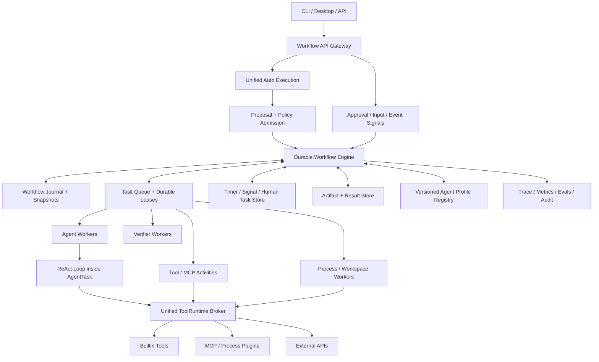
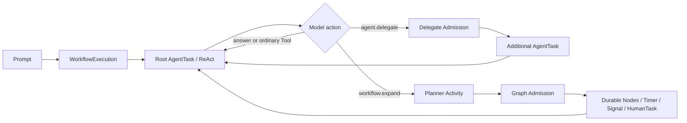
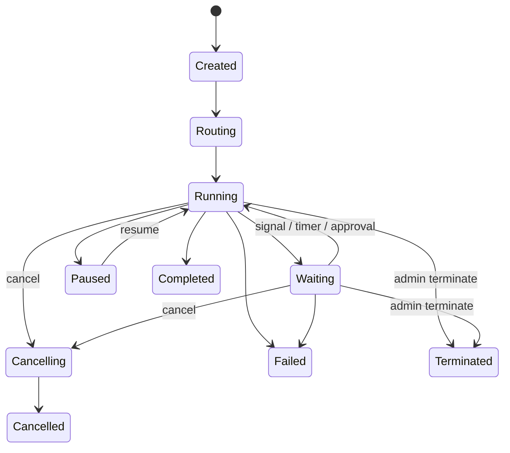

# RFC：统一、持久化的 Planner 与多智能体平台

状态：目标 RFC；阶段 1-5 与阶段 6 的统一 broker/远程 Worker 纵向切片已接入，PostgreSQL/租户治理仍是部署提案
面向读者：Praxis Runtime、Planner、Protocol、Storage 与安全模块维护者
最后更新：2026-08-07

当前实现边界以 [项目状态](project-status.md) 和 [统一 Workflow 与多 Agent](workflow-platform.md) 为准。当前已交付统一 `auto`、Root AgentTask、delegate/expand、SQLite Task/Lease、Local Child Runtime、不可变 Profile/执行快照、后台恢复、HumanTask/Timer、Workflow projection、Git 候选合并、调用前 effect reservation、Saga 账本和认证远程 Worker Authority/Artifact 边界；PostgreSQL、租户治理、高可用通知和连接器自动补偿仍未交付。

## 结论

Praxis 不应退回“全局纯 ReAct”，也不应继续把“是否能创建 Subagent”绑定到 Direct/Supervisor 两条产品路径。推荐的最终架构是：

- 产品只有一个默认 `auto` 执行入口；根 LLM 在同一个 AgentTask 中自主决定直接回答、使用 Tool、委派 Agent 或扩展 Workflow；
- `solo` 与 `workflow` 仅作为兼容期和高级用户的硬约束保留，不形成第二、第三套执行实现；
- LLM 产生结构化 `DelegateProposal`、`GraphProposal` 或 `GraphPatchProposal`，Runtime 根据权限、风险、预算、工作区和可恢复性做最终准入；
- 所有请求都创建统一的 `WorkflowExecution`；只有一个 `AgentTask` 只是最小拓扑，不是另一种产品模式；
- ReAct 保留为 `AgentTask` 内部的执行策略，而不是长生命周期系统的全局控制面；
- 复杂任务由持久化 Orchestrator 调度 Agent、Tool、审批、定时器、外部事件和子 Workflow；
- LLM 只提出 Route、Plan、GraphPatch 和 Handoff，不拥有授权、状态迁移、重试或终态决定权。

一句话概括：**默认把执行拓扑的选择权交给模型，把授权、状态迁移和可恢复性保证留给确定性 Runtime。**

## 为什么不能只用 Prompt 自主选择

Prompt 是路由的重要输入，但不是全部事实。LLM 只读 Prompt 时通常不知道：

- 当前 Tool、Skill、MCP 和 Provider 是否真的可用；
- 工作区是否为 Git 仓库、是否干净、是否允许写入；
- 本次 Run 的 token、Tool、费用、并发和 deadline 预算；
- 某个外部动作是否可幂等重试、是否需要用户审批；
- Runtime 是否能在进程重启后恢复这种任务；
- 当前租户、Session 或组织策略是否允许创建 Child。

因此正确语义不是“LLM 自主获得权限”，而是同一 `auto` 执行中的两阶段决策：

```text
LLM execution proposal + Runtime facts + User policy -> admitted topology and capability lease
```

LLM 可以自主提出委派、扩图、Handoff 或子 Workflow；Runtime 必须保留否决、要求审批、缩小预算和强制图化的权力。所有模式本来就使用同一个持久 Workflow Engine。用户显式选择的 `solo` 是硬上限，不能被模型升级为多 Agent；用户显式选择 `workflow` 要求模型在执行非平凡副作用前提交里程碑图，但仍不能扩大权限。

如果 `solo` override 与任务的强制多责任域条件冲突，Runtime 应返回可解释的 `MODE_OVERRIDE_INCOMPATIBLE` 并请用户改用 `auto/workflow`，而不是偷偷升级或在单 Agent 中冒险执行。`workflow` override 只要求预先形成受准入的里程碑图，不保证一定创建多个 Agent；简单任务仍可以是一个可恢复的 AgentTask。

## 产品层只保留一个 Auto 执行入口

`auto` 不是一个先选 Direct、失败后再切 Supervisor 的 Router。它从一开始就创建统一的 `WorkflowExecution` 和根 `AgentTask`；模型在执行过程中通过受控 Tool 改变图的拓扑。单 Agent、委派和完整 Workflow 是同一执行对象的三个形态，不是三个互斥模式。

| 动态形态 | 适用任务 | 执行形态 | Subagent |
| --- | --- | --- | --- |
| 单 Agent | 单一目标、低风险、无需等待、预计短时完成 | 根 `AgentTask` 在持久化 Workflow 中运行 ReAct | 模型没有提出委派，因此不创建 |
| 有界委派 | 一个主任务加少量并行调查、Review 或验证 | 根 Agent 调用 `agent.delegate`，Runtime 准入后增加短期 AgentTask | 有界、父 Agent 保留回答所有权 |
| 完整 Workflow | 多阶段、长时间、外部等待、多个副作用、需要审批或恢复 | 模型调用 `workflow.expand`，形成队列、租约、Signal、Timer 和多个 Profile 的持久图 | 支持层级委派与子 Workflow |

`supervisor` 不再是用户必须理解的模式名。它变成完整 Workflow 内部的一种 Coordinator Profile。现有 `/planner direct` 和 `/planner supervisor` 在兼容期分别映射为 `/mode solo` 和 `/mode workflow`；新 Session 默认 `/mode auto`。

三个 mode policy 必须进入同一个 Orchestrator、Scheduler、Worker 和 Journal。实现中不得出现“`solo` 实例化 DirectPlanner、`workflow` 实例化 SupervisorPlanner”之类的新分支；override 只能缩小可提交的 Proposal 或要求预先图化。

## 设计目标与非目标

### 目标

- 简单请求保持单 Agent ReAct 的低延迟和高灵活性；
- 长任务可暂停数小时或数天，进程重启后从持久状态继续；
- Agent、Tool、人工审批、定时器和外部事件使用同一编排语义；
- 支持 agent-as-tool、handoff、并行、条件、join、有界循环和子 Workflow；
- 每个 Agent 使用独立 Profile、模型、上下文、Tool、Skill、MCP、预算和权限；
- 所有副作用都有明确的幂等、补偿或人工处理语义；
- 单机 SQLite 和未来多机 PostgreSQL 使用同一领域合同；
- 计划、执行、验证、权限和成本全部可追踪、回放和评测。

### 非目标

- 不承诺任意外部副作用的 exactly-once；
- 不允许执行模型生成的任意条件代码、Shell 验证命令或权限表达式；
- 不允许 Subagent 继承父 Agent 的 ambient credential 或无限预算；
- 不把自然语言聊天记录当作 Workflow 的唯一状态；
- 不用多 Agent 取代可以由一个 Agent 稳定完成的简单任务。

## 总体架构



架构分成六个平面：

1. **接入与准入平面**：接收统一 `auto` 执行，编译用户 override，并准入模型提出的委派或扩图；
2. **持久化控制平面**：拥有 Workflow 状态、图、调度、重试、等待和终态；
3. **Agent 数据平面**：运行 ReAct、Planner、Reviewer、Verifier 等模型任务；
4. **能力与安全平面**：统一 Tool、MCP、Credential、Sandbox 和审批；
5. **状态与上下文平面**：保存事件、结构化状态、Artifact 和长期 Memory；
6. **运维与质量平面**：Trace、指标、回放、Eval、版本和审计。

## 统一执行模型

每个用户请求都创建一个 `WorkflowExecution` 和根 `AgentTask`。模型可以在同一次 `auto` 执行中保持单节点，也可以提出委派或扩图：



这样不再维护两套 Session、终态、事件和权限语义。简单请求仍然足够轻：它只追加少量 Workflow/Task 事件，由同进程 Worker 立即 claim 根 AgentTask；不需要先调用一遍独立 Route Model，再调用一遍回答模型。这个 fast lane 仍经过 durable Task/Lease，不是绕开恢复合同的内存旁路。

### 模型执行提案合同

普通委派直接使用结构化 `DelegateProposalV1`；只有模型判断需要里程碑图、长期等待或多个协调节点时，才提交 `GraphProposalV1`。为了路由解释、Eval 或在执行前必须确定持久化级别的任务，Runtime 也可以要求根 Agent 先提交 `RouteProposalV1`：

```ts
type RouteProposalV1 = Readonly<{
  topology: 'single_agent' | 'delegated_agents' | 'workflow_graph'
  reasons: readonly RouteReasonCode[]
  estimated: {
    stages: number
    parallelism: number
    durationClass: 'interactive' | 'background' | 'long_lived'
    sideEffectClass: 'none' | 'workspace' | 'external'
  }
  requiredCapabilities: readonly string[]
  requiresHumanInput: boolean
  confidence: number
}>

type DelegateProposalV1 = Readonly<{
  profileRef: VersionedRef
  objective: string
  inputRefs: readonly ArtifactRef[]
  grantRequest: CapabilityRequestV1
  budgetRequest: AgentBudgetRequestV1
  assemblyRequest?: {
    instructions?: string
    model?: {
      provider?: string
      model?: string
      tier?: 'fast' | 'balanced' | 'powerful'
      reasoningEffort?: 'none' | 'low' | 'medium' | 'high'
    }
    result?: { format: 'text' | 'markdown' | 'json'; schema?: JsonSchema }
    successCriteria?: readonly { id: string; description: string }[]
  }
  resultSchemaRef: VersionedRef
  reasons: readonly RouteReasonCode[]
}>
```

`reasons` 必须使用 Runtime 定义的枚举，例如 `MULTI_DOMAIN`、`PARALLEL_EVIDENCE`、`EXTERNAL_WAIT`、`HIGH_RISK_WRITE`、`LONG_DURATION`。自由文本可以作为解释，但不能参与准入逻辑。

### Auto 执行与模型自主选择

`auto` 按以下顺序工作：

1. Runtime 执行确定性 preflight，读取用户 override、可用能力、工作区、预算、组织策略和必须持久化条件；
2. Runtime 创建统一 `WorkflowExecution` 和根 `AgentTask`，向根 LLM 暴露普通 Tool、`agent.delegate`、`agent.handoff` 与 `workflow.expand` 中本次被策略允许的部分；
3. 根 LLM 自主决定直接回答、继续使用普通 Tool、提交 `DelegateProposal`，或提交 `GraphProposal/GraphPatchProposal`；
4. `ExecutionAdmissionPolicy` 对每次模型提案做 clamp，可能接受、缩小 grant/预算、要求用户确认或拒绝；
5. 已完成的消息、Tool receipt、Result 和 Artifact 作为新节点输入复用，扩图不能让父 Agent 从头重复执行；
6. 所有 AgentTask 和 Activity 从第一步起都经过 durable Task/Lease；一旦拓扑扩展出等待、审批或外部副作用节点，模型只能减少或修补尚未执行的图，不能把它折叠回不可恢复的内存执行。

以下情况由 Runtime 强制要求 `workflow_graph` 拓扑：等待人工或外部事件、后台期限、多个不可逆动作、跨多个独立权限域、需要定时器，或策略要求双人审批。除此以外，是否保持单 Agent、委派 Agent 或生成图由根 LLM 决定。Runtime 的强制图化不是替模型规划任务，而是对执行可靠性的最低要求。

## Workflow Graph 合同

### 节点类型

| Node Kind | 作用 | 是否允许模型内部 ReAct |
| --- | --- | --- |
| `agent_task` | 使用某个 Agent Profile 完成有界目标 | 是 |
| `tool_activity` | 调用一个已注册 Tool/MCP/API | 否 |
| `decision` | 根据结构化输出选择条件边 | 否 |
| `verification` | 机械、规则或模型验收 | 仅 semantic verifier 可调用模型 |
| `human_task` | 审批、补充信息、选择或人工 Review | 否 |
| `timer` | 等待指定时间或 deadline | 否 |
| `signal_wait` | 等待 webhook、消息或外部状态 | 否 |
| `subworkflow` | 创建独立生命周期的 Child Workflow | 由子图决定 |
| `compensation` | 对已完成副作用执行已注册补偿 | 否 |
| `synthesis` | 汇总已验证结果并形成最终输出 | 可以，但通常禁用外部副作用 |

### 核心 Schema

```ts
type WorkflowSpecV1 = Readonly<{
  workflowId: string
  objective: string
  modePolicy: 'auto' | 'solo' | 'workflow'
  topology: 'single_agent' | 'delegated_agents' | 'workflow_graph'
  revision: number
  nodes: readonly WorkflowNodeSpecV1[]
  edges: readonly WorkflowEdgeV1[]
  completion: CompletionPolicyV1
  budget: WorkflowBudgetV1
  maxGraphMutations: number
}>

type WorkflowNodeSpecV1 = Readonly<{
  nodeId: string
  kind: WorkflowNodeKindV1
  profileRef?: VersionedRef
  inputRefs: readonly ArtifactRef[]
  outputSchemaRef: VersionedRef
  grantRequest: CapabilityRequestV1
  effect: EffectContractV1
  retry: RetryPolicyV1
  timeout: TimeoutPolicyV1
  criteria: readonly VerificationCriterionV1[]
  maxIterations?: number
}>
```

边只允许使用 Runtime 自有 Predicate DSL：`eq`、`in`、`exists`、`status_is`、`all`、`any`、数值比较和对结构化输出的有界 JSON Pointer。不得执行模型提交的 JavaScript、正则脚本或 Shell。

### 图表达力

- 顺序：普通依赖边；
- 并行：多个节点同时满足依赖；
- Join：`all`、`any` 或固定 `quorum`；
- 条件：`decision` 节点和白名单 Predicate；
- 循环：显式 `maxIterations`、退出 Predicate 和循环预算；
- 动态扩图：Planner 提交 `GraphPatchProposal`，经 schema、权限、预算、无悬空引用和 revision CAS 校验后应用；
- 子流程：长生命周期或独立责任域使用 `subworkflow`，短任务使用 `delegate`。

不建议一次生成数百个节点。Planner 先生成里程碑图，接近某个里程碑时再渐进展开，避免早期计划在信息不足时过度具体。

## Planner 不再是一个大类

完整平台应把当前“大 Planner”拆成可独立测试的服务：

| 组件 | 唯一职责 |
| --- | --- |
| `ExecutionAdmission` | 编译用户 mode policy、Runtime preflight 与模型执行提案，准入拓扑和能力 lease |
| `PlanGenerator` | 从目标生成 Workflow Proposal |
| `GraphValidator` | 校验结构、Predicate、Profile、权限和预算 |
| `WorkflowOrchestrator` | 确定性推进状态、生成任务和处理 Signal |
| `Scheduler` | 队列、公平性、锁、优先级、deadline 和租约 |
| `AgentExecutor` | 运行一个 AgentTask 内的 ReAct |
| `ReplanController` | 根据已验证事件提出 GraphPatch |
| `VerificationController` | 机械、规则、语义和人工验收 |
| `RecoveryController` | 识别过期租约并按 effect/retry 合同恢复 |
| `ResultSynthesizer` | 汇总完成状态、证据和残余风险 |

模型可以同时承担某些 Profile，但 Runtime 组件不能因此合并职责。特别是 Planner 不得直接执行 Tool，Scheduler 不得解释自然语言，Verifier 不得修改计划。

## Agent、Subagent 与 Profile

`Subagent` 是一个由父 Workflow 或父 Agent 通过 `agent.delegate` 委派的 `agent_task` execution。它是 `auto` 的正常能力，不要求用户预先切换 Supervisor。承载方式可以是本地 Child Runtime、远程 Worker 或容器，领域合同不依赖进程关系。

### AgentProfile

```ts
type AgentProfileV1 = Readonly<{
  profileId: string
  version: string
  description: string
  instructionsRef: VersionedRef
  modelPolicy: ModelRoutePolicyV1
  toolAllowlist: readonly string[]
  skillAllowlist: readonly string[]
  mcpAllowlist: readonly string[]
  defaultBudget: AgentBudgetV1
  contextPolicy: ContextPolicyV1
  outputSchemaRef: VersionedRef
  delegationPolicy: DelegationPolicyV1
  memoryPolicy: MemoryPolicyV1
}>
```

产品对模型暴露三个同构 Harness Profile：`default`、`worker`、`explorer`。它们不是三套 Runtime，只提供通用、执行修复、只读探索三种基线指令；LLM 再为具体 Child 申请 Prompt、Tool、Skill、MCP、模型、推理强度、预算、结果格式和成功标准。`coordinator` 是根 Agent 的内部 Profile，旧 `researcher/coder/reviewer/verifier` 仅为不可变历史 Workflow 保留。Profile 必须版本化；Workflow 保存精确版本和 digest，恢复时不能静默换成新 Prompt 或新 Tool 集。

### 三种协作语义

- `delegate`：父 Agent 保留回答所有权，子 Agent 返回结构化结果；适合短期调查和 Review；
- `handoff`：响应所有权转给另一个 Profile，必须产生持久 ownership event；适合客服、领域路由；
- `subworkflow`：创建独立 Workflow ID、预算和生命周期；适合跨天、外部等待或独立业务责任域。

Agent 之间不直接共享可变聊天记录。它们通过带 schema、provenance、digest 和访问控制的 Artifact、Result 与 durable mailbox 交换信息。

递归委派必须有绝对深度、累计 Agent 数、并发、成本和时间限制。建议默认深度 2；平台可配置硬上限，但任何 Child 获得的都是父预算衰减后的 delegation token，而不是父权限复制。

## 持久状态与存储

长生命周期平台必须将“会话恢复”和“执行恢复”分开：恢复聊天历史不代表恢复正在运行的 Tool、Agent 或外部动作。

### 存储组件

| Store | 内容 | 权威性 |
| --- | --- | --- |
| Workflow Event Journal | Route、Graph、Node、Attempt、Signal、Approval、Usage、Terminal 事件 | 唯一执行权威 |
| Snapshot Store | 从事件归约出的 Workflow/Node 当前状态 | 可重建缓存 |
| Task Queue / Lease Store | 待执行 Activity、Worker lease、heartbeat、可见时间 | 调度权威 |
| Artifact Store | 大模型输出、patch、日志、报告、Tool receipt | 内容权威，Journal 保存引用 |
| Timer / Signal Inbox | Timer、webhook、人工输入、外部消息去重记录 | 恢复所需权威 |
| Profile Registry | 版本化 Agent/Tool/Schema/Profile | 配置权威 |
| Search / Visibility Index | 状态、标签、时间、成本查询 | 可重建 projection |
| Long-term Memory | 用户偏好、跨 Workflow 知识 | 非执行权威 |

每次状态推进必须在一个事务中同时完成：追加事件、更新 snapshot、创建/确认 Task、写 outbox。不能先改状态再异步“尽量”发任务，否则崩溃会产生丢任务或重复任务。

单机版建议以 SQLite WAL 实现 Event、Snapshot、Queue、Timer 和 Outbox 的同库事务；JSONL 保留为导出、审计或离线迁移格式。多机版再实现同一 Port 的 PostgreSQL，使用行级 CAS/lease。不要让 SQLite 和 PostgreSQL 双写为两个权威。

Artifact 文件不能与 SQLite 行伪装成同一个原子事务。正确写入顺序是：先把内容写入 content-addressed staging/store，再在 SQLite 事务中提交 Artifact metadata/ref；事务失败留下的无引用内容由 GC 回收。每个 Orchestrator 决策还必须生成稳定 `commandId`，Event、Snapshot、Task 和 Outbox 在同一事务中提交；相同历史重放得到相同命令身份，不能创建第二份逻辑 Task。

### 确定性恢复

Orchestrator 只能根据历史事件和版本化 Workflow 定义产生 Command。LLM 调用、Tool 调用、随机数、系统时间和网络读取都是 Activity；它们的结果必须先写入历史，replay 时读取旧结果，不能重新执行。

这借鉴了 durable execution 的核心原则：Temporal 将 Workflow 定义与 Activity 分开，通过 Event History replay 恢复；LangGraph 也把线程 checkpoint 与跨线程 Store 分开。参见 [Temporal Workflow Execution](https://docs.temporal.io/workflow-execution) 和 [LangGraph Persistence](https://docs.langchain.com/oss/python/langgraph/persistence)。

## 状态机

### Workflow 状态



`Waiting` 和 `Paused` 都是 Open 状态，不得被当成失败。`cancel` 允许 Workflow 执行 cleanup/compensation；`terminate` 是管理员立即停止，不保证 cleanup。

### Node / Attempt 状态

```text
proposed -> admitted -> scheduled -> leased -> running
running -> waiting | verifying | retry_wait | unknown
verifying -> succeeded | retry_wait | failed
retry_wait -> scheduled
waiting -> scheduled
unknown -> resolved_succeeded | resolved_failed | manual_intervention
```

Node 表示逻辑工作，Attempt 表示一次实际执行。租约过期只能结束 Attempt，不能凭空删除 Node。新的 Attempt 是否允许创建，由 `EffectContract + RetryPolicy + receipt` 共同决定。

## 副作用、重试与一致性

外部 Activity 默认是 at-least-once，平台不能声称 exactly-once。完整 Effect 合同至少包含：

```ts
type EffectContractV1 = Readonly<{
  class:
    | 'pure'
    | 'read'
    | 'workspace_write'
    | 'external_idempotent'
    | 'external_non_idempotent'
  idempotencyKey?: string
  receiptSchemaRef?: VersionedRef
  compensationRef?: VersionedRef
  requiresApproval: boolean
}>
```

- `pure/read`：租约丢失后可按预算自动重试；
- `workspace_write`：使用隔离 worktree/容器，候选提交先验证，成功后原子推进目标引用；
- `external_idempotent`：必须携带稳定 idempotency key，并保存服务端 receipt；
- `external_non_idempotent`：启动前通常需要审批；失联后进入 `unknown`，禁止盲目重试；
- 多步业务事务使用 Saga：正向 Activity 与已注册 Compensation 成对存在；补偿失败进入人工处理。

LLM 调用只有在尚未持久化任何可消费输出时才能自动重放。流式输出、Tool call 或外部 receipt 一旦被下游观察，就必须延续原 Attempt 或显式创建新 revision，不能把重复结果伪装成同一次执行。

## Human-in-the-loop、Timer 与 Signal

审批不是一个悬挂在内存中的 Promise，而是持久 `human_task`：

- 保存精确请求、风险、目标、diff/参数摘要、授权范围和过期时间；
- 产生 `approval.requested` 事件并释放 Worker；
- 用户通过 `workflow.signal` 提交 allow/deny/edit/input；
- Signal 使用 `(workflowId, signalId)` 去重；
- 支持 deadline、提醒、升级和默认拒绝策略；
- 恢复后 UI 可以重新查询所有等待中的 HumanTask。

同样，等待 CI、PR Review、Webhook、外部文件或定时时间都使用 `signal_wait`/`timer`，不能让 Agent 进程循环 sleep 或轮询数天。

## 统一权限与 Tool Broker

权限按以下链条单向收窄：

```text
User / Organization Grant
  -> Workflow Grant
    -> Node Capability Bundle
      -> Attempt Lease
        -> Tool Permission Decision
```

模型只能提交 `CapabilityRequest`。`CapabilityCompiler` 根据父 grant、Profile allowlist、Node effect、Workspace、Sandbox、MCP descriptor 和用户策略生成签名 Bundle。

所有 Builtin、MCP、process plugin 和外部 API 必须经过同一个 `ToolRuntime Broker`：

- descriptor 带 effect、target、permission、idempotency 和 schema；
- Credential 只通过短期 handle/JIT token 提供，永不写入 Agent Prompt 或 Artifact；
- 文件权限使用 canonical path grant，网络权限使用 host/API scope grant；
- 非只读 Child MCP 只有经过同一审批和 receipt 通路后才能开放；
- untrusted process 必须由真正的 Sandbox Provider 执行；trusted-only 不是 OS 沙箱；
- 子 Agent 不能通过 Shell 启动未登记的 Praxis 实例绕过账本。

## Context、Memory 与 Artifact

Context 不应靠把整个父对话复制给每个 Agent。`ContextCompiler` 为每个 Node 构造最小上下文：

1. Workflow objective 和当前里程碑；
2. Node instructions 与 Profile；
3. 直接依赖的已验证 Result；
4. 被显式引用的 Artifact 片段；
5. 当前 capability 目录和 Skill 摘要；
6. 与任务相关的长期 Memory 检索结果；
7. 剩余预算、deadline、禁止事项和输出 schema。

状态分四层：Event History 负责执行事实，Workflow Projection 负责当前结构化状态，Artifact 保存大内容，Long-term Memory 保存可遗忘的跨任务知识。Memory 不能决定某个外部动作是否已经执行；receipt 和 Journal 才能。

Agent 私有 scratchpad 默认只在当前 Attempt 内可见。需要跨 Agent 或跨重启的信息必须提升为 Result、Artifact 或 Memory entry，并带 provenance 和访问控制。

## Planning、Replanning 与 Verification

### Progressive Planning

初始 Planner 只生成足够开始工作的里程碑和近期节点。每个 `GraphPatchProposal` 必须包含：触发事件、要替换/新增的节点、复用证据、预算差异、权限差异和终止条件。

允许 Replan 的触发器包括：

- 结构化输出表明原假设错误；
- Tool/Provider 长期不可用；
- 用户 Signal 改变目标；
- Verification 可恢复失败；
- deadline、预算或权限变化；
- 外部事件使某个分支失效。

Replan 不是无限反思循环。每个 Workflow 有 graph mutation、迭代、token、费用和 wall-clock 上限；重复相同失败码且没有新证据时直接 blocked/failed。

### Verification

验收顺序固定为：

1. schema、digest、receipt、路径和版本等 mechanical checks；
2. policy、effect、changed files、依赖和声明规则；
3. 注册过的 deterministic check；
4. 必要时独立 semantic verifier；
5. 高风险输出的 Human Review。

模型 Judge 不能覆盖机械失败。写代码时应在候选 worktree/commit 上完成验证，再 fast-forward；post-merge 检查只作为额外监控，不能成为第一次发现失败的主要阶段。

## Scheduler、Worker 与资源治理

Scheduler 基于 durable Task，而不是直接持有 Child 进程引用。Task 至少包含 Workflow/Node/Attempt ID、Profile、能力 Bundle ref、预算 lease、优先级、deadline、conflict keys、retry/effect 合同和 trace context。

Worker 流程：claim task → CAS 获取 lease → JIT 获取 credential → heartbeat/checkpoint → 提交 receipt/result → 原子确认 Task。Worker 崩溃后 lease 到期，由 RecoveryController 决定 retry、unknown 或人工介入。

调度必须支持：

- tenant/session/workspace/Provider 多层并发限制；
- 累计 token、Tool、Agent、费用和 wall-clock 预算；
- 公平队列、优先级和 deadline；
- workspace、repo、branch、外部资源 conflict key；
- Provider rate limit 和熔断；
- Agent/Profile/Tool/Sandbox 能力匹配；
- 父子 Workflow 预算的同步预留与结算。

本地版可以使用进程内 Worker 加 SQLite durable queue；领域协议必须允许以后把 Worker 移到其他主机，而不改变 Planner 或 Workflow Schema。

## API 与 Protocol

建议新增独立于聊天 Session 的 Workflow API：

```text
workflow.start
workflow.get
workflow.list
workflow.events.subscribe
workflow.signal
workflow.pause
workflow.resume
workflow.cancel
workflow.terminate
workflow.retry-node
workflow.resolve-unknown
workflow.artifacts.list
agent.profile.list
agent.profile.get
```

`session.prompt` 可以创建或关联 Workflow，但 Session ID、Workflow ID、Workflow Run ID 和 Agent Attempt ID 必须分离。一个 Session 可以包含多个 Workflow；一个 Workflow 可以跨多个 Session 交互；Continue-As-New 可以保留 Workflow ID 并创建新的 Run ID，以限制历史无限增长。

Event 至少覆盖 Route、Graph revision、Node/Attempt、Task lease、Tool receipt、Signal、HumanTask、Usage、Budget、Profile version、Policy decision、Artifact 和 Terminal。客户端只能根据持久事件恢复 UI，不能依赖某个进程仍持有内存状态。

## 可观测性、评测与治理

每次执行应能回答：为什么选这个策略、谁创建了这个节点、使用哪个模型/Profile/Prompt、获得哪些权限、花费多少、调用了什么、证据在哪里、为什么重试、谁批准、为什么结束。

最低指标：

- route 接受/降级/升级率和误路由率；
- Planner schema/admission/replan 成功率；
- Node latency、排队、重试、unknown 和人工介入率；
- token、Tool、Agent、费用与 wall-clock；
- Verification 首次通过率和 post-merge 失败率；
- Subagent 带来的质量增益与额外成本；
- crash recovery、重复 Signal 和幂等性测试结果；
- 按 Profile、模型、版本和任务集切分的 Eval 分数。

Trace 与 Eval 必须记录版本化 Route/Planner/Profile/Schema，才能重放历史数据并比较改动。工业界 Agent SDK 已普遍把 specialists、handoff、human review、resumable state、MCP、trace 和 eval 分成独立能力面，而不是塞进一个 Planner Prompt；参见 [OpenAI Agents SDK](https://developers.openai.com/api/docs/guides/agents)。AutoGen GraphFlow 也展示了顺序、并行、条件、join 和有界循环等图语义；参见 [AutoGen Teams / GraphFlow](https://microsoft.github.io/autogen/stable/reference/python/autogen_agentchat.teams.html)。

## 从当前 Praxis 迁移

现有实现不是废代码。建议按下表演进：

| 当前组件 | 保留方式 | 需要演进 |
| --- | --- | --- |
| `AgentLoop` | 成为 `AgentTaskExecutor` 内的 ReAct engine | 支持 durable Task context、delegate/escalate Tool |
| `PlannerRouter` | 兼容期只解析 `auto/solo/workflow` policy | 删除 Direct/Supervisor 实例二选一；默认 `auto` 始终创建统一 Workflow |
| `ProductSupervisorPlannerV1` | 拆出 PlanGenerator、GraphValidator、Replan、Synthesis | 等价 Workflow 纵向切片通过后删除产品总控类，不再同时拥有整条执行流程 |
| `SessionJournalV3` | 复用 event/commit/reducer 思路 | 新建 Workflow execution schema、Queue/Timer/Outbox 事务 |
| `DagSchedulerV1` | 复用依赖、conflict key 和预算思想 | 从内存执行升级为 durable task/lease scheduler |
| `DagRecoveryCoordinatorV1` | 复用 retry-safe recovery 判断 | 接入 shipping startup，覆盖 heartbeat/receipt/unknown |
| `InMemorySubagentAdmissionLedger` | 复用父子预算算法 | 持久化 claim、lease、charge 和 ancestry |
| `ChildCapabilityBundleV1` | 继续作为 Node/Attempt 权限基础 | 加 path/network/effect/idempotency/profile grants |
| `ChildRuntimeHost` | 保留为本地 Agent Worker backend | 通过 Worker Port 解耦本地进程和远程执行 |
| `ControlledWorkspaceMergeV1` | 保留 Git scope/digest/fast-forward 思想 | 验证候选提交后再合并，增加恢复/补偿协议 |
| `ArtifactStore` | 继续保存大结果 | 增加 durable metadata、ACL、retention 和跨 Workflow ref |
| Permission Port | 演进为 durable HumanTask/Approval | 决策、过期、Signal 和恢复全部写 Journal |

当前架构事实见 [统一 Workflow 与多 Agent](workflow-platform.md) 和 [当前架构](architecture.md)。本 RFC 同时保留后续阶段的目标形态，不能仅凭目标章节宣称功能已经交付。

## 实施顺序与交付门

完整架构可以分阶段交付，但每一阶段都必须是可用纵向切片，不能只留下未接线接口。

前三个阶段共同组成第一个公开切换门。在第三阶段通过前，新 Workflow Engine 只作为内部纵向切片和测试目标，不能把一个只有类型或内存队列的半成品暴露成默认 `auto`。

### 第一阶段：统一执行身份与 Workflow Authority

- 所有 Prompt 创建 Workflow/Run ID；
- 每次执行先创建根 `AgentTask`，不再创建 Direct/Supervisor 两种执行对象；
- 引入 `auto|solo|workflow` mode policy、模型执行 Proposal 与 `ExecutionAdmissionPolicy`；
- Route reason、预算、Profile、拓扑 revision 和终态进入独立 Workflow Journal；
- 交付门：单 Agent 行为兼容，模型选择可解释、可 override、可 Eval，但尚不切换产品默认路径。

### 第二阶段：Auto Delegate、Profile 与统一 Worker

- 版本化 AgentProfile；
- 根 Agent 获得受控 `agent.delegate` 与 `workflow.expand` Tool，是否调用由模型决定；
- Local Worker Adapter 复用现有 Child Host/Bundle，并把 Ledger claim/charge/ancestry 持久化；
- 默认委派授权从 read/isolated process 开始，父 Agent 保留回答所有权；
- 交付门：同一个 Auto Workflow 可从单 Agent 动态增长为命名 Subagent，预算、输入、结果和 provenance 全部可追踪。

### 第三阶段：Durable Queue、Lease、恢复与产品切换

- SQLite transactional queue/outbox/timer；
- 持久 claim/charge、heartbeat、lease expiry；
- pure/read/idempotent Activity 自动恢复；
- CLI/API/TUI 读取同一份 Workflow projection，旧 `/planner` 命令只作为 mode alias；
- 删除产品 Direct/Supervisor 实例分叉和 `ProductSupervisorPlannerV1` 总控路径；
- 交付门：故意杀死 Runtime/Worker 后，不丢任务、不重复不可重试副作用，并能继续完成安全任务；通过后新 Session 默认 `auto`。

### 第四阶段：HumanTask、Signal 与 Timer

- 审批、输入、等待和 timeout 成为持久节点；
- CLI/API 可查询并恢复等待项；
- 交付门：进程退出后审批和外部 Signal 仍能正确唤醒同一 Workflow。

### 第五阶段：完整图与多智能体协作

- 条件、join、有界循环、GraphPatch、handoff、subworkflow；
- Profile 级模型/Tool/Memory 路由；
- 交付门：代码任务、研究任务和客服 handoff 三套场景通过固定 Evals 与故障注入。

### 第六阶段：外部副作用与分布式运行

- 统一 MCP/process/API broker、idempotency receipt、Saga compensation；
- PostgreSQL authority、远程 Worker、租户隔离和运维控制面；
- 交付门：多进程竞争、网络分区、重复消息、Worker 崩溃和 Provider 限流下保持状态与预算一致。

## 复杂度应该到哪里为止

如果 Praxis 的产品目标只是本地 Coding Agent，不需要一次实现完整通用平台。最划算的范围是：统一 `auto` Workflow、根 Agent 自主 `delegate`、命名 Profile、持久 Queue/Lease、候选提交验证和固定 Eval；当前 Supervisor 组件只作为迁移期实现来源，不能继续作为长期产品分叉。

如果目标明确是“跨天、可恢复、能等待人和外部系统、能执行企业业务动作的通用多智能体平台”，上述 Queue、Lease、Signal、Idempotency、Saga、Profile 和 Workflow 状态机不是过度设计，而是正确性所需的基础设施。

真正应避免的复杂度是：让一个 Planner Prompt 同时负责路由、授权、排程、重试、恢复、验证和终态；让 Agent 用聊天文本模拟数据库；或者一开始就做任意递归 swarm。**Planner 模型应保持小而受约束，Runtime Orchestrator 可以复杂但必须确定、可测试。**

## 最终决策清单

1. 产品只有一个默认 `auto` 执行入口；兼容期保留用户 `solo/workflow` override，但不保留多套执行实现；
2. 根 LLM 自主决定直接回答、调用普通 Tool、`agent.delegate`、Handoff 或扩展 Workflow，Runtime 最终准入；
3. 不回退纯 ReAct，ReAct 成为 AgentTask 的局部执行器；
4. 所有请求统一为 WorkflowExecution；单 Agent只是未发生委派的最小拓扑，不是 Direct 产品路径；
5. 长生命周期采用 event history、durable task、lease、timer、signal 和 replay；
6. 多智能体采用版本化 Profile、delegate、handoff 和 subworkflow；
7. 所有能力按父授权逐层收窄，所有 Tool/MCP 经过统一 Broker；
8. 外部副作用按 at-least-once、idempotency、receipt、unknown 和 compensation 设计；
9. Planner/Admission/Validator/Orchestrator/Scheduler/Recovery/Verifier 分离；
10. 先交付本地 SQLite 纵向切片，再扩展 PostgreSQL 和远程 Worker。
