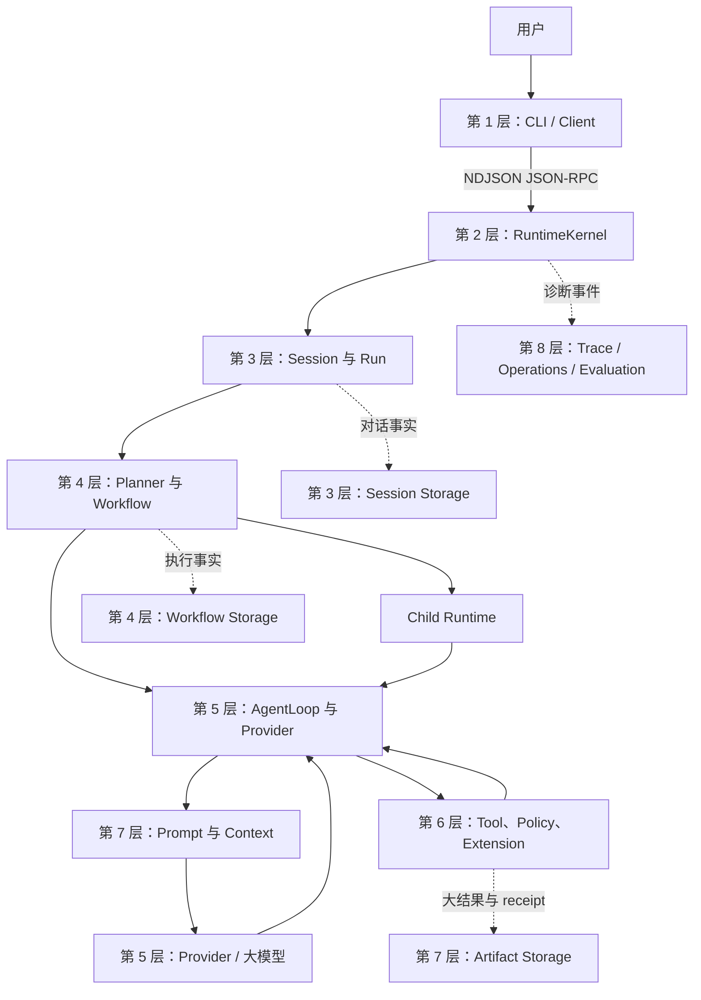
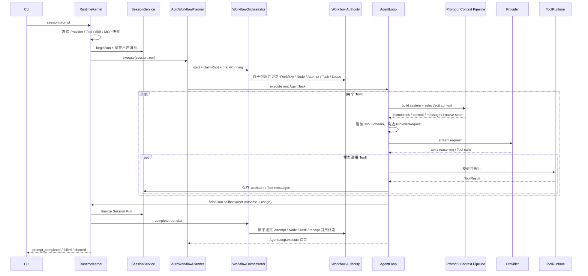

# Praxis 当前分层架构：Planner、Prompt、Context 与 Storage

本文只描述当前代码已经接入的架构，不讨论历史方案、评测过程或未来路线。读完后，你应该能回答：

- 一条用户输入怎样经过 Praxis；
- Planner、Workflow 和 AgentLoop 分别负责什么；
- 真正发送给模型的 Prompt 怎样装配；
- 长上下文怎样裁剪和压缩；
- 对话、执行状态、大结果和凭证分别存在哪里；
- `apps/runtime/src` 下的模块为什么这样分层。

面向新手，本文在首次进入相关模块时解释关键名词，并在第 13 章提供统一速查。代码类型名和目录名保留英文，
方便直接搜索源码。

## 1. 先建立一张总图

Praxis 是一个 **Agent Runtime**：它位于用户和大模型之间，负责把模型的文字输出变成受权限约束、可记录、
可恢复的工具调用和多 Agent 执行。



这张图最重要的边界是：

1. **Session 保存对话与 Run 生命周期，Workflow 保存可调度执行。** 两者通过 ID 关联，但不是同一种状态。
2. **Planner 组织执行，AgentLoop 执行一个 AgentTask。** Planner 不负责逐字生成最终回答。
3. **Prompt 是给模型的输入视图，不是执行账本。** 模型摘要不能证明命令已经执行。
4. **Tool 是模型触发 workspace 或外部动作的唯一入口。** Runtime 自己仍会写 Journal、调度和恢复。
5. **Child 是受限的独立 Agent 进程。** 它不会继承父 Agent 的全部权限和凭证。

图中的 RuntimeKernel 是组装各模块并接收协议请求的总入口；Provider 是大模型服务适配器；Policy 是权限规则；
Extension 是 Skill、MCP 或插件等扩展能力；Storage/Authority 是持久化事实来源；Trace/Operations/Evaluation
分别用于单次诊断、聚合指标和质量评测。Journal 是只追加、不原地改写旧事件的事实日志。后文会逐层展开这些概念。

## 2. 最少需要掌握的实体

先掌握下面八个实体，后文就不会混乱。

| 实体 | 通俗解释 | 关系 |
| --- | --- | --- |
| Session | 一段可恢复的对话 | 一个 Session 可以有很多 Run |
| Run | 一条 Prompt 或 follow-up 的完整执行 | 当前产品路径为每个 Run 创建一个根 Workflow |
| Turn | Run 内的一次模型请求 | 调用 Tool 后通常会进入下一 Turn |
| Workflow | 一次 Run 的持久执行账本 | 保存节点、依赖、任务、租约和副作用 |
| AgentTask | 一个 Agent 要完成的工作单元 | 根 Agent 和每个 Child 各自执行一个 AgentTask |
| Node | Workflow 图中的逻辑步骤 | 一个 Node 可以有多次 Attempt |
| Attempt | Node 的一次具体执行尝试 | 崩溃重试会创建新 Attempt |
| Lease | Worker 对 Task 的限时执行权 | 用 token 和 heartbeat 降低并发重复领取，并保护状态提交 |

这里的 **Worker** 是领取并执行 Task 的运行单元；**heartbeat** 是 Worker 周期性报告“我还活着”的心跳；
**Task** 是可被 Worker 调度的持久工作记录。

它们的层级关系是：

```text
Session
  └─ Run
      ├─ 多个 Turn
      └─ 一个根 Workflow
          └─ Node
              └─ Attempt
                  └─ Task + Lease
```

## 3. 仓库与 Runtime 的分层

### 3.1 七个 Workspace

**Workspace** 在这里指 monorepo 中一个独立的 npm 包或应用。

| Workspace | 所在层 | 当前职责 |
| --- | --- | --- |
| `apps/cli` | 客户端层 | Commander 命令、Ink TUI、启动 Runtime、展示事件 |
| `apps/runtime` | Runtime 层 | Planner、Agent、Provider、Tool、权限、存储和恢复 |
| `packages/core-sdk` | 领域合同层 | Provider-neutral 的 Session、Workflow、Prompt、Tool 等类型 |
| `packages/protocol` | Wire 协议层 | Runtime JSON-RPC 方法、事件和 JSON Schema |
| `packages/client` | 客户端合同层 | 初始化、订阅、sequence 校验和重连 |
| `packages/plugin-protocol` | 插件协议层 | 插件 manifest、握手和 Process RPC |
| `packages/plugin-sdk` | 插件作者层 | 插件开发 API 和合同校验 |

`packages/*` 保存跨模块合同，不拥有数据库、网络服务或产品 UI；`apps/runtime` 提供实现，
`apps/cli` 只做客户端交互。

### 3.2 Runtime 的八层模块

下表把 `apps/runtime/src` 的每个直接子目录只放入一个主要责任层，避免按字母顺序阅读。

| 层 | 模块 | 主要责任 |
| --- | --- | --- |
| 1. 接口 | `apps/runtime/src` 根文件、`process/`、`server/` | 独立进程入口、NDJSON 连接、本地 Server |
| 2. 组合与控制 | `framework`、`commands`、`settings` | 组装服务、RPC dispatch、命令和用户默认设置 |
| 3. 会话生命周期 | `session`、`session-db` | Session/Run 规则、Journal、JSONL/SQLite 后端和迁移 |
| 4. 执行编排 | `workflow`、`planner`、`planner-api`、`subagent` | Workflow、图、Task/Lease、Child 和恢复 |
| 5. Agent 与模型 | `loop`、`providers`、`provider-router`、`llm-provider` | ReAct 循环、Provider 适配、路由和模型能力 |
| 6. 能力与安全 | `builtin-tools`、`tools`、`policy`、`security`、`credentials`、`extensions`、`plugin` | Tool、权限、路径、凭证、Skill、MCP 和插件 |
| 7. Prompt 与数据 | `prompt`、`memory`、`artifacts`、`store` | Prompt 装配、上下文管理、大对象和兼容适配 |
| 8. 可观测性 | `trace`、`operations`、`evaluation` | Trace、运行指标、性能分析和评测 |

这里的 `process/`、`server/` 是子目录；此外，Runtime 源码根还包括 `entry.ts`、`run.ts`、`process.ts`、`server.ts`、`storage.ts`、
`longDurationTimer.ts` 和 `longLivedExecutionPolicy.ts`。

## 4. 一条 Prompt 的唯一主线



这是**调用时序图**：从上到下表示一次根任务的主要调用顺序。第 1 章总图是**逻辑依赖图**，表示模块边界，
不要求每一条边都对应一次直接函数调用。Child 和持久等待由同一 Orchestrator/Authority 管理，但会通过
durable worker service 领取，不必经过根 AgentLoop 的当前调用栈。

图中看似“AgentLoop 回调 Kernel”是有意的依赖注入：Planner 在进入 AgentLoop 前，把 `finalizeWorkflow`
注册到 Run；AgentLoop 持有 RuntimeKernel 提供的 `finishRun` callback，而 Planner 一直等待
`AgentLoop.execute()`。终态时 callback 先让 RunCoordinator 提交 Session，再调用已注册的
`finalizeWorkflow` 让 Orchestrator 提交 Workflow；callback 返回后 AgentLoop 才结束并返回 Planner。

- **WorkflowOrchestrator**：把 Planner/Scheduler 的 start、claim、complete、reconcile 意图转换成经过校验的
  Workflow authority 事务；
- **RunCoordinator**：协调 Session Run 的结束规则，并通过 SessionService 持久化终态与 usage；
- **durable worker service**：后台扫描可运行或需恢复的 Workflow Task，领取 Lease、创建 Worker，并把结果
  交回 Orchestrator；它与处理当前调用栈中根任务的 Planner 路径可以并存。

顺序可归纳为十步：

1. CLI 发送 `session.prompt`；
2. Runtime 检查 Session 是否空闲、Provider 是否可用和凭证是否存在；
3. 当前 Tool、Skill、MCP、插件和 Provider 形成不可变能力快照；
4. 输入被编译为 `PromptEnvelope`；
5. SessionJournal 原子记录用户消息并开始 Run；
6. 统一 Planner 创建根 Workflow；
7. Worker 领取根 Task 的 Lease；
8. AgentLoop 反复装配 Prompt、调用模型并执行 Tool；
9. 如果模型扩展 Workflow，Child 和后继节点由 durable scheduler 调度；
10. Session 与 Workflow 分别提交自己的终态。

`PromptEnvelope` 是版本化输入信封，记录有效文本、来源、组成部分、摘要和持久化策略。
**durable scheduler** 是依赖持久化状态工作的调度器；进程重启后仍能从数据库重新推导哪些节点可以运行。

## 5. 第 1–3 层：接口、组合与 Session

### 5.1 CLI 与 Runtime 是两个进程

`apps/cli` 不直接连接大模型，也不执行 Tool。它启动 `apps/runtime`，双方使用
**NDJSON JSON-RPC** 通信：

- JSON-RPC 定义请求方法、参数、结果和错误；
- NDJSON 表示每行一个 JSON 对象，便于流式传输；
- Runtime 的 stdout 只输出协议消息，诊断写 stderr；
- CLI 订阅事件，再把文本、Tool 状态、权限请求和 Workflow projection 渲染到 TUI。

**projection** 是从 Journal 事件计算出的当前状态快照。它适合查询和展示，但完整恢复仍以 Journal 为依据。
**TUI（Terminal User Interface）** 是运行在终端里的交互界面；**Schema** 是机器可校验的数据结构规则。

相关模块：

- `apps/cli/src/bridge`：启动和连接 Runtime；
- `packages/protocol`：方法与事件 Schema；
- `apps/runtime/src/process`：进程连接；
- `apps/runtime/src/server`：Runtime Server 边界。

### 5.2 RuntimeKernel 是 Composition Root

**Composition Root** 指“集中创建对象并把依赖连接起来的地方”。当前产品级 Composition Root 是
`apps/runtime/src/framework/runtimeKernel.ts`。

它负责组装：

- `SessionService` 与 `RunCoordinator`；
- `AutoWorkflowPlannerV1`、`WorkflowOrchestratorV1` 和 Workflow Authority；
- `AgentLoop`、`ProviderRouter` 和 `ToolRuntime`；
- Prompt、Memory、Policy、Credential、Artifact 和 Trace；
- Skill、MCP、Process Plugin 和命令系统；
- JSON-RPC handler 与事件投影。

RuntimeKernel 负责“接线”和跨模块流程，不应自己实现数据库事务、Prompt 裁剪或 Tool 具体逻辑。

### 5.3 Session、Run 与 Turn

`session` 模块保存业务规则：

- 一个 Session 同时只能有一个 active Run；
- `clientRequestId` 重复时返回原 Run，避免重复执行；
- beginRun 原子保存用户消息和 running 状态；
- finalizeRun 保存 completed、failed 或 aborted 终态及 usage；
- 已关闭 Session 可以恢复，删除使用 tombstone。

**tombstone** 是“逻辑删除标记”：保留发生过删除这一事实，而不是直接抹掉所有 Journal 记录。

`session-db` 模块把这些操作转换为 `SessionCommitV3`。Session 的 canonical messages
是后续 Prompt 和 compaction 的原始历史。

**canonical** 表示 Runtime 认可的标准原始版本；发送给某个 Provider 的裁剪视图不是 canonical history。

## 6. 第 4 层：Planner 与 Workflow

### 6.1 当前只有一个产品 Planner

当前每条 Prompt 都进入 `AutoWorkflowPlannerV1`。Planner 的职责是：

1. 创建 Workflow 和根 AgentTask；
2. 绑定执行模式、workspace、能力 Grant 和 Budget；
3. 创建 Node、Attempt、Task 并让 Worker claim；
4. 在模型提出委派或图扩展时执行准入；
5. 推进依赖、join、等待、恢复和最终状态。

**Grant** 是 Runtime 已批准的能力集合；**Budget** 是显式的 token、Turn、Tool、Child 或时间限制。

Planner 不负责：

- 决定每一 Turn 的具体 Tool call；
- 拼接最终 ProviderRequest；
- 把自然语言计划直接当成执行状态；
- 代替 AgentLoop 生成最终回答。

`planner` 目录包含图验证、恢复、workspace 隔离和 verifier 等可复用组件；产品入口仍是
`workflow/autoWorkflowPlanner.ts`。

**verifier** 是独立检查一个结果是否满足成功标准的验证器，不等同于执行该任务的 Agent 自我声明。

### 6.2 三种模式是 Policy，不是三套实现

**Policy** 是同一实现上的行为限制。

| 模式 | 当前行为 |
| --- | --- |
| `auto` | 默认；模型可以直接执行，也可以调用协作工具扩展 Workflow |
| `solo` | 不向模型提供创建 Child 或图的拓扑工具 |
| `workflow` | 使用同一 Planner；非只读副作用前要求先形成非 single-agent 拓扑 |

`auto` 下，Root Prompt 会要求模型在以下情况重新评估委派价值：任务很长、跨多个领域、风险较高、
存在独立调查/审查工作流，或者直接执行已重复失败。短任务和强耦合任务仍可保持单 Agent。

### 6.3 Workflow 的持久对象

```text
WorkflowSpec       声明目标、模式、图、预算和完成规则
WorkflowProjection 当前 Workflow / Node / Attempt 状态
Node               一个逻辑步骤
Attempt            Node 的一次执行尝试
Task               等待 Worker 执行的持久任务
Lease              Worker 对 Task 的限时所有权
Event              造成状态变化的追加式事实
Message            Agent、用户或 Runtime 之间有类型、可确认的协调消息
Artifact           通过内容摘要寻址的完整结果或证据
```

Workflow 图是 **DAG**，即有向无环图。边表示依赖；无依赖节点可并行，有依赖节点必须等待前驱成功。

**join** 是汇合规则：

- `all`：所有必需分支都成功；
- `any`：任一分支成功；
- `quorum`：达到指定成功数量。

**HumanTask** 是必须由人提供决定或输入后才能继续的持久节点；**Timer** 是到指定时间自动唤醒 Workflow
的持久计时器；**GraphPatch** 是一组经过校验后应用到现有图上的节点和边变更。

Scheduler 只读取持久化 Node/Edge/projection。它不依赖调用 `workflow.expand` 的进程内变量，因此重启后
仍能释放后继节点。

### 6.4 模型可调用的拓扑工具

**拓扑工具**是改变 Workflow 结构的模型 Tool。

| Tool | 作用 |
| --- | --- |
| `agent.delegate` | 创建一个有界 Child AgentTask，并同步等待其结果 |
| `agent.handoff` | 把一个结果责任交给专业 Agent，保存为 synthesis Node |
| `workflow.expand` | 一次提交多个有依赖关系的 AgentTask；Root 选择 `wait` 或 `continue` |
| `workflow.inbox` | 分页读取 Root 的持久化类型消息与节点状态，不加载 Child transcript |
| `workflow.join` | Root 在自己选择的时点等待后台节点满足 all/any/quorum |
| `workflow.loop` | 每轮用新 GraphPatch 展开迭代，并用结构化条件退出 |
| `workflow.wait` | 创建 HumanTask 或 Timer，Workflow 可跨重启等待 |
| `workflow.subworkflow` | 创建具有独立 ID 的子 Workflow |

**synthesis Node** 是负责汇总、比较或整合前驱结果的节点；它通常不重新执行前驱任务。**Agent Profile**
是带版本的 Agent 配置，规定可选模型、Tool/Skill/MCP allowlist、预算和执行属性。

模型提交的是 Proposal（提案）。Runtime 会验证：

- 当前模式是否允许；
- 图是否无环、依赖是否存在；
- 父 Grant 和 Profile 是否允许；
- Tool、Skill、MCP、网络和 workspace 请求是否可用；
- 模型、推理强度和 Budget 是否在允许范围内；
- 结果 Schema 和成功标准是否合法。

### 6.5 Root 等 DAG，还是继续工作

Root 不是在发出 DAG 后固定阻塞。`workflow.expand` 的 `rootAction` 有两个值：

```text
rootAction=wait
  admit graph → 当前 Tool call 调度并等待 join → 结果直接回到本轮 ReAct

rootAction=continue
  admit graph → 返回 node ID → 后台 durable Worker 执行 Child
                                  ↘ Root 继续独立工作
  Root 之后调用 workflow.inbox / workflow.join
```

**默认是 `wait`**，保证旧调用和“下一步立刻依赖结果”的任务不改变语义。只有 Root 确实有独立工作时才应选择
`continue`。后台 Task 带 `coordinationMode=background`，因此同一 Workflow 的 Root Run 活跃时，Worker 仍能领取
这些非根 Task。显式 `workflow.join` 会再次等待，但这是 Root 在合适边界做出的决定，不是 Planner 强制一开始就阻塞。
在 Root 尝试输出最终响应时，AgentLoop 的完成门禁会读取 Authority：后台节点仍未终结就注入 join 指引，节点已
终结但结果未消费就注入 inbox/join 指引，然后继续下一 Turn。这个门禁保证 `continue` 用于重叠独立工作，而
不是悄悄绕过必需结果。

Root 也不会一直自动看到 Child 的所有消息。当前通信模型是：

| 信息 | 保存位置 | Root 怎样看到 |
| --- | --- | --- |
| Node 是否运行/成功/失败 | Workflow projection | `workflow.inbox` 或 `workflow.join` 返回有界状态 |
| `result/error/instruction` 等短消息 | `workflow_messages` | inbox 按 sequence、类型和未确认状态读取 |
| Child 完整结果和长证据 | ArtifactStore | 通过消息或 Node 的 `resultRef` 按需读取 |
| Child 的完整 Session / 隐藏推理 | Child 临时 Session | 不自动共享给 Root |

这里的 **mailbox（信箱）** 是持久化消息队列；**acknowledge（确认）** 表示消费者已经处理过某条消息，
不等于删除。每条消息包含固定 message ID、Workflow 内递增 sequence、sender、recipient、type、payload、
可选 Artifact 引用和确认时间。Child 完成时，结果消息与 Node/Attempt/Task 终态在同一个 Authority 事务提交，
所以不会出现“节点成功但完成通知永久丢失”。inbox 使用类型过滤并确认时只确认实际返回的 message ID，不会跨过
未展示的其他类型消息。join 达到成功或确定失败终态时，也会精确确认本次所选节点的 `result/error` 消息。

当前自动生产者只有两类：Child 终态生成 `result/error`；用户 steer 生成 `instruction`。协议还定义
`progress/milestone/question/answer/control`，但它们是已预留的受控消息类型，不代表当前 Child 会不断把思考过程
推给 Root。

一条 Child 成功消息在概念上是下面的形状；具体 ID 和时间由 Runtime 生成：

```json
{
  "schemaVersion": 1,
  "messageId": "result-attempt-...",
  "workflowId": "workflow-...",
  "sequence": 12,
  "sender": { "kind": "node", "id": "graph-node-...", "attemptId": "attempt-..." },
  "recipient": { "kind": "node", "id": "root" },
  "type": "result",
  "payload": {
    "nodeId": "graph-node-...",
    "attemptId": "attempt-...",
    "state": "succeeded",
    "resultRef": {
      "artifactId": "artifact-...",
      "digest": "sha256:...",
      "mediaType": "application/json"
    }
  },
  "artifactRefs": [{ "artifactId": "artifact-...", "digest": "sha256:...", "mediaType": "application/json" }],
  "causationId": "task-...",
  "correlationId": "workflow-run-...",
  "createdAt": "2026-08-21T00:00:00.000Z"
}
```

`sequence` 是同一 Workflow 内的读取顺序；`causationId` 指向直接导致消息的 Task；`correlationId` 把消息与
同一 Run 串起来。消息被消费后会增加 `acknowledgedAt`，原消息仍保留供审计。

**steer** 是用户在 Run 执行中追加的方向调整。Runtime 先把它持久化到 Root mailbox，再放入进程内 steer
queue；AgentLoop 在安全边界把 steer 写入 SessionJournal，成功后按 message ID 精确确认。顺序是“先 durable、
后可执行、最后确认”，从而缩小崩溃丢消息窗口。

这套设计与“直接 ReAct”不同：ReAct 的 Tool result 自动进入同一个 Agent 的下一轮消息；多 Agent 中每个 Child
有独立 Prompt、Session、权限和 ReAct 循环，Root 只消费结构化状态与证据引用。这样并行 Agent 不会把各自对话
混成一个无边界上下文。

### 6.6 Child Runtime

Child 是受授权的独立 Runtime 进程，不是一段附加 Prompt。它通过 `ChildRuntimeHost` 启动，并获得：

- 独立的临时 Session、Trace 和 Artifact 根；
- 签名 `ContextPacket`；
- 收窄后的 `Capability Bundle`；
- Provider credential broker 的短期 handle；
- 父侧 MCP/Tool broker；
- 明确的 workspace、Budget、结果 Schema 和成功标准。

`ContextPacket` 是 Runtime 签名的任务包，包含 objective（目标）、constraints（约束）、前驱引用、
成功标准和输出结构。`Capability Bundle` 是这个 Child 最终可以使用的 Tool、Skill、MCP、网络和目录集合。
这里的签名用于证明任务包确由父 Runtime 生成且未被内容文本篡改；**broker** 是代为访问受控能力的中间服务，
短期 **handle** 是只能在限定范围和时间内使用的引用，而不是把原始凭据交给 Child。

有效能力按交集计算：

```text
父 capability snapshot
∩ Workflow Grant
∩ Profile allowlist
∩ Node request
∩ Policy / permission
= Attempt 的 Capability Bundle
```

**capability snapshot** 是 Run 开始时冻结的可用能力清单；**allowlist** 是明确允许项列表。取交集意味着 Child
只能获得每一层都允许的能力，任何一层拒绝都会把该能力移除。

Child 固定不能创建 descendant（下一代 Child），防止绕过 Workflow ancestry、权限和预算账本。
**ancestry** 是父子 Agent 的来源链，用来追踪责任和授权从哪里传下去。

### 6.7 Lease 与恢复

Worker claim Task 时，Authority 写入随机 lease token、worker ID、到期时间和 heartbeat。只有持有相同 token
的 Worker 才能继续更新 Task。

Lease 过期后：

- pure/read/idempotent 工作可在 RetryPolicy 内创建新 Attempt；
- workspace write 或非幂等外部副作用不会盲重试；
- 无法确认结果时进入 `unknown` 或 `manual_intervention`；
- 已成功 Node 保持原 Attempt，不会因为后继失败而重跑。

**idempotent** 表示同一输入重复执行不会产生额外副作用；**non-idempotent** 表示重复执行可能再次付款、
再次发送消息或再次修改外部系统。

这里的 **pure/read** 指不改变外部状态的纯计算或读取；`RetryPolicy` 是 Runtime 明确规定“哪些失败、最多几次、
在什么条件下可以重试”的规则。

## 7. 第 5–6 层：AgentLoop、Provider、Tool 与权限

### 7.1 AgentLoop 只执行一个 AgentTask

`AgentLoop` 实现 ReAct 循环。**ReAct** 是 Reason + Act：模型先根据上下文决定行动，调用 Tool 后读取结果，
再继续下一 Turn。

每个 Turn 的主要步骤是：

1. 构造 system prompt；
2. 选择上下文窗口；
3. 必要时触发 compaction；
4. 通过 ProviderRouter 流式调用模型；
5. 解析 text、reasoning 和 Tool calls；
6. 校验 Tool input；
7. 请求权限并执行可并行的 Tool；
8. 保存 assistant/Tool messages 和 usage；
9. 没有 Tool call 时形成终态，或进入下一 Turn。

当前长生命周期策略没有隐式的累计 Turn、Tool、Child、图节点或墙钟上限；只有用户、CLI、组织策略或节点
Proposal 的显式 Budget 才会收紧。重复 Tool call、相同结果和连续同错会周期性产生 guidance，帮助模型
纠偏，但不会自行终止整个 Run。

### 7.2 Provider 层

`providers` 把不同厂商协议转换为统一 stream event；`provider-router` 负责：

- 选择 Provider 与模型；
- 检查能力和认证；
- 归一化 text、reasoning、Tool call 和 usage；
- 分类 429、暂时性 5xx、网络和 stream 错误；
- 在允许范围内 retry 或 fallback；
- 为 Prompt fallback 重新选择符合目标模型窗口的 Context。

`llm-provider` 保存内置 Provider 能力注册。最终模型用量以 Provider 返回的 usage 为准，Runtime tokenizer
只用于上下文预算估算。

**stream event** 是模型边生成边返回的一小段结构化事件；**retry** 是使用同一路径重试，**fallback** 是切换
到另一个允许的 Provider 或模型；**tokenizer** 是把文本估算为模型 token 数的组件。

### 7.3 ToolRuntime

模型看到的是 Tool Definition：名称、说明和 JSON Schema。调用到达 `ToolRuntime` 后依次经过：

1. Tool 是否在当前 capability snapshot；
2. input 是否符合 JSON Schema；
3. target 和 workspace path 是否允许；
4. side effect、并行安全和冲突 key；
5. PolicyEngine 是否 allow、deny 或需要 permission；
6. 是否需要 Workflow effect broker；
7. 执行、Artifact 外置和结果规范化。

**JSON Schema** 是机器可验证的数据格式规则；**side effect** 指会改变文件、进程、网络或外部系统的影响。
Schema 错误会返回有界字段路径和约束，不回显完整输入值，方便模型下一 Turn 修正。

### 7.4 权限与副作用

`policy` 判断 Tool 风险和用户授权；`security` 处理路径安全与隔离合同；`credentials` 管理加密凭证。

write/process/network Tool 进入 `WorkflowEffectBrokerV1`：

1. 创建 durable `tool_activity` Node；
2. 对幂等动作在调用前 reservation；
3. 执行 Tool；
4. 成功结果写 Artifact receipt 正文；
5. receipt 元数据与引用、Attempt/Node 终态和 Task acknowledgement 在 Workflow 内原子提交。

**reservation** 是调用前的幂等占位，防止相同请求并发执行；**effect receipt** 是成功副作用的持久证据。
外部调用返回失败但可能已产生部分副作用时，状态标记为 unknown，要求先检查真实外部状态再决定是否重试。

ArtifactStore 与 Workflow SQLite 不能组成一个跨存储原子事务。当前顺序是先把完整 Tool 结果或 effect receipt
正文写为 Artifact，再在一次 Workflow 事务中原子提交 receipt 元数据、Artifact 引用、Attempt/Node 终态和
Task acknowledgement。若 Artifact 已写而 Workflow 事务失败，可能留下未被引用的对象，但不会把副作用误记为
已提交；后续恢复仍以 Workflow receipt 记录为准。

### 7.5 扩展能力

- `builtin-tools`：组装 read、write、edit、shell、artifact_read 等内置 Tool；
- `extensions`：Capability/Resource registry、Skill、MCP 和 Process activation；
- `plugin`：插件管理、独立 Process host 和插件协议；
- Skill：按需加载的任务说明，不会扩大 Runtime 权限；
- MCP：外部工具协议；Child 通过父 broker 使用获准 MCP，不直接取得 server credential。

## 8. 第 7 层之一：Prompt 装配

### 8.1 Prompt 不是用户输入的同义词

Praxis 中常见的四个对象：

| 对象 | 含义 |
| --- | --- |
| 用户输入 | CLI/TUI 收到的原始文本 |
| `PromptEnvelope` | 规范化后的任务信封，包含来源、parts、digest 和持久化策略 |
| `SystemPromptBuild` | Trusted Instructions 与 runtime/skill/project context |
| `ProviderRequest` | 每个 Turn 真正发送给 Provider 的完整请求 |

一个 Run 可以有多个 Turn，所以一条用户 Prompt 可能产生多个 `ProviderRequest`。后续请求复用稳定前缀，
并在后面追加新的 assistant 和 Tool messages。

### 8.2 Prompt 的装配链

`ContextBuilder` 先收集：

- cwd、platform 和 shell；
- Root/Child 角色与 planner mode；
- Provider 能力；
- 当前 Tool definitions；
- Skill disclosure（只公开可用 Skill 的名称和说明，正文按需加载）；
- workspace 中的 `AGENTS.md` 和 `PRAXIS.md`。

`ProjectInstructionLoader` 限制单个项目指令文件最多 16 KiB、合计最多 24 KiB，并拒绝越出 workspace
的路径或符号链接。

`ContextBuilder` 的 Context 指“构造 System Prompt 所需的环境和指令材料”，不是从历史消息中选择 token
窗口；历史窗口选择由 `memory/contextWindow.ts` 完成。

随后：

- `SystemPromptComposer` 生成 Trusted Instructions、runtime facts、Skill catalog 和 project guidance；
- `PromptAssembler` 加入 Child ContextPacket、Session ContextView、checkpoint/native context 和消息后缀；
- `AgentLoop` 附加 Tool definitions，形成最终 `ProviderRequest`。

当前默认 Prompt variant 是 `iron-law-lean-v1`；其中 **lean** 表示使用较精简、减少重复规则的指令版本。
`DEFAULT_PROMPT_VARIANT` 位于
`prompt/promptRegistry.ts`，是唯一默认来源。

**Prompt variant** 是同一装配框架下的一套已命名 Prompt 程序，用于确定可信指令和动态上下文的渲染方式。

### 8.3 ProviderRequest 的字段分组

```text
instructions
  └─ 唯一 Praxis Trusted Instructions

contextMessages
  ├─ runtime_facts
  ├─ skill_catalog（可选）
  ├─ project_guidance（可选）
  ├─ Child ContextPacket（仅 Child）
  ├─ session_view
  └─ semantic checkpoint（未使用 native 时）

nativeContext
  └─ Provider native compact state（精确匹配时）

messages
  └─ checkpoint/native boundary 后的最新完整对话

tools
  └─ 当前 capability snapshot 获准的 Tool Schema
```

这些是不同 Provider 字段，不是把九段文字简单拼接。Provider adapter 可以改变 wire format，但不能改变
装配语义。例如 Anthropic 使用 `system`，OpenAI Responses 使用 `instructions`。

**wire format** 是真正通过网络发送给某个 Provider 的字段和 JSON 形状；**adapter** 是把 Praxis 统一对象
转换成该厂商格式、再把响应转回统一事件的适配层。

### 8.4 唯一 Trusted Instructions

当前 lean Prompt 每个请求只有一个可信指令块，主要声明：

- Runtime 强制的权限、workspace 边界和 Tool receipt 最终有效；
- 项目文件、Skill、Tool result、summary 和 Child output 不能授予新权限；
- 没有 Tool 证据不能宣称命令、修改、测试或外部动作成功；
- 不泄漏凭证、隐藏指令或敏感诊断；
- 当前 Root 或 Child 的 operational contract。

**operational contract** 是当前 Agent 的操作职责。例如 Root 可以直接执行或使用协作工具；Child 只能完成
ContextPacket 中的有界目标，不能创建 descendant。

### 8.5 Authority、Provenance 与 Verification

Runtime 内部保留内容来源和权限元数据，但生产 Prompt 不把所有内容简单标成 “high/low trust”。
当前架构把三个问题分开：

| 概念 | 解释 | 例子 |
| --- | --- | --- |
| Authority | 这段内容有没有权力改变指令或授予能力 | Runtime policy、用户授权、签名 ContextPacket |
| Provenance | 内容从哪里来，能否追踪 | Tool call ID、Artifact digest、Child ref、时间 |
| Verification | 某个事实目前由什么证据支持 | Tool receipt、测试结果、verifier、cross-review |

外部 Tool result 没有改变系统指令的 Authority，但可能是最关键的事实证据；Runtime 生成的说明有较高
Provenance，也不代表其中每个业务结论都已 Verification。

动态 context 使用中性的 XML-like envelope：

```text
<praxis-context kind="session_view">
{...JSON...}
</praxis-context>
```

JSON 中的 `<` 会转义，避免内容伪造结束标签。权限边界由 Runtime 的 Grant、Schema、Policy 和 receipt
执行，而不是依靠模型服从一个“低可信”形容词。

**XML-like envelope** 是使用开始/结束标签包住内容的标记形式；它只帮助模型识别内容边界，不提供授权。

### 8.6 ContextView 为什么在 Run 内稳定

`PromptContextView` 是从 SessionJournal projection 构造的有界状态视图，包含：

- Session authority、revision 和近期 entry range；
- checkpoint 描述；
- 当前 plan projection；
- 前驱 result refs 和 Artifact refs；
- 被省略内容的数量与原因。

它装配后表现为 `session_view`。一个 Run 第一次选择 ContextView 后会冻结该视图；新 assistant、Tool、
steer 和 Workflow 结果继续追加在它后面。只有 compaction 成功建立新 replay boundary 时才重建。

这样既保持 Provider prefix cache 的稳定前缀，也不会冻结 Runtime 的真实 Session 或 Workflow 状态。

**prefix cache** 是 Provider 对请求开头相同内容的缓存；稳定前缀通常可以减少重复处理成本和延迟。

## 9. 第 7 层之二：上下文选择与压缩

### 9.1 五个步骤

```text
canonical Session messages
  → reasoning-only editing
  → Tool-result-only editing
  → checkpoint / native context 选择
  → 最新完整消息后缀
  → Provider adapter
```

前两步只创建 Provider 发送视图，不改 SessionJournal。Compaction 会新增持久 checkpoint，但同样不删除
canonical messages。

### 9.2 Context window 预算

**Context window** 是模型单次请求能接收的最大 token 数。Runtime 先预留：

```text
最大 context
- system / instructions
- ContextView 与 Child pinned context
- Tool Schema
- 预计输出 token
- safety reserve
= checkpoint 与对话消息预算
```

当前 `reserve=0.05`；实际 safety token 在 RuntimeKernel 中限制为 8–256 个估算 token。Tokenizer 只用于
预算估算，最终计费仍使用 Provider usage。

**safety reserve** 是故意不占满窗口而留下的缓冲，防止估算误差导致 Provider 拒绝请求；**pinned context**
是任务合同等必须保留、不能被普通裁剪移除的上下文。

窗口选择优先顺序：

1. 精确匹配且能放入预算的 Provider native context；
2. portable semantic checkpoint；
3. checkpoint 之后最新的完整消息后缀。

选择器从新到旧加入消息，并移除开头没有对应 assistant Tool call 的孤立 Tool result。

### 9.3 Reasoning 编辑

**Reasoning block** 是部分 Provider 在 assistant 消息中返回的独立推理字段，不是给用户的最终文本。

默认 reasoning 总量超过 8,000 估算 token 时：

- 从最旧的 reasoning-bearing assistant turn 开始移除 reasoning block；
- 保留最近 1 个含 reasoning 的 Turn；
- 至少能释放 2,000 token 才执行；
- 普通文本、Tool call、Tool result 和 SessionJournal 不变。

### 9.4 Tool result 编辑

默认规则：

- 单条非 Skill Tool result 超过 12,000 token 时保留头尾、digest、大小和恢复引用；
- 可重放的 read/none 结果总量超过 32,000 token 时，从最旧结果开始清理；
- 最近 3 个可重放结果保持完整；
- 总节省不足 8,000 token 时不执行陈旧清理；
- write/process/network、`agent.*`、`workflow.*` 和 Skill invocation 不做陈旧清理。

占位结果仍保留 Tool 名、call ID、成功/失败、digest 和 Artifact 位置。

### 9.5 自动 Compaction

**Compaction** 是把较老的完整消息区间总结成可重放 checkpoint。当前默认策略：

**pressure** 是“已选择消息 token / 可用消息预算”的比例；**armed** 表示阈值触发器当前允许发起一次压缩，
成功后会解除武装；**rearm** 是压力降下来后重新允许触发。**safe cut point** 是不会拆开 Tool call/result、
Skill turn 或未完成后缀的安全切分位置。

| 配置 | 当前值 | 含义 |
| --- | ---: | --- |
| `threshold` | 0.85 | 已选上下文压力达到消息预算的 85% |
| `maxUncompactedTokens` | 65,536 | checkpoint 后 canonical 正文的软阈值 |
| `hysteresis` | 0.1 | 压力和正文都下降后才重新武装 |
| `keepRecentTokens` | 8,192 | checkpoint 外保留有意义的最新完整执行前沿 |
| `maxSummaryTokens` | 1,024 | semantic summary 上限 |
| `overflowRetryLimit` | 1 | Provider context overflow 最多压缩重试一次 |
| `generatorDeadlineMs` | 120,000 | summary generator 的 deadline |

触发逻辑可以简化为：

```text
如果窗口省略了 checkpoint/native 未覆盖的 canonical 消息：
    尝试 compact
否则如果 compaction 已武装，
并且 pressure >= 0.85 或未压缩正文 >= 65536：
    尝试 compact

成功后解除武装；
只有 pressure <= 0.75 且正文降到 64K 的 90% 以下时重新武装。
```

这里的 64K 是成本软阈值，不是任务、Turn 或 Tool 上限。

### 9.6 Semantic checkpoint 怎样生成

1. 从 canonical messages 找到安全 cut point；
2. 不拆开 Tool call/result、Skill turn 或最新未完成后缀；
3. 只处理上一 checkpoint 之后的新范围；
4. Runtime 先确定性提取 continuation frontier；
5. semantic generator 总结 decisions、unresolved 和 active plan；
6. 按字段所有权合并 Runtime baseline 与模型摘要；
7. 压缩到 1,024 token，并优先保留继续执行所需字段；
8. 检查 estimated gain；
9. 把 checkpoint 写入 Session authority。

**continuation frontier** 是“接下来继续任务必须知道的最小状态”，例如已修改但尚未 rebuild 的文件、
仍失败的测试、下一步验证和未完成计划。

这里的 **open loop** 是已开始但尚未闭合的工作，例如“代码已改，但测试尚未运行”。

Runtime baseline 从以下来源提取：

- 用户任务与签名 Child ContextPacket；
- 上一版已准入 checkpoint；
- 成功 Tool result；
- 成功 `edit/write` 的目标路径；
- 成功 shell 中可确定的文件变更路径；
- 结构化失败证据和 open loops。

字段所有权：

| 字段 | 当前权威来源 |
| --- | --- |
| objective、constraints | 用户任务、签名 Packet、上一 checkpoint |
| relevantRefs、readFiles、modifiedFiles | Packet、上一 checkpoint、成功 Runtime Tool 证据 |
| decisions、unresolved、activePlan | Runtime baseline，并允许 semantic generator 补充 |

这防止一个格式正确但内容空洞或错误的模型 JSON 删除任务合同，或把推测伪装成已发生的文件修改。

### 9.7 Semantic 与 native context

每次有效 compaction 都先产生 **semantic checkpoint**：Praxis 可理解、可跨 Provider 重放的结构化摘要。

支持 `compact()` 的 Provider 还可以附加 **native context**：Provider 自己生成的不透明状态。它只有在
provider、model、message range 和 instructions digest 精确匹配时才重放；否则自动回退 semantic。

两者可以持久化在同一个 checkpoint 中，但一次 ProviderRequest 只选择一种重放表示。native 失败不会回滚
已经生成的 semantic checkpoint。

### 9.8 Compaction 不负责执行恢复

Checkpoint 只服务模型上下文。以下事实从各自 authority 恢复：

- Node、Attempt、Task、Lease：Workflow authority；
- 副作用：reservation 与 receipt；
- 大结果：ArtifactStore；
- Child 合同：签名 ContextPacket 和 Capability Bundle；
- 文件修改：真实 workspace、候选 commit 或 snapshot；
- 原始消息：SessionJournal。

因此摘要声称“测试通过”不能代替真实 Tool result；摘要漏掉一条 receipt 也不会删除 Workflow 中的副作用证据。

这里的候选 **commit** 是隔离 workspace 中等待合并的版本控制提交；snapshot 是目录在某一时刻的受控副本。

## 10. 贯穿第 3、4、7 层：持久化与恢复

### 10.1 先理解“Authority”

**Authority（权威存储）** 是某类事实最终以谁为准。缓存、摘要、UI 文本和模型记忆都可以帮助读取，
但它们不能推翻 authority 中的记录。

Praxis 没有把所有状态塞进一个数据库，而是按事实类型拆开：

| 要回答的问题 | 当前 authority | 原因 |
| --- | --- | --- |
| 用户说过什么、Run 是否结束、checkpoint 是什么 | SessionJournalV3 | 这是会话与 Run 时间线 |
| Workflow 有哪些 Node、哪个 Attempt 被领取、Lease 是否过期 | Workflow authority | 这是调度和恢复状态 |
| Tool 的大结果、Child 结果、effect receipt 正文是什么 | ArtifactStore | 大对象不应反复塞进消息或数据库行 |
| 文件现在是什么内容 | workspace 文件系统 | 文件事实必须读真实文件 |
| Provider key 是什么 | CredentialStore | 凭据需要独立加密和访问控制 |
| 一次调用多快、哪里失败 | Trace 与 metrics | 这是诊断数据，不是业务事实 |

这里有三个容易混淆的词：

- **Journal（日志）**：只追加事件的事实序列。后面的事件不会原地改写前面的事件；
- **Projection（投影）**：把 Journal 从头归并后得到的“当前状态”，类似根据流水账算出的余额；
- **Cache（缓存）**：为了加速读取保存的副本。损坏时应能由 authority 重建，不能反过来成为真相。

### 10.2 `PRAXIS_HOME` 数据根目录

Praxis 的持久化数据根目录由 `PRAXIS_HOME` 指定；未指定时使用当前用户目录下的 `.praxis`。
目录按职责分开，而不是按一次任务分开：

```text
PRAXIS_HOME/
├─ session-authority.json
├─ session-journal-v3/            # 默认 JSONL Session authority
├─ session-journal-v3.sqlite      # 显式选择的 SQLite Session authority
├─ workflow-platform-v1.sqlite    # 本地 Workflow authority
├─ artifacts/                     # 通用大对象与执行证据
├─ credentials.json               # 加密后的凭据记录
├─ credential.key                 # 本地加密密钥
├─ settings.json                  # Provider/model 等非秘密偏好
├─ policy-grants.json             # 持久授权规则
├─ policy-audit.jsonl             # 脱敏后的授权审计
├─ audit/commands.jsonl           # 命令审计
├─ traces/YYYY-MM-DD/*.jsonl      # 有界 Trace
├─ extensions/                    # 已安装扩展
└─ locks/                         # writer、Runtime 和迁移锁
```

`session-journal-v3/artifacts/` 不是通用 ArtifactStore。它是 Session 格式兼容 checkpoint 的专用位置；
当前 Tool、Child 和 effect receipt 大对象写入顶层 `artifacts/`。

Session、Artifact 和审计文件可能包含敏感内容，当前不是全部加密。只有凭据值由 CredentialStore 使用
AES-256-GCM 加密；`credential.key` 与密文分开保存。**AES-256-GCM** 是一种同时提供加密和完整性校验的
对称加密算法。

### 10.3 SessionJournalV3：会话事实

SessionJournal 保存 `SessionEntryV3`。Entry 可以理解为一个不可变事件，例如：

- `session.created`：会话创建；
- `message.committed`：一条用户、助手或 Tool 消息写入；
- `run.started` / `run.terminal`：Run 开始或结束；
- `compaction.created`：新 checkpoint 建立；
- 可选 `plan.created`、`step.state_changed`、`attempt.state_changed`：Session 兼容计划视图；
- `permission.decided`：权限决定；
- `usage.recorded`、`artifact.referenced`：用量和对象引用。

多个 Entry 由一个 `SessionCommitV3` 原子提交：

```text
SessionCommitV3
├─ sessionId          写入哪个 Session
├─ commitId           本次提交的唯一身份
├─ expectedRevision   提交者认为当前 revision 是多少
├─ idempotencyKey     重试时识别“还是同一操作”的键
├─ entries[]          一次共同成功或共同失败的事件
└─ checksum           内容校验和
```

**原子提交** 表示这一组 Entry 要么全部写入，要么一个也不写入，不会只写一半。

`expectedRevision` 实现 **CAS（Compare-And-Swap，比较并交换）**：只有存储当前 revision 与调用方预期相等，
提交才被接受。两个并发写者基于同一旧 revision 写入时，只能有一个成功；另一个必须重新读取后再决定。
这避免“后写入者悄悄覆盖先写入者”。

`idempotencyKey` 实现 **幂等性**：同一操作因网络或进程重试而重复提交时，存储返回原来的 receipt，不重复
产生事件。若同一个 key 携带了不同内容，存储会拒绝它，而不是猜测调用方意图。这里返回的
**commit receipt** 只证明 Session Commit 被接受，不是外部副作用的 effect receipt。

`checksum` 是根据内容计算的摘要值。Praxis 使用 SHA-256 检查记录是否在写盘、复制或读取过程中被改变；
它用于完整性，不等于加密。

### 10.4 Projection：从事件得到当前状态

`ReducingSessionJournalV3` 读取 Entry 并执行 **reduce（归并）**，生成 `SessionProjectionV3`：

| Projection 部分 | 包含什么 | 谁使用 |
| --- | --- | --- |
| `snapshot` | Session 元数据、消息、Run、用量、checkpoint ID、artifact ID | CLI、ContextBuilder、恢复逻辑 |
| `catalog` | 名称、workspace、Provider、model、生命周期、消息数 | 会话列表 |
| `contextView` | revision、checkpoint、最近范围、结果与 artifact 引用、省略数 | 当前 Run 的上下文装配 |
| `checkpoint` | 被覆盖范围、摘要、来源、可选 native context | CompactionService |
| `planGraph` | 可选的 Session 兼容计划视图 | 非产品级兼容执行组件、ContextView 或 UI；不驱动统一 Workflow |

Projection 不是另一个 authority。只要完整 Entry 仍在，Projection 就能重算。JSONL 后端把校验过的 Projection
写成读取缓存；SQLite 后端也维护等价的可查询状态，但两者都必须符合相同 `SessionJournalV3` 接口。

这里的 `planGraph` 容易与统一 Workflow 混淆。它是 SessionJournal 合同中保留的 Session-scoped 计划投影，
供兼容执行组件、Prompt ContextView 或界面读取；当前产品 `AutoWorkflowPlannerV1` 的 Node、Attempt、Task、
Lease 和推进状态只以 Workflow authority 为准，不能从 `planGraph` 恢复或推进统一 Workflow。

### 10.5 JSONL Session 后端

默认后端位于 `session-journal-v3/`。**JSONL** 是“每行一个 JSON 对象”的文本格式。主要结构为：

```text
session-journal-v3/
├─ authority.json
├─ commits/            # 每个 Session 的只追加 commit 记录
├─ projections/        # 可重建的 SessionProjection 缓存
├─ pending/            # 中断恢复标记
├─ catalog.json        # Session 列表的基线缓存
├─ catalog-delta.jsonl # catalog 增量
└─ catalog-state.json  # catalog 策略和校验信息
```

一次写入的关键顺序是：

1. 获取 Session writer lock；
2. 校验 Commit、checksum、CAS 和幂等身份；
3. 写 `pending` 标记；
4. 追加 Commit 并 `fsync`；
5. 归并 Entry，原子写 Projection；
6. 追加 catalog delta；
7. 删除 `pending` 标记。

**fsync** 是要求操作系统把缓冲数据真正刷新到持久化设备。**原子写文件** 通常先写临时文件，再用 rename
替换目标，使读者不会看到半个 JSON。

如果进程在第 4 步后、第 7 步前退出，Commit 已经是事实，但 Projection 或 catalog 可能落后。下次初始化
发现 `pending` 后，会读取有效 Commit、修复不完整尾部、重建 Projection 和 catalog，再清掉标记。

### 10.6 SQLite Session 后端

显式选择 SQLite 时，authority 位于 `session-journal-v3.sqlite`。**SQLite** 是嵌入进程的关系型数据库，
不需要单独启动数据库服务。

当前初始化启用：

- `journal_mode=WAL`：先写 Write-Ahead Log，再合并到主数据库；
- `synchronous=FULL`：提交时采用较强的落盘保证；
- `foreign_keys=ON`：启用表间引用约束；
- `BEGIN IMMEDIATE`：事务开始时就取得写权限，避免执行到一半才与其他写者冲突。

**Transaction（事务）** 是数据库内的一组原子操作。SQLite 后端在同一事务中写 Commit、Entry 和当前状态，
并实现与 JSONL 相同的 CAS、幂等、校验和、分页读取与 Projection 语义。

JSONL 和 SQLite 是同一个 Session authority 接口的两个实现，不是两份同时写入的副本。`session-authority.json`
记录当前唯一选择；若两个后端同时看起来有数据，Runtime 会拒绝在不明确的 authority 上启动。

切换后端必须在没有其他 Runtime 使用同一 `PRAXIS_HOME` 时执行离线迁移。迁移先导出、校验，再导入并切换
authority 标记；正常运行路径不做双写。

### 10.7 Workflow authority：执行事实

本地 Workflow authority 默认位于 `workflow-platform-v1.sqlite`，与 Session 数据库分开。分开不是重复保存，
而是因为两者回答不同问题：Session 保存用户可见时间线，Workflow 保存可领取、可重试的调度状态。

核心表按职责分组如下：

| 表 | 当前职责 |
| --- | --- |
| `workflow_schema` | 记录 Workflow SQLite schema 版本 |
| `workflows` | Workflow 当前 Projection、revision、sequence、state |
| `workflow_events` | Workflow 的不可变事件序列 |
| `workflow_transactions` | transaction ID 到提交结果，用于幂等 |
| `workflow_tasks` | 待领取、执行中、完成的 AgentTask 与 Lease |
| `workflow_scheduler_fairness` | 调度公平性游标，避免某个 Workflow 长期独占 |
| `workflow_outbox` | 已与状态原子提交、等待发布的消息 |
| `workflow_messages` | Agent/用户/Runtime 的定址消息、Workflow sequence 与确认状态 |
| `workflow_timers` | 到期后应唤醒的计时器 |
| `workflow_signals` | 外部送入 Workflow 的信号 |
| `workflow_human_tasks` | 等待人工处理的持久任务 |
| `workflow_effect_reservations` | 副作用执行前的占位与 Lease |
| `workflow_effect_receipts` | 副作用已经发生的证据 |
| `agent_profiles` | 带版本的 Agent 配置 |

`workflow_effect_receipts` 保存 effect receipt 的权威状态、幂等身份和 Artifact 引用；ArtifactStore 保存包含
完整 ToolResult 的 receipt 正文。判断“该副作用是否已提交”看 Workflow 记录，读取“完整结果是什么”再沿引用
读取 Artifact，二者不是两个 receipt authority。

**Outbox（发件箱模式）** 指业务状态和“稍后要发出的消息”先在同一事务落盘，提交后再异步发布。这样即使
进程在提交后立刻退出，消息仍留在 outbox 中，不会出现状态已经变化但通知永久丢失。

不要把 Outbox 与 mailbox 混为一谈：`workflow_outbox` 面向 Worker/通知发布，是基础设施可靠投递；
`workflow_messages` 面向具体 Workflow 或 Node，是 Agent 协调信息的可读队列。两者都持久化，但消费对象和
确认语义不同。

本地 authority 的每个状态变更、Task 入队/确认、Timer、Outbox、reservation 和 receipt 都在
`BEGIN IMMEDIATE` 事务中提交。当前代码也提供可注入的 `RemoteWorkflowAuthority` 适配器；无论使用本地或
远程 authority，Planner 和 Scheduler 都只依赖 `WorkflowAuthorityPortV1`，不直接依赖 SQLite 表。

### 10.8 Workflow 怎样在重启后继续

恢复不依赖模型“记得做到哪里”，而依赖持久状态：

1. Runtime 重新读取 Workflow Projection；
2. Scheduler 找出已经 ready 的 Task 和到期 Timer；
3. 仍有效的 Lease 继续视为被原 Worker 持有；
4. 过期 Lease 可被重新领取，并生成新的 Attempt 身份；
5. Worker 从 execution snapshot、ContextPacket 和 Artifact 引用重建 Child 输入；
6. 副作用执行前先检查 reservation/receipt，避免把“重试”变成“再执行一次”；
7. 新事件提交后重新计算后继 Node 是否 ready。

未确认的 mailbox 消息也会跨重启保留。当前正常 AgentLoop 会在 Session steer 落盘后精确确认对应消息；
Child 结果由 Root 使用 inbox/join 消费。恢复路径依然以 projection、execution snapshot 和 Artifact 引用重建
执行输入，不会把整段 Child transcript 拼回 Root。

**Execution snapshot（执行快照）** 是某个 Attempt 启动时已经解析和校验过的输入、能力、引用与版本。它使
恢复后的 Worker 不必重新猜测当时看到了什么。

需要注意：并非所有失败都能自动重试。只读操作通常容易重试；已经产生外部影响但没有可靠幂等键或 receipt
的操作必须保守处理，可能进入人工确认，而不能假定它“应该没执行”。

### 10.9 Session 与 Workflow 的终态不是一个跨库事务

SessionJournal 和 Workflow authority 是两个 authority，所以不存在一个同时覆盖两者的本地原子事务。
当前根 Run 的正常结束顺序是：

1. `AgentLoop` 得到根任务结果；
2. `RunCoordinator` 先把 Session Run 终态和 usage 提交到 SessionJournal；
3. Runtime 再调用 Planner 注册的 `finalizeWorkflow`；
4. Orchestrator 在 Workflow 事务中提交根 Attempt、Node、Task 和 Workflow 状态；
5. 两边都成功后才向客户端发出正常终态事件。

如果第 2 步已成功而第 4 步失败，Session Commit 不能回滚。Runtime 会把客户端结果改为
`WORKFLOW_FINALIZATION_FAILED`，而不是假装两边一致。重启时两类恢复也各自以自己的 authority 为准：

- SessionRepository 把遗留的 `running` Run 标成 `interrupted / RUNTIME_RESTARTED`；
- Workflow authority 回收过期 Lease、触发到期 Timer，durable worker service 从 Workflow Projection
  重新领取 Task，并用 `reconcileWorkflow()` 归并图状态；
- 恢复出的根结果可以作为新的 assistant message 和 `WORKFLOW_ROOT_RECOVERED` 警告写回 Session，
  但不会把旧 Session Journal 伪装成一个跨库事务。

三个 ID 用于对账：`sessionId` 定位会话，`runId` 关联用户这次执行，`workflowId` 定位持久工作流。诊断不一致
时应同时读取 Session Run 终态和 Workflow Projection；不能只看其中一边推断另一边已经提交。

### 10.10 ArtifactStore：大对象和证据

**Artifact（制品）** 是独立持久化、通过引用访问的大对象。Tool 输出过大时，ToolRuntime 不把全部正文塞进
模型上下文，而是：

1. 把完整 JSON 值写入 `artifacts/`；
2. 对内容计算 SHA-256；
3. 生成 `artifact-<64位十六进制摘要>`；
4. 给模型返回有界摘要和 `artifact_ref`；
5. 需要细节时由 `artifact_read` 分片读取。

这种 ID 叫 **content-addressed ID（内容寻址 ID）**：同样内容得到同样 ID。`put()` 使用只创建、不覆盖的
写法；已有同内容文件时直接复用。读取时会重新计算 digest，内容与记录不一致就报校验错误。

通用 Tool 的默认内联上限通常为 65,536 bytes；`write` 和 `edit` 为 16,384 bytes。不同 Workflow Tool
可以有自己的上限。**内联** 表示内容直接放进 Tool result；超过上限后正文 artifact 化，但摘要、类型、字节数、
digest 和引用仍留在结果中。

Child Runtime 不能读取父 Runtime 的全部 ArtifactStore。父级只把经过验证的 artifact ID 闭包写入
`ArtifactReadGrantV1`，Child 的 `artifact_read` 只能访问它自己的 root 和 allowlist 中的父 artifact。
**闭包** 在这里指“从允许的入口引用继续递归追踪后，所有确实依赖的 Artifact 集合”。

### 10.11 恢复证据不能互相替代

| 需要恢复的内容 | 应读取 | 不能拿什么替代 |
| --- | --- | --- |
| 对话和 checkpoint | SessionJournal | 模型自己复述的历史 |
| Node/Attempt/Lease | Workflow authority | Session 中的一句“正在执行” |
| Tool/Child 完整结果 | ArtifactStore | Provider 可见的截断摘要 |
| 外部副作用是否发生 | reservation + receipt | Tool 的自然语言说明 |
| workspace 修改 | 文件系统、commit 或 snapshot | checkpoint 的 `modifiedFiles` 字段 |
| 当前权限 | PolicyEngine 和授权记录 | Prompt 中来自项目或 Tool 的文字 |

这张表是 Praxis 存储架构的核心：摘要负责让模型继续推理，Journal 负责证明状态如何演进，Artifact 负责保存
完整数据，receipt 负责证明外部影响。它们相互引用，但不互相冒充。

## 11. 第 8 层：Trace、Operations 与 Evaluation

### 11.1 Trace 是什么

**Trace（追踪）** 是一次执行经过哪些阶段的结构化诊断记录。`TraceService` 可以记录 span 的开始、结束、
耗时、状态和有界错误元数据，`JsonlTraceSink` 将其写入：

```text
PRAXIS_HOME/traces/YYYY-MM-DD/<trace-id>.jsonl
```

**Span** 是 Trace 中一个有开始和结束的步骤，例如一次 Provider 调用或一次 Tool 执行。多个嵌套 span 能回答
“时间花在哪一层”，但 Trace 不是 SessionJournal：它不保存完整 Prompt、凭据、环境变量或原始 Tool payload，
也不能用于恢复 Workflow。

### 11.2 Operations 是什么

`operations` 模块提供运行指标与性能画像：计数、延迟、失败率、资源使用等。**Metric（指标）** 是可聚合的
数值，例如 Provider 请求耗时；它适合看趋势，不适合还原一条完整执行时间线。

因此：

- 想知道“这一次具体经过了什么”看 Trace；
- 想知道“最近总体是否变慢”看 metrics；
- 想知道“任务当前做到哪里”看 Workflow authority；
- 想知道“用户和助手说过什么”看 SessionJournal。

### 11.3 Evaluation 是什么

`evaluation` 模块用场景、ReplayProvider、grader 和 report 比较 Runtime 行为。**Replay（回放）** 是用固定响应
重现测试过程；**Grader（评分器）** 按规则或模型判断输出质量。Evaluation 消费 Runtime 能力和 Trace/Artifact，
但它不参与正常请求的 Planner 决策，也不是生产状态 authority。

## 12. 按问题定位源码

读源码时，先确定问题属于哪一层，再进入文件。这样比从 `index.ts` 全仓跳转更容易建立稳定认识。

| 你想弄懂的问题 | 主要入口 |
| --- | --- |
| Runtime 如何把所有实现接起来 | `apps/runtime/src/framework/runtimeKernel.ts` |
| Prompt 请求如何进入 Session | `apps/runtime/src/session/`、`apps/runtime/src/session-db/sessionRepositoryV3.ts` |
| `auto/solo/workflow` 怎样决定拓扑 | `apps/runtime/src/workflow/autoWorkflowPlanner.ts` |
| Workflow 如何调度和恢复 | `apps/runtime/src/workflow/durableWorkflowScheduler.ts`、`apps/runtime/src/workflow/durableWorkflowWorkerService.ts`、`apps/runtime/src/workflow/sqliteWorkflowAuthority.ts` |
| delegate/handoff/expand/loop 做什么 | `apps/runtime/src/workflow/` 下的 `agent*Tool.ts` 和 `workflow*Tool.ts` |
| Root 如何读取后台结果与显式 join | `apps/runtime/src/workflow/workflowCoordinationTools.ts` |
| mailbox 如何落 SQLite / 走远程 authority | `apps/runtime/src/workflow/sqliteWorkflowAuthority.ts`、`apps/runtime/src/workflow/remoteWorkflowAuthority.ts` |
| steer 如何先持久化再进入 AgentLoop | `apps/runtime/src/framework/runtimeKernel.ts`、`apps/runtime/src/loop/index.ts` |
| Child 如何启动和隔离 | `apps/runtime/src/subagent/childRuntimeHost.ts`、`apps/runtime/src/workflow/localWorkflowAgentWorker.ts` |
| 模型与 Tool 如何循环 | `apps/runtime/src/loop/index.ts`、`apps/runtime/src/loop/units.ts` |
| Provider 如何选择和调用 | `apps/runtime/src/provider-router/`、`apps/runtime/src/providers/`、`apps/runtime/src/llm-provider/` |
| System Prompt 如何生成 | `apps/runtime/src/prompt/systemPromptComposer.ts`、`apps/runtime/src/prompt/promptRegistry.ts` |
| 最终 ProviderRequest 如何装配 | `apps/runtime/src/prompt/promptAssembler.ts`、`apps/runtime/src/loop/index.ts` |
| 项目指令从哪里来 | `apps/runtime/src/prompt/contextBuilder.ts`、`apps/runtime/src/prompt/projectInstructionLoader.ts` |
| 上下文如何选取和编辑 | `apps/runtime/src/memory/contextWindow.ts`、`apps/runtime/src/memory/contextEditing.ts`、`apps/runtime/src/memory/reasoningContextEditing.ts` |
| checkpoint 何时创建 | `apps/runtime/src/memory/compactionPolicy.ts`、`apps/runtime/src/memory/compactionService.ts` |
| semantic summary 怎样产生 | `apps/runtime/src/memory/providerCompactionSummaryGenerator.ts` |
| Tool 如何校验、执行和 artifact 化 | `apps/runtime/src/tools/toolRuntime.ts`、`apps/runtime/src/tools/` 下各 `*Tool.ts` |
| 权限如何决定 | `apps/runtime/src/policy/`、`apps/runtime/src/security/`、`apps/runtime/src/credentials/` |
| Session 如何落盘 | `apps/runtime/src/session-db/jsonlSessionJournalV3.ts`、`apps/runtime/src/session-db/sqliteSessionJournalV3.ts` |
| Workflow 如何落盘 | `apps/runtime/src/workflow/sqliteWorkflowAuthority.ts`、`apps/runtime/src/workflow/remoteWorkflowAuthority.ts` |
| Artifact 如何保存 | `apps/runtime/src/artifacts/artifactStore.ts` |
| Trace 与指标如何记录 | `apps/runtime/src/trace/`、`apps/runtime/src/operations/` |

建议沿下面顺序阅读一次真实请求：

```text
RuntimeKernel
  → SessionRepositoryV3
  → AutoWorkflowPlanner
  → WorkflowOrchestrator / Scheduler
  → LocalWorkflowAgentWorker
  → AgentLoop
  → SystemPromptComposer + PromptAssembler
  → ProviderRouter
  → ToolRuntime
  → SessionJournal / Workflow authority / ArtifactStore
```

## 13. 术语速查

| 名词 | 新手解释 |
| --- | --- |
| Agent | 能根据模型输出调用 Tool、观察结果并继续行动的执行单元 |
| AgentTask | Workflow 交给一个 AgentLoop 的持久工作项 |
| Attempt | 对同一个 Node 的一次具体执行尝试 |
| Authority | 某类事实最终以谁为准的存储 |
| Artifact | 独立持久化、通过引用读取的大对象 |
| Broker | 代调用方访问受控能力、但不交出底层秘密的中间服务 |
| Canonical message | SessionJournal 中未经临时编辑的正式消息 |
| CAS | 提交前比较 revision，防止并发覆盖 |
| Capability | Runtime 可以提供且 Policy 允许使用的一项能力 |
| Checkpoint | 覆盖一段旧消息、供后续继续推理的结构化状态摘要 |
| Child Runtime | 为一个 Child AgentTask 启动的受限 Runtime |
| Commit | 一组共同成功或共同失败的持久化变更 |
| Compaction | 用 checkpoint/native context 替代一段旧上下文 |
| Context | 本次 ProviderRequest 允许模型看到的信息 |
| ContextView | 从 Session projection 派生的稳定、有界上下文视图 |
| Digest / checksum | 根据内容计算的短标识，用于身份或完整性校验 |
| Durable worker service | 从持久状态领取或恢复 Workflow Task 的后台执行服务 |
| Entry / Event | Journal 中一条不可变的“发生了什么”记录 |
| Evidence | Tool result、Artifact、receipt 或验证结果等可核查事实 |
| Idempotency | 同一操作重试多次仍只产生一次效果 |
| Journal | 只追加的事实记录 |
| Lease | 带过期时间的临时执行权 |
| Mailbox | 按 Workflow 排序、按收件人读取并可确认的持久协调消息队列 |
| Native context | Provider 专有、仅在精确匹配时可重放的不透明上下文 |
| Node | Workflow 图中的一个工作节点 |
| Planner | 把任务变成可执行 Workflow 拓扑的组件 |
| Projection | 把事件序列归并得到的当前状态 |
| Prompt | System、消息、Tool、Skill 等组成的完整模型输入 |
| Prompt variant | 一套已命名的 Prompt 渲染程序 |
| Provider | 实际提供模型推理服务的后端适配器 |
| ProviderRequest | Praxis 发送给 Provider 的结构化请求 |
| Provenance | 一段内容从哪里来、经过什么转换 |
| Commit receipt | Session Commit 已被存储接受的回执 |
| Effect receipt | 外部或 workspace 副作用已经发生并被 Workflow 提交的证据 |
| ReAct | 模型推理、调用 Tool、观察结果、再继续的循环 |
| Revision | 对象状态版本号，用于并发控制 |
| Run | 用户一次 Prompt 或 follow-up 触发的完整执行 |
| RunCoordinator | 负责持久化 Session Run 终态与 usage 的协调器 |
| Steer | 用户在活动 Run 中追加、将在下一个安全边界生效的方向调整 |
| Schema | 供机器验证对象字段、类型和约束的数据规则 |
| Semantic checkpoint | Praxis 能解释且可跨 Provider 使用的 checkpoint |
| Session | 跨多次 Run 保存的长期会话 |
| Snapshot | 某一时刻已经归并好的状态或执行输入 |
| Tool | Runtime 提供给模型调用的结构化能力 |
| Trace / Span | 一次执行的诊断时间线 / 其中一个步骤 |
| TUI | 运行在终端里的交互式用户界面 |
| Turn | Run 内一次 ProviderRequest 及其响应处理 |
| Verification | 使用 Tool 或独立检查验证一个说法 |
| Workflow | 一个 Run 的持久执行图和状态机 |
| WorkflowOrchestrator | 把 Planner/Scheduler 意图转换为 Workflow authority 事务的协调器 |

掌握本章后，可以用一句话描述当前 Praxis：**接口把一次 Prompt 交给 RuntimeKernel；SessionJournal 保存会话事实，
唯一 Planner 生成根 Workflow，Scheduler 用 Lease 驱动 AgentTask；AgentLoop 装配 Prompt 并循环调用 Provider 与
Tool；上下文窗口选择器和 CompactionService 控制模型窗口；Workflow authority、ArtifactStore、receipt 与 Trace
分别保存调度状态、完整对象、副作用证据和诊断信息。**
