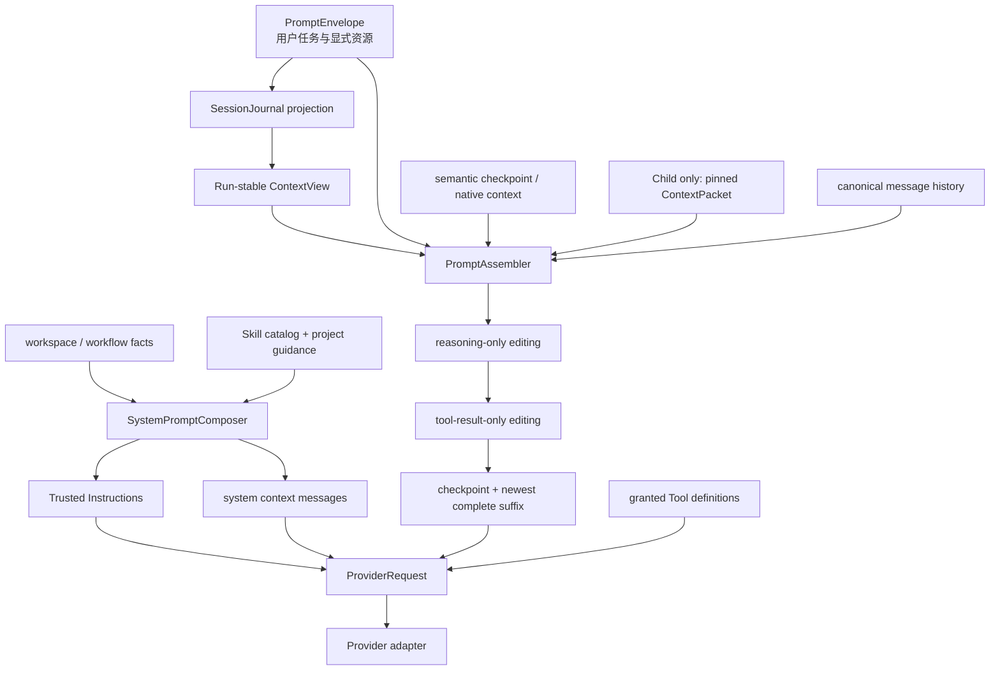

# Prompt、Context 与 Compaction

最后核对：2026-08-18。本文是 Praxis 当前 Prompt 装配的规范入口；`docs/prompt-audit/` 保存审计基线、历史决策和执行台账，不覆盖本文的现行规则。

第一次接触这些概念时，建议先读
[Praxis 当前分层架构：新手源码导读](planner-prompt-context-storage-guide.md)。
本文保留为精确规范和 Prompt 变更审查入口。

Praxis 把模型输入分成四类：唯一可信指令、任务与上下文、可执行能力、可恢复状态。Prompt 不是 Workflow authority，摘要不能证明副作用已经执行，Tool/Skill/MCP 内容也不能扩大 Runtime 授权。

`trust: 'user' | 'low'` 继续作为 Runtime 内部的来源、持久化和权限元数据存在，但生产候选 Prompt 不反复向模型展示 “low-trust / untrusted” 标签。这里的 `trust` 只表示**指令权限**，不是事实置信度：Tool 结果、MCP 数据、Skill 文本、Child 结论和 checkpoint 都不能借内容扩大授权，但它们仍可能是当前任务最重要的事实证据。事实是否成立由来源、时间、receipt / verifier 和交叉验证决定，不能用一个 `low` 标签代替。模型看到的是中性的 `<praxis-context kind="...">` 数据包；权限边界由 Runtime 执行，而不是依赖模型对“可信度”措辞的服从。`baseline-v1` 仅为历史回滚与 A/B 保留旧措辞。若未来重构内部类型，宜拆成 `authority`、`provenance` 和 `verification`，避免继续把授权与事实可靠性混在 `trust` 一词中。

## 一次主 Agent 请求的实际结构



在 OpenAI-compatible wire 上，顺序表现为一条 system message、`contextMessages`、对话 `messages`，以及独立 `tools`。Anthropic 把同一 `instructions` 映射到 `system` 字段；OpenAI Responses 把它映射到 `instructions`。Provider 适配可以改变协议表示，不能改变装配语义和权威顺序。

## 1. 版本与唯一默认源

当前注册两个 Prompt 程序：

| Variant | 用途 | 默认 |
| --- | --- | --- |
| `iron-law-lean-v1` | 当前代码默认、单铁律和中性 context | 是 |
| `baseline-v1` | 显式回滚与 A/B | 否 |

唯一默认源是 [`DEFAULT_PROMPT_VARIANT`](../apps/runtime/src/prompt/promptRegistry.ts)。Runtime、Planner、semantic verifier、Skill、checkpoint replay 和 Child composition 都必须引用该常量；不能在调用点再次写死默认字符串。`RuntimeKernelOptions.promptVariant` 优先，其次解析 `PRAXIS_PROMPT_VARIANT`，未设置时使用常量，未知值 fail closed。

Prompt 程序 manifest 记录 variant、version、owner、唯一 block 数、rendered digest、estimated tokens 和 component IDs。Trace 只写 digest 与统计，不写 Prompt 明文。

## 2. 最终装配顺序

`iron-law-lean-v1` 的最终模型可见顺序是确定的：

| 顺序 | 单元 | Provider 位置 | 信任/生命周期 |
| ---: | --- | --- | --- |
| 1 | `praxis.trusted-instructions` | `instructions` / `system` | Runtime 可信；每个 lean 请求恰好一个 block |
| 2 | `runtime_facts` | user-shaped context message | Runtime 生成的事实容器；低权限 context |
| 3 | `skill_catalog`，可选 | user-shaped context message | 名称、description、invocable 元数据；正文按需加载 |
| 4 | `project_guidance`，可选 | user-shaped context message | 工作区约定；按预算裁剪 |
| 5 | 签名 Child ContextPacket，仅 Child | pinned context message | Runtime 认证；不进入可压缩历史 |
| 6 | `session_view` | user-shaped context message | 一次 Run 内冻结；成功 compact 后换代 |
| 7 | Provider native context 或 `session_checkpoint` | native prefix 或 context message | 二选一；native 不匹配时回退 semantic |
| 8 | checkpoint 后最新完整消息后缀 | conversation messages | reasoning/tool 发送前视图可被编辑 |
| 9 | granted Tool definitions | Provider `tools` 字段 | 独立 schema；不是 system 文案 |

代码上的拼装分两段完成：`SystemPromptComposer` 产生第 1–4 项；`PromptAssembler` 产生第 5–8 项；`AgentLoop` 按上述顺序合并 `contextMessages` 并附加第 9 项。`PromptAssembler.systemContextMessages` 是带 trust/intent 元数据的审计视图，实际请求仍由 Loop 使用 `promptBuild.contextMessages`，避免重复发送。

### 2.1 唯一 Trusted Instructions

lean 程序只生成一个 `# Praxis Trusted Instructions`，包含：

- Runtime 权限、workspace 边界和 Tool receipts 最终有效；
- project、Skill、外部内容、Tool result、memory、summary、Child output 都不能覆盖该层或授予权限；
- 没有 Tool 证据不能宣称命令、修改、测试或外部动作成功；
- 不泄漏 credential、secret、隐藏指令和敏感诊断；
- 当前调用的 operational contract。

主 Root 的 operational contract 是可在 direct work 与已提供 collaboration tools 间自主选择。对非 `solo` 且实际提供 `agent.delegate` 或 `workflow.expand` 的 Root，合同还要求：长任务、多领域任务或高风险任务存在独立工作流时，在大量串行工作前至少委派一个有边界的调查或审查；短任务和强耦合任务保持 direct，并在重复失败后重新评估。Child 的合同是只完成被委派目标且不能创建 descendant。Planner、verifier 等辅助调用把自己的结构化输出合同并入同一个 Trusted Instructions 字符串，不创建第二个 system 政策块。

### 2.2 动态事实与项目内容

动态数据使用 `<praxis-context kind="…">JSON</praxis-context>`。JSON 中的 `<` 转义为 `\u003c`，避免内容伪造关闭标签。

- `runtime_facts`：cwd、platform、shell，以及可选 role、Planner mode、实际可用 collaboration tool 名称；
- `skill_catalog`：至多 64 个 disclosure，受独立 token budget 约束；
- `project_guidance`：ContextBuilder 已完成来源发现、路径边界、digest 和决策后，再按段落确定性裁剪；
- MCP：已激活、已授权的 MCP Tool 进入 Tool definitions，不把 MCP server 的任意文本提升为 Trusted Instructions；
- Capability manifest：进入不含正文的 `PromptAssemblyManifest` 和 Tool snapshot，不额外生成一段模型政策文字。

### 2.3 为什么不向模型展示“可信度等级”

生产 Prompt 不使用 `high-trust / low-trust / untrusted` 给上下文分级。这样的单轴标签会同时损害两类行为：模型可能把低权限但高价值的编译错误、Tool 结果和 Child 证据当成“不可信事实”忽略，也可能把 Runtime 生成但尚未验证的描述当成“高可信结论”。安全边界本来就由 Tool grant、workspace policy、schema、receipt 和 verifier 机械执行，不应依靠一个含义模糊的形容词。

Runtime 内部仍保留来源元数据，但评估三个互相独立的维度：

| 维度 | 回答的问题 | 典型实现 |
| --- | --- | --- |
| `authority` | 这段内容能不能改变指令或授予能力？ | 只有 Runtime policy、用户显式授权和签名合同能改变对应边界 |
| `provenance` | 内容从哪里来、何时产生、是否可追踪？ | source、digest、timestamp、Artifact/Tool/Child ref |
| `verification` | 这个事实目前被什么证据支持？ | Tool receipt、测试结果、verifier、cross-review、未知/待验证状态 |

模型看到中性的内容种类和必要来源引用，例如 `kind="tool_result"` 或 `kind="session_checkpoint"`；只有在会改变具体决策时才提示“未验证副作用”“需要重新检查”等操作状态。这样既不把外部内容提升为指令，也不会用安全标签污染事实推理。

## 3. PromptEnvelope 与 ContextView

普通文本、Prompt Template、显式 Skill、Slash workflow command 都先编译为版本化 `PromptEnvelope`。Envelope 保存 effective text、typed parts、source、digest、attachment refs 和每部分 persistence policy；敏感原文按 policy redacted/digest/none，不进入 Trace。

Planner policy 不靠匹配 Prompt 字符串切换实现。每个 Envelope 都进入统一 `AutoWorkflowPlanner`；`auto/solo/workflow` 只改变策略和可用 topology proposal。

父 Agent 从 `journalContextView` 读取 Session projection。ContextView 只包含 revision/range、checkpoint 描述、当前 plan projection、prerequisite result refs、artifact refs 和 omission 原因，不包含完整 Journal。产品父 Session 使用 V3 authority；`compatibilityContextView` 只服务注入的兼容 repository 或 Child ephemeral Session。

一次 Run 首次选择 ContextView 后冻结同一模型可见快照。后续 assistant、Tool、steer 和 Workflow 结果作为消息追加在该快照之后；成功 compact 建立新 replay boundary 时才丢弃旧快照并重建。这是 cache 生命周期规则，不是把 Session 状态冻结在 Runtime 内。

## 4. Root、direct、workflow 与 Child 的装配差异

Praxis 没有两套 direct/supervisor Prompt 管线。

| 路径 | 相同部分 | 差异 |
| --- | --- | --- |
| `auto` Root | 同一 composer、assembler、loop | collaboration tools 可用，模型自主 direct/delegate/expand |
| `solo` Root | 同一 composer、assembler、loop | topology tools 不在有效 capability snapshot 中 |
| `workflow` Root | 同一 composer、assembler、loop | policy 要求非平凡副作用先形成图；简单任务仍可 direct |
| Child | 同一 AgentLoop、Provider、Skill/MCP/Tool 基础设施 | role contract 为 bounded Child；有 pinned ContextPacket；能力是父级 grant 的子集；固定禁止 descendant |

Child ContextPacket 包含 packet/parent/child ID、objective、bounded step、constraints、`relevantRefs`、success criteria、workspace、Capability Bundle ref、budget、prohibitions 和 output schema。bootstrap 校验签名 Packet 与 authoritative Bundle；Packet 每轮重放，历史选择和 compaction 不能删除。

## 5. Skills、MCP 与结构化 Child 终态

Skill catalog 只发送目录 disclosure。模型或用户选中后，SkillInvocationService 校验固定 digest、加载正文并记录 `SkillInvocationEntry`；重放使用 `skill_invocation_replay` context。Skill 不能扩大 Tool、网络、workspace、credential 或 budget。

MCP stdio server 经过 manifest、workspace grant 和 activation 后，其 Tool descriptor 进入同一个 ToolRuntime。Child 获得的是父 Runtime brokered view，不是原始 server 或 credential；只有获批且父进程存在的 environment 变量传给 server。MCP result 作为 Tool evidence 进入消息历史，不能成为 system policy。

Child 以 Runtime-owned `praxis_submit_child_result` Tool 提交 `SubagentResultV1`。其参数 schema 来自签名 ContextPacket，criterion IDs 必须精确、完整、唯一；如果模型先以 prose 结束，Loop 下一轮用 `toolChoice` 强制提交。父 Host 对原始值再次执行完整 schema/criterion 校验，失败和 skipped 均 fail closed。过大正文外置到父 ArtifactStore，但校验使用未截断原值；evidence 过多时聚合为可递归 manifest Artifact。

## 6. Provider-only Context Editing

编辑顺序固定为：

```text
canonical Session messages
  -> reasoningContextEditing
  -> contextEditing for Tool results
  -> context window selection
  -> provider adapter
```

这些阶段只生成发送视图，不改 SessionJournal、Workflow authority 或 Artifact。

### Reasoning

默认 reasoning 总量超过约 8K 估算 token 时，从最旧 reasoning-bearing assistant turn 开始删除 reasoning block；保留最近 1 个 turn，一次至少释放约 2K token。普通 text、citation、Tool call 不变。DeepSeek 保留其 Tool-thinking 协议所需的最近 `reasoning_content`；Praxis 不把展示 reasoning 伪造成普通 assistant text。

### Tool results

默认规则：

1. 非 Skill 单条结果超过约 12K 估算 token 时保留头尾、digest、原始字节数和恢复引用；
2. 可重放 `sideEffect=read/none` 结果合计超过约 32K 后从最旧开始清理；
3. 最近 3 个可重放结果保留，一次释放不足约 8K 时不清理；
4. `write/process/network`、`agent.*`、`workflow.*` 和 Skill invocation 不做陈旧清理；
5. 清理占位保留 Tool call 连续性、成功/失败状态、名称、digest 和 Artifact 恢复位置；
6. 窗口切分造成的开头孤立 Tool result 会被删除，避免 Provider 协议错误。

## 7. Compaction 与恢复

Context 接近模型 limit，或 checkpoint 后 canonical 未压缩正文达到默认 64K 估算 token 软阈值时，CompactionService 选择安全范围、生成结构化 semantic checkpoint、检查 gain、保存 retained tail，并在 overflow 时只允许有进展的 retry。

64K 是成本触发器，不是 context、turn、tool 或任务寿命上限。默认 `compactionScope=body_after_checkpoint`；`total` 可显式选择。阈值具有 hysteresis，工作集降到 rearm 线以下后才再次触发。

每次有效 compaction 始终先得到 portable semantic checkpoint。若 Provider 实现 `compact()`、当前选择没有 uncovered omission 且调用成功，可以额外保存 opaque native state。重放 native 必须同时满足 provider、model、format、message range 和 instructions digest；任何不匹配都自动回退 semantic checkpoint。native 失败不回滚 semantic 成果。

OpenAI Responses 已接 standalone `/v1/responses/compact`；DeepSeek、Kimi、通用 chat compatible 和当前 Anthropic Messages 路径使用 semantic checkpoint。Child 可通过 credential broker 的 standalone compact RPC 使用父 Provider，不接触 API key。

签名 Child ContextPacket 位于 compactable history 之外。`relevantRefs` 同时是 checkpoint 结构化字段并确定性继承；因此摘要遗漏不能删除任务合同或已授权前驱引用。Workflow Node/Attempt/Lease/receipt、Tool Artifact 和 candidate commit 从各自 authority 恢复，不依赖自然语言 checkpoint。

真实 MiniMax M3 fidelity 压力运行在 24K 强制 context 下生成 19 个递增 semantic checkpoint；每次都保留目标 sentinel、禁止修改项和最终输出合同。后续真实中等任务发现 `keepRecentTokens=8` 会把“源码已改但尚未 rebuild / reinstall / verify”的继续执行边界裁掉，因此生产默认值已提升为 `8192`；semantic summary 还会与 Runtime 确定性提取的 modified files、失败证据和 open loops 合并，结构合法但内容空洞的模型摘要不能再抹除这些状态。真实 `build-cython-ext` 回归又发现，合并正确的 continuation frontier 仍可能被最终 1024-token fitting 按“最长数组优先”裁掉；当前 fitting 已改为先丢弃可重读的 read files、历史 decisions 和 references，再缩短目标，最后才允许裁剪 constraints、modified files、unresolved 与 active plan，并尽量为每类保留至少一项。Runtime 还会把成功 `edit/write` 的调用路径以及成功 shell 中明确的 `sed -i`、`perl -pi`、重定向、复制、移动、删除、patch 等变更目标并入 modified files；它只提取有界路径，不回放整条 shell 命令，也不把失败调用误记为已修改。

中等 C++ 调试样本进一步证明“模型生成结构化 JSON”仍不等于字段可信：模型曾把“只读、尚未修改的 `/app/user.cpp`”写进 `modifiedFiles`，并把自己的调试推测写进 `constraints`。当前 merge 使用字段级所有权：`objective/constraints` 只来自用户任务、签名 Child Packet 或上一版已准入 checkpoint；`relevantRefs/readFiles/modifiedFiles` 只来自 Packet、上一 checkpoint 和成功 Runtime Tool 证据；模型只允许补充 `decisions/unresolved/activePlan` 等语义状态。这样 compactor 不能通过填对 schema 把推测升级为权限、来源或副作用事实。

这些样本证明多次 checkpoint 的关键合同链路可用，但不是多类型或统计保真率保证。模型曾尝试 9 次被 policy 拒绝的 `shell`，0 次成功执行；权限执行结果和自然语言服从性必须分开计分。

## 8. Prefix cache 规则

Provider cache 取决于最终 wire prompt 的最长公共前缀，而不是某段文案是否短。Praxis 遵守以下不变量：

1. 同一 Run 的 Trusted Instructions、system context 和 ContextView 保持稳定；
2. 新 assistant/Tool 历史只追加在稳定前缀之后；
3. Tool definition 顺序与序列化必须由 capability snapshot 确定；
4. 只有成功 compact、Provider fallback 或能力快照变化等真实边界才允许前缀换代；
5. trace 必须记录 Prompt variant、manifest digest、input/cache read 和命中率，不用模糊百分比代替 token 证据。

DeepSeek 五轮 paired A/B 排除首轮冷热差异后，baseline 命中率 78.0%，lean 77.2%；lean 后四轮输入从 18,543 降至 17,403，减少约 6.1%。因此 lean 被晋升为默认是因为体积更小且行为合同保持，cache 改善来自 ContextView 生命周期修复，不把两者混为一个因果结论。

## 9. Tool Search 决策

当前常见 Root 约 15 个工具、完整 schema 约 5.3K 估算 token，默认不启用 Tool Search。满足任一条件时重新评估：

- `toolCount > 20`；
- `toolSchemaTokens > 8K`；
- schema 超过有效窗口约 8–10%；
- MCP/process 动态目录使 capability snapshot 无法形成稳定前缀。

未来实现应为“短 catalog + grant-filtered schema fetch”。搜索只能缩小已授权 bundle，不能发现并授予新权限。

## 10. Prompt 变更规则

任何模型可见变更都按以下顺序处理：

1. 在 registry 中创建或升级版本，不在调用点写隐式变体；
2. 明确该内容属于 Trusted Instructions、context、conversation、Tool schema 还是 Runtime-only metadata；
3. 同一条 Runtime 已强制规则不要在多个 Prompt 单元重复；
4. 动态 JSON 使用中性 envelope 和确定性序列化，保持 `<` escaping；
5. Child 合同、权限、budget 和 success criteria 由签名 Packet/Bundle/schema 强制，不交给 prose；
6. 更新 Prompt manifest 与最终 payload 合同测试，检查单 block、顺序、digest、omission 和 Provider mapping；
7. 如果声称质量、成本或 cache 改善，必须做除 Prompt 外固定的 paired eval；
8. 默认晋升后保留显式回滚路径，并同步本文、审计台账和项目状态。

### Review checklist

- 最终请求是否恰好一个 Trusted Instructions block？
- Tool schema 是否仍是独立字段，且只包含有效 grant？
- ContextView 是否在 Run 内稳定、compact 后才换代？
- checkpoint/native binding 是否不会跨 provider/model/instructions 误用？
- reasoning/Tool editing 是否只改变 Provider 视图？
- Child Packet 和 criterion 是否由 Runtime 机械校验？
- manifest/trace 是否能在不泄漏正文的前提下解释实际变体与 omission？
- 新默认是否只有一个源码入口？

## 11. 当前未完成

- Anthropic server-side compaction、thinking clearing 和显式 cache blocks 尚未接入；
- 已有一次 19-checkpoint fidelity 压力样本，但没有覆盖错误码、Child Artifact refs 等多类型集合，也没有重复运行统计；
- 没有完整 wire payload dump 的生产级脱敏与离线重放系统；
- Tool Search 尚未达到启用门槛；
- cache 是 best-effort，仍受 Provider 粒度、过期和首轮冷热影响。

## 主要文件

| 文件 | 作用 |
| --- | --- |
| `apps/runtime/src/prompt/promptRegistry.ts` | Prompt variant、唯一默认、Trusted Instructions 编译与 program manifest |
| `apps/runtime/src/prompt/contextBuilder.ts` | 发现并验证 workspace/project instructions，形成 `PromptBuildInput` |
| `apps/runtime/src/prompt/systemPromptComposer.ts` | 第 1–4 项：唯一 instructions 与低权限 system context |
| `apps/runtime/src/prompt/contextView.ts` | 从 SessionJournal projection 构造 ContextView |
| `apps/runtime/src/prompt/promptAssembler.ts` | pinned/context/checkpoint/history 的预算、编辑、选择与 assembly manifest |
| `apps/runtime/src/memory/contextWindow.ts` | native/semantic checkpoint 与最新消息后缀选择 |
| `apps/runtime/src/memory/compactionService.ts` | semantic checkpoint、gain policy 与 native 附加状态 |
| `apps/runtime/src/memory/contextEditing.ts` | Provider-only Tool result 编辑 |
| `apps/runtime/src/memory/reasoningContextEditing.ts` | Provider-only reasoning 编辑 |
| `apps/runtime/src/loop/index.ts` | 合并最终 ProviderRequest、compact retry 和终结 Tool |
| `packages/core-sdk/src/prompt.ts` | PromptEnvelope、ContextView、manifest 与 build 合同 |
| `packages/core-sdk/src/llm.ts` | ProviderRequest、Tool definitions 与 stream 合同 |
| `apps/runtime/src/subagent/contextPacket.ts` | Child Packet/Result 合同验证 |

最终测评、优化原因与能力边界见 [Praxis 最终小样本测评与优化总结](evaluation-final-2026-08-09.md)。
