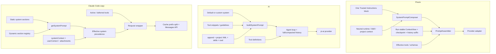

# 三套 Prompt 装配原理与差异

状态说明：Praxis 部分已于 2026-08-18 按默认 `iron-law-lean-v1` 重新对账；[Praxis 当前生产 Prompt](./01-praxis-prompts.md)只展示现行装配，旧式 wrapper 和版本演进仅保留在执行台账中，不再混入当前架构说明。

## 1. 一张图看三套主线



## 2. Praxis 装配

### 2.1 构建阶段

1. Runtime 解析 `PromptEnvelope`、工作区、workflow role/mode、可用能力、Skills 与项目指令，并从 `promptRegistry.ts` 解析一次 Prompt variant。
2. 默认 `iron-law-lean-v1` 由 `SystemPromptComposer` 生成一个不可裁剪的 `praxis.trusted-instructions` 字符串；identity、root/child 合同与 execution contract 都并入同一个 Provider `system`/`instructions` block。
3. 动态 workspace/workflow 事实后置为 `runtime_facts`；在剩余预算中依次装配 `skill_catalog` 与 `project_guidance`。三者都是中性的 user context envelope，不进入 system。
4. 若唯一铁律和必要 runtime facts 超过 `maxSystemPromptTokens`，直接报 `PROMPT_BUDGET_TOO_SMALL`，不会静默删除边界。
5. 生成 program/section manifest：variant、唯一 block、source、order、cacheScope、characters、estimatedTokens、included 和 digest；项目文件另记录选择/裁剪决策。
6. `baseline-v1` 仍可显式选择，以旧的 safety/identity/workspace/workflow/execution sections 和 `low-trust` reminder 服务回滚/A-B。

### 2.2 历史选择阶段

1. `PromptAssembler` 渲染中性的 Session ContextView，作为 selector context 的第一个 user message；它在一次 Run 内冻结，成功 compact 后才换代。
2. 计算系统、ContextView、工具 schema、响应和 safety reserves。
3. 如果 durable checkpoint 连同 Skill replay 能放下，从 checkpoint 的 `messageEnd` 开始选择历史；否则退回原始历史起点。
4. 从最新消息反向选择可放入预算的连续后缀，删除开头孤立的 tool results。
5. 可配置的 context editing 只替换陈旧工具结果，并受 Provider 能力和策略约束。
6. 输出 omission、pressure、checkpoint coverage 等报告与最终 prompt manifest。

### 2.3 Provider wire 顺序

```text
One Trusted Instructions block
  ↓
runtime_facts / skill_catalog? / project_guidance?
  ↓
Session ContextView
  ↓
Checkpoint / Skill replay（若选中）
  ↓
对话历史后缀 + 当前用户/工具/steer
  ↓
当前有效 tools + schemas
```

Anthropic 把 Trusted Instructions 放 `system`；OpenAI Responses 放 `instructions`；Chat-compatible 适配成首个 system message。其余 context messages 在普通 history 前保持 `role=user`。Runtime 对消息保留内部 `trust/source/provenance` 元数据，但默认 Prompt 不把它渲染成事实可信度标签。

主 loop 的精确 context 顺序是 `promptBuild.contextMessages` 在前（Skill metadata、project guidance），context selector 的 ContextView/checkpoint 在后；这不是按“信任高低”排序，而是当前实现的线序。

### 2.4 运行中再注入

- 每个 tool call/result 持久化到 Session，下一轮进入历史；
- 重复相同失败达到阈值前注入 Runtime guidance；到阈值则停止而不是继续耗 token；
- steer 以 `role=user, intent=steer, trust=low` 进入；其中 `trust` 是 Runtime 内部协议字段，不是模型可见的可信度评分；
- Skill/Prompt resource 按调用时插入包装消息，并根据 persistence policy 以明文、脱敏、digest 或省略形式重放；
- 子 Agent 使用完全独立 ContextPacket，不直接继承父历史。

## 3. Pi 装配

### 3.1 系统字符串

Pi 的核心是一个 `buildSystemPrompt()`：

```text
customPrompt ? customPrompt : default core
  + appendSystemPrompt?
  + <project_context> files?
  + available skills?（仅有 read）
  + Current working directory
```

默认 core 内部再由所选工具生成 `Available tools` snippets 和去重后的 guidelines。`customPrompt` 只替换 core，不替换 append/project/skills/cwd。

### 3.2 会话与扩展

基础 system 在 `AgentSession` 初始化时构建，在有效工具集或 extension resource 变化时重建，并通常跨 turns 复用；不是每次 `AgentSession.prompt()` 都从源码重新装配。它与转换后的 session messages、当前 tools 一起交给 `Agent.prompt()` 和 `runAgentLoop()`。每个 assistant tool call 执行后，tool result 追加到历史并继续下一轮，直到模型结束或被中断。

Extension 可在至少三处改变模型输入：

- 输入阶段：变换用户输入或把命令展开为 Prompt；
- `before_agent_start`：为当前 turn 替换 system、添加消息；没有替换时恢复并使用基础 system；
- context 阶段：过滤/重排送给模型的历史。

因此 Pi 的最终请求是“核心装配 + 扩展变换”的结果，核心本身没有类似 Praxis manifest 的统一 digest 链。

### 3.3 压缩

达到上下文阈值后，Pi 用独立摘要调用把旧历史压成一个 `compactionSummary` user message；可保留最近后缀，超大单轮只总结前缀。分支导航则生成 `branchSummary`。这两个摘要在模型视角中都是 user messages，而不是 system。

## 4. Claude Code copy 装配

### 4.1 会话初始化

```text
fetchSystemPromptParts()
  ├─ getSystemPrompt()   默认主体与动态 sections
  ├─ getUserContext()    CLAUDE.md、记忆、日期
  └─ getSystemContext()  Git 启动快照等
        ↓
buildEffectiveSystemPrompt()
  override > coordinator > agent > --system-prompt > default
  then append（override 除外）
```

非交互自定义 system 是特殊路径：仍可得到 userContext，但跳过默认主体和 Git systemContext。

### 4.2 每轮 query

1. `appendSystemContext()` 把 Git 等 context 加到 API system 尾部。
2. `prependUserContext()` 把 CLAUDE.md、记忆、日期包装成 `<system-reminder>`，作为首个合成 user message。
3. 运行时 attachments 合并文件变化、计划、权限、任务、MCP delta、团队状态等。
4. request wrapper 在 system 首部放 attribution 与 CLI prefix，在尾部放 advisor/Chrome 指令。
5. deferred tools 未加载时只以合成 user message列名称；ToolSearch 后才进入 `tools` 完整 schema。
6. `splitSysPromptPrefix()` 删除动态边界标记，把当前已解析变体的缓存前缀转换成带 `cache_control` 的 system blocks；该前缀可能因 output style、`USER_TYPE`、enabled tools 等条件形成不同字节版本。
7. 发送 Anthropic Messages API；system 或 tools 变化时 dump `system_update`。

### 4.3 动态 section registry

`systemPromptSection()` 首次求值后按 Session 缓存，在 clear/compact/resume/worktree 生命周期变化时清空。这里的“Session 缓存”不等于 Provider 的 prompt cache：前者缓存 section 求值，后者复用最终请求前缀。`DANGEROUS_uncachedSystemPromptSection()` 每次重建都计算，主要服务可能变化的 MCP instructions。它降低了把多个 runtime bit 放入缓存前缀所造成的组合变体问题，但 resolved 配置本身仍可形成不同前缀。

### 4.4 压缩与记忆

Claude copy 同时有三条连续性机制：

- Compact：把旧对话详细压成 user summary，保留近期消息时可只压前缀；
- Session Memory：固定结构 notes，后台 Edit 更新，compact 时可一并带入；
- Persistent memory：后台子 Agent 从近期消息提取并维护 private/team memory files。

它们都不是简单“加长 system prompt”，而是不同生命周期、不同存储和不同更新触发器。

## 5. 关键差异

| 维度 | Praxis | Pi | Claude copy |
| --- | --- | --- | --- |
| 核心哲学 | 单一指令权威边界 + Runtime provenance/verification | 小核心、强扩展 | 产品行为覆盖广、按功能条件装配 |
| 主 system 体量 | 中等、固定政策少 | 最小 | 很大，分支多 |
| 项目指令角色 | 中性 user JSON context；权限元数据仅在 Runtime | system XML | 通常合成 user reminder；部分 context 进 system |
| Skill | metadata 与正文分离，正文按需以中性 context 返回 | catalog 进 system，正文由 read | discovery/Tool + attachments + memory integration |
| 工具暴露 | 当前有效能力全集 | 当前工具全集 | 当前工具 + deferred tool search |
| 子 Agent | canonical packet、能力衰减、结果 schema | 由 extension/harness 组织 | Agent system prompt + tools + env/memory addenda |
| 上下文压缩 | durable checkpoint + suffix | structured summary + suffix/branch | compact + recent suffix + session/persistent memory |
| 缓存 | Run-stable ContextView 与 usage 指标已接入；未完成 Anthropic 显式 cache blocks | 无核心显式缓存边界 | 静态/动态 boundary + cache blocks + MCP delta |
| 可观测性 | manifest/digest/omission 强 | 会话树强，Prompt lineage 弱 | request dump/cache update 较强 |
| 安全隔离 | 最强：中性来源容器，能力/工作区/receipt 在 Runtime | 主要靠 Prompt 与工具实现 | Prompt 规则丰富，外部内容通道按产品路径不同 |

## 6. 对 Praxis 的直接启示

1. 保留 Praxis 的单一指令权威边界和 Runtime 内部 provenance，不把 Pi 的项目 XML 或 Claude 的外部 MCP instructions 复制进 Trusted Instructions，也不向模型添加高/低可信度阶梯。
2. 借鉴 Pi 的小核心：把重复的输出风格、工具选择、完成度规则合并为单一、可测策略；不要靠更长 Prompt 获得安全。
3. 借鉴 Claude 的 cache boundary 和 deferred tools：稳定政策/稳定工具放前，环境/会话/项目放后；大工具集按需加载。
4. 借鉴 Pi/Claude 的摘要职责分离，但保持 Praxis 的 durable manifest：摘要应有 schema、来源范围、coverage、版本和回放 digest。
5. 把辅助调用视为一等 Prompt 产品：Planner、verifier、未来 compactor 都应拥有独立 ID、版本、eval dataset 和发布门禁。

“内容不能授予权限”与“内容是否为真”是两个问题。Praxis 的完整现行决策见[指令权威、来源与事实验证](./10-authority-provenance-and-verification.md)。
