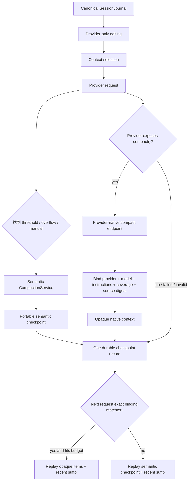

# 原生 Compaction、Reasoning 清理与 Tool Search 决策

状态：**Root/Child 的双层 compaction 路径已接通；OpenAI Responses 可生成、持久化和重放原生 opaque context，其他 Provider 确定性回退到 portable semantic checkpoint。Reasoning/Tool result 清理只作用于 Provider 视图。Tool Search 当前不启用。**

本文记录 2026-08-08 对 Prompt 审计文档与当前实现的冲突检查、已落地架构、能力边界和后续门禁。2026-08-09 已补充真实 DeepSeek compaction、cache A/B 与 MiniMax 19-checkpoint fidelity 压力运行；2026-08-18 再次确认 checkpoint/summary 的内部 `trust` 只是来源与持久化元数据，不能作为事实可信度标签。后者仍不替代多类型、大样本保真率或长任务成功率统计。最终汇总见[最终测评总结](../evaluation-final-2026-08-09.md)，术语决策见[指令权威、来源与事实验证](./10-authority-provenance-and-verification.md)。

## 1. 冲突检查结论

| 冲突 | 风险 | 当前处理 |
| --- | --- | --- |
| candidate checkpoint 仍写成 `Session checkpoint:` | 动态摘要继续表现得像第二段指令，违背中性 context envelope 决策 | `iron-law-lean-v1` 改为 `kind="session_checkpoint"`；baseline 原文保留用于成对实验 |
| Tool result 清理占位包含新的英文指导句 | context editor 在 registry 外偷偷新增 prompt-like 文案 | 改为结构化 `canonicalLocation` 与 `recovery` code |
| reasoning block 被当作普通 assistant 文本重放 | Provider 签名语义丢失，模型把展示用 thinking 当成普通答案 | OpenAI Responses/Anthropic 不再伪造文本；独立 reasoning editor 清理旧 block；DeepSeek 只按其协议重放最近 Tool-thinking |
| 原生 compact 覆盖通用 checkpoint | 切换 Provider/model/Prompt 后 opaque 状态不可解释且不可移植 | 两层并存：semantic checkpoint 始终是恢复底座，native context 只是精确绑定的优化层 |
| 生成与存储大小边界不一致 | 状态能生成却不能写入 journal，重启后断链 | 取消 native 8 MiB 与 journal 单事件 1 MiB 字节硬上限；保留结构、深度、字段和数量校验 |
| manifest 看不到实际采用哪种上下文 | 无法解释一次请求为何走 native 或 fallback | `PromptAssemblyManifest.context.state` 记录状态种类与无正文的 binding/digest |
| 当前工具集直接套 Tool Search | 多一次发现调用可能比省下的 schema token 更贵 | 测量后暂缓，以规模和占窗比例作为启用门槛 |

## 2. 为什么不是“只用原生 compact”

Provider-native compaction 和 Praxis semantic checkpoint 解决的问题不同：

- **Provider-native context** 是某个 Provider/model 对历史的 canonical、可能不透明的表示。它适合低损失续写，但不能假设跨 Provider、跨模型或跨 Prompt 程序可用。
- **Semantic checkpoint** 是 Praxis 自己理解和验证的 portable 状态，保存目标、决策、约束、文件、未完成事项、活动计划和 provenance。它可以跨 Provider 恢复，也便于人类审计。
- **SessionJournal** 保存完整 canonical transcript。Compaction 不删除历史，不把自然语言摘要升级成 Workflow authority。
- **Workflow/Artifact authority** 独立保存 Task、Lease、receipt、副作用结果和大对象。它们不会因为摘要遗漏而凭空消失。

因此 Praxis 使用“可移植底座 + Provider 优化层”，而不是二选一。



## 3. 一次 native compaction 的完整生命周期

1. `PromptAssembler` 先从 canonical messages 生成 Provider-only 视图：清理旧 reasoning，再处理 Tool results，然后选择 checkpoint/native prefix 与最新完整后缀。
2. `AgentLoop` 只在当前选择没有 uncovered omission、且 Provider 实现了 `compact()` 时，把**实际即将发送的 ProviderRequest**作为原生压缩候选。
3. `CompactionService` 先生成有界 semantic checkpoint。低收益或没有安全 cut range 时，两种压缩都不落盘。
4. OpenAI Responses adapter 调用 `/v1/responses/compact`，传入当前 model、唯一 instructions 和 canonical input items。
5. Runtime 验证结果包含 compaction item，创建 `ProviderNativeContext`，记录 provider、model、format、message range、instructions digest、source digest、估算 token 与时间。
6. native 调用不存在、失败、限流或返回非法结果时，不让主任务失败；semantic checkpoint 仍正常保存。
7. native compact 返回的 input/output/cache/cost usage 计入当前 Run；若因此耗尽 token budget，在发起下一次普通模型请求前终止。Child broker 同时用同一 usage 约束 delegated handle。
8. 下一轮只在 provider/model/instructions 精确匹配且 native state 能放进预算时选择它，否则自动选 semantic checkpoint。
9. Adapter 将 opaque output **原样**放在新请求 input 前面，再追加 compact 之后的 recent suffix；Runtime 不解释或局部删改 opaque items。

OpenAI 官方把独立 `/responses/compact` 定义为 stateless compaction：输入完整上下文，输出后续请求可直接使用的 canonical compacted window，其中可含不透明的 encrypted compaction item；官方明确要求不要自行裁剪输出。Praxis 当前采用这条独立端点，而不是服务端 `context_management` 自动阈值，以便 threshold、journal commit、fallback 与 trace 仍由 Runtime 统一控制。参考：[OpenAI Compaction guide](https://developers.openai.com/api/docs/guides/compaction)、[Codex agent loop](https://openai.com/index/unrolling-the-codex-agent-loop/)。

## 4. Prompt 与存储如何绑定

原生状态不是另一份 system prompt，也不会把 provider 输出拼成低优先级提示文字：

- compact 请求使用当前 `SystemPromptBuild.instructions`；
- checkpoint 保存 `instructionsDigest`，Prompt variant、静态铁律或 call-specific contract 改变后旧 native state 自动失效；
- `sourceDigest` 记录生成该状态的 exact request source，供审计和问题定位；
- `messageStart/messageEnd` 定义覆盖范围，recent suffix 从覆盖终点之后开始；
- `PromptAssemblyManifest.context.state` 只保存 `provider/model/format/digest/checkpointId`，不泄漏 Prompt 或 opaque payload；
- native state 嵌入 `compaction.created.checkpoint.nativeContext`，JSONL 与 SQLite V3 都通过同一个 journal contract 重建；semantic checkpoint 与 native state 同一次原子提交。

被取消的是两个不一致的**整包字节硬上限**。仍保留：合法 JSON、最大嵌套深度、固定 schema、ID/digest 格式、最大 items/messages/tools 数量、journal checksum、revision CAS 和 reducer 状态机。这样避免任意文本长度决定任务寿命，同时没有放弃协议完整性。

## 5. Reasoning / thinking block 专门清理

Reasoning 不能和普通文本共用“截头尾”的 Tool-result 策略。它可能带 Provider 专用签名、和 Tool call 有连续性要求，也可能只是 UI 展示摘要。因此新增独立阶段：

```text
canonical messages
  -> reasoningContextEditing (old reasoning blocks only)
  -> contextEditing (tool results only)
  -> contextWindow selection
  -> provider adapter
```

默认策略：reasoning 总量超过约 8K 估算 token 才激活；保留最近 1 个含 reasoning 的 assistant turn；一次至少释放约 2K token。清理只删除旧 `reasoning` block，保留同一消息里的 text、citation 和 tool call；SessionJournal 原文不变，trace 只记录数量和 token。

Provider 边界不同：

| Provider 路径 | 当前行为 |
| --- | --- |
| OpenAI Responses | opaque compact item 原样重放；普通历史中的展示 reasoning 不伪造成 `output_text` |
| Anthropic Messages | 展示 reasoning 不伪造成普通 assistant text；Praxis 当前未保存可验证的 Anthropic signed thinking block |
| DeepSeek | thinking Tool turn 按协议使用 `reasoning_content`；reasoning editor 保留最近 turn、清理更旧 turn |
| 通用 OpenAI-compatible | 没有统一 signed-reasoning 协议；只重放编辑后仍保留的语义内容 |

Anthropic 官方把 tool-result clearing、thinking clearing 与 compaction 作为不同策略；组合时 thinking clearing 应先于 tool-result clearing。Praxis 采用相同阶段顺序，但当前实现是本地 Provider-view 编辑，不声称已经接入 Anthropic beta `context_management`。参考：[Anthropic context editing](https://platform.claude.com/docs/en/build-with-claude/context-editing)。

## 6. Provider 与 Child 能力矩阵

| 路径 | semantic checkpoint | 生成 native compact | 重放 native state | 失败语义 |
| --- | --- | --- | --- | --- |
| Root + OpenAI Responses | 是 | 是 | 是 | native 失败回退 semantic |
| Root + DeepSeek/Kimi/OpenAI Chat-compatible | 是 | 否，Provider 无对应 contract | 否 | 正常使用 semantic |
| Root + Anthropic Messages | 是 | 尚未接 Anthropic native compaction/context editing | 否 | 正常使用 semantic |
| Child + OpenAI Responses parent credential broker | 是 | 是，独立 `credential_broker.compact` RPC | 是 | native 失败回退 semantic |
| Child + 其他 Provider broker | 是 | 否，父 Provider 未暴露 `compact()` | 否 | 正常使用 semantic |

Child 的 standalone compact 使用与 stream 分离的 IPC 消息、相同的短期 handle、target/deadline/replay/busy/token-budget 校验和脱敏 trace；父进程调用真实 Provider，API key 不进入 Child。compact usage 计入 delegated token budget，缺少 usage 时 fail closed 并由 Runtime 回退 semantic。`credential_broker_*` trace 通过 `operation=stream|compact` 区分两类调用。

## 7. Tool Search 现在要不要做

结论：**现在不默认启用。**

当前代码测量结果：

- direct 基础内置工具约 8 个，schema 约 1.8K OpenAI-compatible 估算 token；
- 常见 supervisor root 加 artifact 与 collaboration 工具约 15 个，schema 约 5.3K token；
- 启用 Skill tool 时通常约 16 个；MCP/process plugin 会动态增加；
- 最大的单个 schema 主要是 `workflow.expand`、`workflow.loop`、`agent.delegate`。

Tool Search/deferred loading 会减少常驻 schema，但会增加发现步骤、延迟和一次选错目录的机会。Anthropic 当前建议主要面向大约 20 个以上工具的场景，并明确它解决的是 tool definition，而 prompt caching/context editing 解决的是其他上下文来源。参考：[Anthropic tool context management](https://platform.claude.com/docs/en/agents-and-tools/tool-use/manage-tool-context)。

Praxis 的启用门槛采用可观测条件，而不是固定追赶某个产品：

- `toolCount > 20`；或
- `toolSchemaTokens > 8K`；或
- tool schema 超过当前有效上下文窗口的约 8–10%；或
- MCP 动态目录增长到 capability bundle 无法保持稳定前缀。

达到门槛后应实现两级接口：第一层只暴露短 catalog（name、purpose、risk、bundle/provider），第二层由 Runtime 返回经过 grant 过滤的完整 schema。Child 继续只能搜索父级 grant 允许的 bundle，搜索不能扩大权限。现阶段先使用现有 capability bundle、Child 子集和 manifest 中已有的 `toolCount/toolSchemaTokens` 指标。

## 8. 尚未宣称完成的部分

- 没有完成 Anthropic server-side compaction/thinking clearing adapter；
- 已完成 DeepSeek/OpenAI-compatible 稳定前缀生命周期与 usage 方言解析，但没有完成 Anthropic 显式 cache block 与 native compact 联合优化；
- 已有一次 MiniMax 19-checkpoint fidelity 场景，目标、禁止项、最终合同和关键参数均保留；尚未形成覆盖未完成事项、精确错误、文件状态和 Artifact refs 的大样本成功率；
- 没有启用 Tool Search，也没有把工具目录发现能力写进 production Prompt；
- `iron-law-lean-v1` 已是 `DEFAULT_PROMPT_VARIANT`；命名式 production/canary alias 机制仍未创建。

## 9. 验证门禁

已完成定向 contract 验证：typecheck；OpenAI compact endpoint/opaque replay；native exact binding 与跨 Provider fallback；semantic/native journal persistence；reasoning 编辑不改 canonical history；checkpoint 中性 envelope；JSONL 恢复；Child standalone compact 的授权、计费、IPC 往返与 secret 隔离。最新一组共 74 项，73 pass、0 fail、1 个需显式 API key 的网络 smoke skip。

进入长任务测评时至少记录：每轮 context state、native/semantic fallback 原因、压缩次数、压缩前后 token、被清理 reasoning/tool tokens、约束/待办/错误召回、重启后首轮成功率、总 input/cache/output token 与 wall time。只有这些指标稳定，才能说 compaction 改善了长生命周期能力，而不只是“某次请求没超窗”。

随后真实 DeepSeek 24K 强制 context 运行已 exit 0：一次 `context.compacted` 使用 9,387 input、731 summary output，覆盖 5 条消息，checkpoint 752 tokens；最终恢复预设 threshold、64K 未压缩阈值和 keep-recent 参数并输出 `COMPACT_OK`。MiniMax M3 的后续压力运行以 26 turns、19 次 threshold compaction 完成；journal coverage 严格递增，每个 checkpoint 都保留 sentinel、禁止项和最终合同，最终恢复相同三个参数。MiniMax 的 9 次 `shell` 尝试均被只读 policy 拒绝，且最终 marker 前有说明性前言，因此报告同时保留“框架 fidelity 通过”和“严格模型服从未全过”两层结论。

## 10. Prefix cache 生命周期验证（2026-08-09）

此前 ContextView 直接从 SessionJournal projection 每轮重建，其中 `revision`、`recentEntryRange`、result/artifact refs 和 omission 会随每条消息变化。它又位于完整对话历史之前，所以 Provider 最长公共前缀在 ContextView 处中断；精简 Trusted Instructions 只能减少 miss token，不能修复命中率。

现在 ContextView 以 Run 为生命周期冻结，成功 compact 后才换代。DeepSeek V4 Flash 的五轮串行 read A/B 结果如下：

| Variant | 全部输入 | cache read | 全部命中率 | 排除首轮后的命中率 |
| --- | ---: | ---: | ---: | ---: |
| `baseline-v1` | 20,651 | 16,256 | 78.7% | 78.0% |
| `iron-law-lean-v1` | 19,210 | 13,440 | 70.0% | 77.2% |

baseline 首轮命中 85% 来自同账户此前请求留下的热前缀；lean 首轮是冷启动 0%，因此跨 variant 比较必须排除首轮。两条路径均完成 5 turns/4 tools 并输出 `CACHE_OK`。证据保存在 `D:\agent-evals\results\cache-ab\2026-08-09__03-22-52`。

显式 manual compact 也与自动阈值分离：短会话只要存在较早的完整安全 turn，就压缩该前缀并保留最近完整 turn；`threshold/overflow` 继续使用 keep-recent token 策略。
