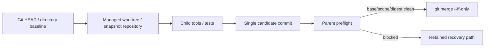

# 统一 Workflow 与多 Agent

Praxis 的产品执行入口现在只有一套：每个 Prompt 创建一个 durable Workflow 和根 `AgentTask`。默认策略是 `auto`，根模型在普通 ReAct 中自主决定直接回答、调用 Tool、委派 Agent 或扩展 Workflow；Runtime 负责最终准入和状态推进。

## 模式不是三套实现

| Policy | 语义 | 实现 |
| --- | --- | --- |
| `auto` | 模型可保持单 Agent，也可调用 delegate/handoff/graph/loop/subworkflow | 统一 Orchestrator + AgentLoop |
| `solo` | 硬性禁止增加 Child | 同一实现，child budget 为零 |
| `workflow` | 非平凡副作用前要求图化 | 同一实现，增加 admission 约束 |

旧 `direct` 与 `supervisor` 只在输入解析时迁移为 `solo` 与 `workflow`。不存在 ProductSupervisor fallback，也不存在先失败再从头运行另一套 Planner 的行为。

## 模型可调用的拓扑工具

### `agent.delegate`

用于一个有界、命名的 AgentTask。模型可以申请 Harness、目标、角色 Prompt、Tool/Skill/MCP、workspace/network、模型/档位、推理强度、预算、结果合同和成功标准；Runtime 将其与父 Grant、Profile allowlist、模型目录、可用资源和剩余 Budget 求交集。调用同步等待 Child 结果，因此父 Agent 保留最终回答权。

### `workflow.expand`

节点 `dependencies` 可以引用本次调用的逻辑 ID，也可以引用先前 `workflow.expand` 返回的、已经成功的内部 node ID。后一种边会让替换节点继承旧成功节点的持久化 result/artifact 闭包，而不重跑前驱。节点也可通过 `inputRefs` 显式接收父 Run 已拥有的 content-addressed Artifact；Worker 会校验可用性并只把递归引用闭包写入签名 Child allowlist。失败 expansion 返回 `supersedableNodeIds`；只有 replacement graph 真正成功后，`supersedes` 才原子地把旧失败节点从 required graph 中替换，失败的 replacement 不会掩盖原故障。

用于多个带依赖的命名节点。每个节点使用与 `agent.delegate` 相同的装配申请；无依赖节点并行，依赖边表达串行阶段，依赖实现节点的独立 `default/explorer` 节点表达交叉审查。Runtime 在单个事务中校验并写入图、Node、Attempt、Task 与 Outbox；依赖节点保持 `admitted`，只有 Journal 中所有前置节点成功后，durable scheduler 才将其推进为 `scheduled`。SQLite claim 会再次核验持久节点状态，因此换 Worker 或重建 scheduler 也不能提前执行后继。写节点还通过 workspace conflict key 串行。

Scheduler 不把完成集合保存在 Tool 内存中。成功结果先进入 ArtifactStore，再把 `resultRef` 写入 Node/Attempt projection。后继 Child 从同一 projection 解析前驱 `resultRef`，把校验过的 Artifact 摘要作为低信任 Context Reference，并将解析后的输入引用写入 execution snapshot；因此串行综合和交叉审查不是只控制顺序。Worker 还递归解析 result wrapper 中精确的 `artifact://` 闭包，把父 Artifact root 与允许读取的内容寻址 ID 列表写入签名 bootstrap profile。Child 的 `artifact_read` 因而可以读取被委派的前驱完整输出和 evidence manifest，但读取任意其他父 Artifact 仍返回不存在。每次 Agent 执行前还会持久化 Profile、Provider、预算以及 Tool/Skill/MCP digest 的不可变 execution snapshot。进程重建后，后台 durable Worker pump 会恢复过期 Lease，并从持久化 Node/Edge 重新推导执行前沿、释放后继阶段、解析 decision join；它不依赖已丢失的 `workflow.expand` 内存调用栈。已经成功的节点保持原 Attempt，不会重跑；被中断节点才创建新 Attempt。恢复 Root 会等非根 DAG 全部收敛后再接管，并把所有持久化 descendant `resultRef` 作为 Context Reference 注入，结果重新写回 Session 与同一 Workflow。

条件边只读取持久化 Node projection（状态、错误码和结果引用元数据），不执行模型判断。未选分支进入 `skipped`。`workflow.expand` 可声明 `all`、`any` 或固定 `quorum` join；Runtime 将 join 保存为 `decision` Node，只有持久化成功数满足门槛才写入成功，剩余分支以 `WORKFLOW_JOIN_SATISFIED` 关闭。图合同保持无环。

### `agent.handoff`

把一个结果责任交给命名 Profile，并持久化为 `synthesis` Node。专业 Agent 的输出作为低信任证据返回根 Agent；当前根 Agent 仍拥有面向用户的最终响应权，因此这是结果责任 handoff，不是把活动 TUI 会话永久转移给另一个进程。

### `workflow.loop`

实现显式终止条件的迭代。Runtime 不向 DAG 写入回边，而是每轮提交一个新的 GraphPatch，创建新的 Node、Attempt 和 revision；后一轮依赖前一轮并引用其 Artifact。退出条件是对 Worker 结构化输出执行确定性 JSON Pointer `exists/eq/in` 判断。调用者仍必须给出 `maxIterations` 作为该 loop 的显式安全条件，但 v4 不再施加额外的平台默认上限；显式次数耗尽后返回 `WORKFLOW_LOOP_LIMIT_REACHED`。

### `workflow.subworkflow`

创建独立 Workflow ID，并在子 Spec 中记录 `parentWorkflowId/parentNodeId`。父 Workflow 用 `subworkflow` Node 等待并合并子结果。当前子 Workflow 固定 `solo`，不能再创建后代；这提供独立身份和生命周期边界，但尚不是任意递归层级。

### `workflow.wait`

一个精简模型工具覆盖两种持久等待：`kind=human` 创建 HumanTask，`kind=timer` 创建 Timer。两者都会创建独立 Node/Attempt 并把 Workflow 推进到 `waiting`。Runtime 在线 wake pump 每秒幂等扫描；启动时也会补扫已到期 Timer/HumanTask。决策或到期后，同一 Node 终结并恢复 Workflow。

HumanTask 可在活动等待期间执行：

```text
/human-tasks [workflow-id]
/human-allow <human-task-id>
/human-deny <human-task-id>
/human-cancel <human-task-id>
```

TUI 在等待中的 HumanTask 节点旁显示 `/human-tasks` 提示。进程退出后，Node、Attempt、请求和到期语义仍可恢复；到期或收到 Signal 后由 wake pump 推进，同一 durable Worker pump 可接管重新变为 ready 的 AgentTask。

核心 Schema 还定义 verification、human_task、timer、signal_wait、compensation 等节点；这些长生命周期节点尚未全部开放为模型产品工具。

## 持久化权威

`workflow-platform-v1.sqlite` 是默认本地 Workflow authority，使用 WAL、FULL synchronous、foreign keys 和 `BEGIN IMMEDIATE`。原子事务覆盖：

- Workflow event 与 projection；
- Node、Attempt、Task 和 Lease；
- Outbox、Timer、Signal、HumanTask；
- 带内容 digest 的不可变 AgentProfile 和每 Attempt execution snapshot；
- budget charge 与调用前 effect reservation；
- Task acknowledgement 与 terminal。

SessionJournal 保存对话，Workflow SQLite 保存执行事实。二者不能互相替代。`session.plan` 是兼容查询，返回该 Session 最新 Workflow projection，不再读取 CompactPlan。

## Worker、授权与能力

Local Worker 复用真实 `ChildRuntimeHost`，不是在父进程里模拟一段函数。每个 Child 获得：

- 独立 child Runtime 进程和临时 Session/Trace/Artifact 根；
- 由父 Provider credential broker 提供的短期 handle；
- Capability Bundle 中明确的 builtin Tool、Skill 与 MCP；
- 节点 workspace access、总期限、无进展期限和父 Budget ceiling；
- 由父 Runtime 转发的权限决策。

Builtin、Skill、MCP、process 与 API 默认都可按父 Grant/Profile/节点请求的交集下发。外部 Tool 下发的是父 `ToolRuntime` 的 brokered view，不是原始插件对象，因此 Child 仍经过父 schema、PolicyEngine、冲突协调器与 Workflow effect broker。

Child 的能力接近父 Agent，但必须是父授权的子集。当前 Child 固定 `solo`，不能继续创建 Child；这防止未持久化 ancestry 和预算结算被递归绕过。

## 写任务安全

可写 Child 必须在 Git 仓库中运行：



父侧重新计算 patch 和 changed files，不接受 Child 自证。Git 仓库还会验证 HEAD、clean state 和 commit shape；非 Git 目录会验证整目录基线摘要并在单写锁内回写。主目录变化、越界路径或验证失败都会阻止合并，失败后的 worktree 或 snapshot 会保留，避免丢失有效部分结果。

## Lease 与恢复

Worker claim 通过 Authority CAS 获取 Lease，并按 heartbeat 延期。启动时和后台 pump 都会运行 `recoverExpired`：

- `pure/read/external_idempotent`：在 RetryPolicy 允许时创建新的 Attempt 和 ready Task；
- 尝试耗尽：进入 `manual_intervention`；
- `workspace_write/external_non_idempotent`：进入 `unknown`，禁止盲重试。

Root Attempt 成功只表示该 AgentTask 已结束，不再直接把 Workflow 标为完成。`all_required` 由 Authority reconciliation 单独判定：仍有 admitted/scheduled/running/waiting descendant 时保持 `running`；依赖就绪后持久化调度下一阶段；join 与所有 required 节点收敛后才写 `workflow.terminal`。并行 Child 同时提交 Node/Attempt 终态时会在 SQLite sequence CAS 冲突后读取新 projection 重试，避免把正常结果误降级为 `unknown`。条件裁剪或确定不可达的未租赁 Task 与 Node/Attempt 在同一事务中取消，避免长期积累 ready 垃圾任务。

Child deadline 支持“总期限 + 无进展期限”，但 v4 默认二者都不构成产品预算：总期限采用内部 unlimited 编码，no-progress 终止默认关闭；父 deadline、CLI、部署策略和 Proposal 的显式值仍会收紧。长于 Node.js 原生 timer 范围的期限会分段重挂。失败结果、Artifact 和 recovery path 会返回父 Agent，父不需要从头重复调查。

`retain_on_failure` 的临时 Child Session/Trace/Artifact 由已认证父 Host 在观察到 prompt 终态后决定清理；child 进程自身的正常 shutdown 不再抢先把“prompt 失败但进程正常退出”的证据目录删除。成功 Child 仍由父 Host 回收，失败 Child 保留用于诊断。

长 Child 的成功 Tool evidence 不再直接无限追加到 `SubagentResultV1`。达到 64 个协议引用前，Host 把最早 63 个引用写成父级 ArtifactStore 中的 `subagent_evidence_manifest`，并用一个可递归解析的 manifest ref 代替；后续证据继续增量压缩。这样结果信封始终满足协议大小约束，同时没有丢弃审计链，也不会因执行超过 64 次 Tool 调用把已完成 Child 误判为结果无效。

Child 的 `maxInlineBytes` 只控制父子结果信封的传输形式。模型通过 Runtime 内部 `praxis_submit_child_result` Tool 的参数提交一次完整 envelope；若先输出 prose，AgentLoop 在终结阶段强制该 Tool。参数经 output schema 和精确 criterion ID 双重校验后成为提交记录，父 Host 再自动把超限正文外置到父 ArtifactStore，并返回摘要、digest 和 evidence ref。模型不需要、也无权预先制造父 Artifact 引用；无效 JSON、漏项、重复/杜撰 criterion 或 failed/skipped check 都会 fail closed。

真实 Provider 已运行 3 Child quorum、5 Child cross-review 和一次只复用既有 reviewer Artifact 的 synthesis recovery。原长任务因自由文本 JSON 与旧 replacement 引用范围暴露缺陷后，主干改为结构化提交、跨 expansion 成功节点依赖和显式 `inputRefs`；修复后的 recovery 没有重跑四个成功前驱，四项 criterion 全通过。

Restart recovery 已补做确定性 MiniMax 硬重启：崩溃前成功节点保持原 Attempt，中断 Child 以 `LEASE_EXPIRED_RETRYABLE` 结束并由新 Attempt 成功接管，后继 synthesis、quorum join 和 root 第二 Attempt 全部成功；最终没有非终态 Node、`ready` Task 或 `leased` Task。旧运行曾出现的 Workflow/后继投影矛盾保留为历史故障证据，当前代码合同已有单次端到端验证；重复故障、跨机 Authority/Worker 和统计 SLA 仍未证明。

## Profile

模型可申请的内置 Harness Profile 只有三种：

- `default`：通用任务；
- `worker`：执行、修复和验证；
- `explorer`：偏只读调查和证据收集。

三者复用同一个 Child Runtime/AgentLoop，只改变基线指令；任务专用 Prompt、工具、Skill、MCP、模型、推理强度和预算由每个 Proposal 单独申请。`coordinator` 是根 Agent 的内部 Profile；`researcher/coder/reviewer/verifier` 作为历史 Workflow 的不可变兼容 Profile 保留，不再暴露给新的 topology Tool Schema。

Profile 带版本、内容 digest、带 digest 的指令引用、模型策略、Tool/Skill/MCP allowlist、默认预算和 delegation policy。同一 `(profileId, version)` 不能被覆盖；Workflow/Task 记录具体版本和 digest，恢复时发现漂移会停止执行。Task 还保存模型原始 `assemblyRequest` 和能力请求；执行前快照保存最终模型、推理、Prompt、结果合同、Capability Bundle digest 与被裁剪项，恢复不能重新解释模型提案。

## Protocol 与 TUI

当前公开方法：

- `workflow.get`
- `workflow.list`
- `workflow.events`
- `workflow.signal`
- `workflow.pause` / `workflow.resume`
- `workflow.cancel` / `workflow.terminate`
- `workflow.human-tasks.list` / `workflow.human-task.resolve`
- `workflow.retry-node` / `workflow.resolve-unknown`

暂停会阻止新 Task 获得 Lease；恢复后才能继续 claim。取消或终止活动 Workflow 时，Runtime 同时中止父 AgentLoop、后台 Worker、Child Host 和待处理权限。Signal、HumanTask resolution 与到期 Timer 都以幂等事务写入事件；Workflow 处于 `waiting` 时会恢复为 `running`。启动会扫描已到期 Timer。

Runtime 发送 `workflow_update`，包含 Workflow ID、Run ID、revision、sequence、topology、state、节点状态和 terminal code。TUI 的 `WORKFLOW` 面板先从持久化 projection 恢复，再叠加实时事件；模型不再猜测 Plan 失败原因。

## 预算

当前 v4 长生命周期策略采用“默认无预算、显式才限制”：根 Run、Child 和 Workflow 不再因内置 turns、Tool calls、tokens、wall clock、累计 Child、depth、loop 或累计图演化次数而终止。usage 仍逐轮写入 Journal，取消、恢复、公平调度、权限与审计继续生效。内部 v1 数据结构必须携带数字时，用 safe-integer/Date-safe 的 unlimited 哨兵编码，并由 overflow-safe timer 实现；这不是对外配额。Local Runtime 的 256 并行只表达 worker-pool 容量，不限制累计工作量。用户、CLI、组织策略或节点 Proposal 可显式收紧任一维度。Profile v1-v3 的旧预算与 digest 保持不可变，新任务统一钉住 v4。

同一原则应用到执行边界：Provider stream、Shell command、MCP Tool 和 Process Plugin capability invocation 默认无隐式执行超时；显式 timeout 仍受支持。初始化、协议发现、健康检查、取消和关闭属于控制面 liveness，不等同于 Agent 任务期限。

## 已交付与后续边界

已交付：统一 `auto` 产品路径、`solo/workflow` policy、动态 delegate/handoff/expand/loop/subworkflow、条件分支与持久化 `all/any/quorum` join、SQLite Workflow authority、Task/Lease/recovery、版本化 Profile、Local Child Runtime、Skill/MCP 能力衰减、Git worktree 与非 Git snapshot 写合并、Projection API/TUI，以及本地 durable pause/resume/cancel/terminate、Signal/Timer wake 和 HumanTask query/resolve。

`resolve-unknown` 要求操作人先把未知副作用明确判定为 succeeded、failed 或 manual；只有进入 failed 且未耗尽 RetryPolicy 的节点才能 `retry-node`。未知外部副作用不会自动重试。

所有可变 Tool 通过 `WorkflowEffectBrokerV1` 执行。原 ToolRuntime 的 schema、permission、路径和 conflict 检查保持不变；broker 在调用前创建 durable `tool_activity`、Task 和 Lease。workspace write 使用输入 digest 生成稳定键；外部调用显式提供合法 `idempotencyKey` 时按 `external_idempotent` 处理，否则按 `external_non_idempotent` 保守处理。

外部 effect 的成功完成必须带 Artifact receipt。调用前 reservation 以 `(workflowId, idempotencyKey)` 为唯一键在 Authority 事务中抢占；只有所有者能执行。receipt、reservation terminal、Attempt terminal、Node terminal 和 Task acknowledgement 同事务提交。已 committed 的同输入调用直接读取完整 ToolResult 重放，不再次产生副作用；不同输入返回 `WORKFLOW_EFFECT_IDEMPOTENCY_CONFLICT`。结果不确定时 reservation 保持 unknown，必须由操作人确认失败后释放，不能盲重试。

Saga compensation 不允许模型仅用文字宣称“已撤销”。模型必须先正常调用补偿 MCP/process/API Tool，得到第二份 committed receipt；此后才动态暴露 `workflow.compensate`，把源 receipt 与补偿 receipt 原子关联，并写 `effect.compensated` 事件。自动选择哪个业务补偿动作仍依赖各连接器提供明确 descriptor，Runtime 不猜测逆操作。

远程 Worker 已通过认证的 Authority/Artifact HTTP 边界接线：Authority Runtime 设置 `PRAXIS_WORKFLOW_AUTHORITY_LISTEN` 和 `PRAXIS_WORKFLOW_AUTHORITY_TOKEN`，远程 Runtime 设置 `PRAXIS_WORKFLOW_AUTHORITY_URL` 和同一 token；所有 Worker 竞争同一 durable Lease，SQLite 文件不会跨机器共享。当前公平性以持久 `last_claimed_at` 做跨 Workflow 轮转，Worker 对连续基础设施失败做有界熔断。

尚未宣称交付：PostgreSQL Authority、租户级分布式熔断、高可用外部通知渠道与 HumanTask TUI 一键操作、任意嵌套 Subworkflow，以及连接器声明驱动的自动补偿策略。规模化 restart/soak、远程多 Worker 故障组合和统计成功率也未验证。目标设计见 [Planner Platform RFC](planner-platform-rfc.md)，本轮运行证据见[最终小样本测评与优化总结](evaluation-final-2026-08-09.md)。
